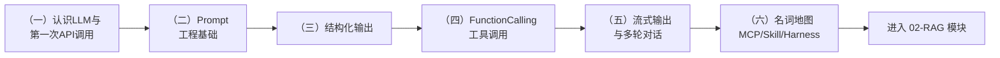

# 模块 01：LLM 基础

> 一切 Agent 都构建在「会调用 LLM」之上。本模块先用 5 章建立 LLM 应用开发的「五件套」基本功，再用 1 章纯文档建立生态名词地图——每一章都为后续的 RAG 和 Agent 模块埋下伏笔。

## 学习路径

| 章节 | 核心知识点 | 与后续模块的关系 |
| --- | --- | --- |
| （一）认识LLM与第一次API调用 | messages/角色、token、temperature、返回结构 | 所有模块的地基；建立 `llm_client.py` 封装 |
| （二）Prompt工程基础 | 清晰指令、分隔符与注入防御、Few-shot、CoT | RAG 的回答 Prompt、Agent 的系统提示词都靠它 |
| （三）结构化输出 | JSON 模式、Pydantic 校验、自动重试 | 博客接口返回 JSON、Agent 工具参数都依赖它 |
| （四）FunctionCalling工具调用 | tools schema、工具调用循环 | **Agent 的基石**，03 模块直接在此之上构建 |
| （五）流式输出与多轮对话 | stream/SSE、历史管理、记忆裁剪 | 博客聊天框的打字效果与会话记忆 |
| （六）名词地图（纯文档） | Function Calling / MCP / Skill / Harness / 上下文工程的分层关系 | 生态导航图：后续遇到这些词不迷路 |

## 学习方式建议

1. **顺序学习**：每章的代码都建立在前一章的概念之上，不要跳章
2. **先读 README，再跑代码**：每章 `README.md` 是讲解，`project/` 是配套可运行项目
3. **每章独立环境**：进入该章 `project/` 目录执行 `uv sync` 即可，互不影响
4. **一定要做动手作业**：每章末尾有 2~3 个小作业，做完才算真正掌握

## 前置条件

- 已安装 uv（见根目录 README.md）
- 已在仓库根目录配置 `.env`（DeepSeek API Key），**全模块只需配置一次**

## 预计耗时

每章 1~2 小时（含动手作业），整个模块约 1 周（业余时间）。
