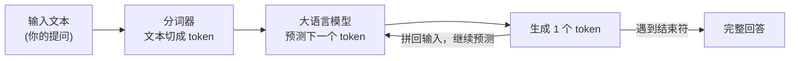
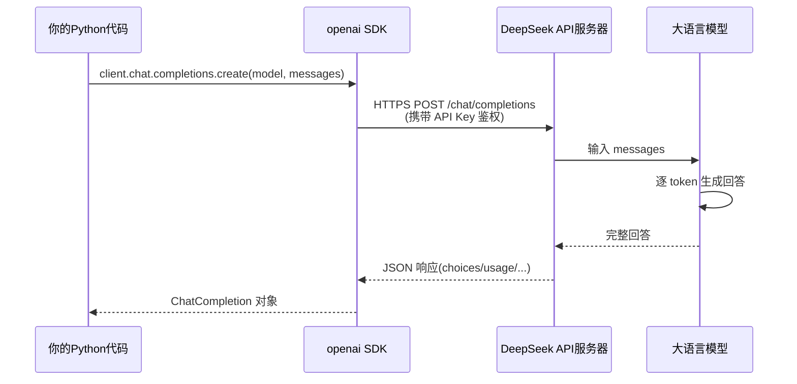
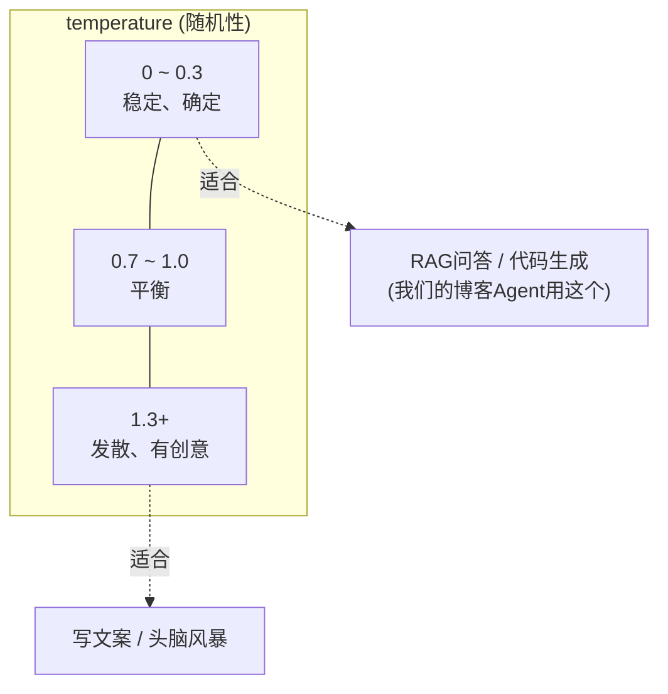

# （一）认识 LLM 与第一次 API 调用

> 本章是整套课程的起点。学完后你将完成人生第一次「用代码调用大模型」，并真正理解请求和响应里的每一个字段。

## 本章目标

- 理解 LLM（大语言模型）的基本工作方式：token、上下文窗口、补全
- 理解 Chat Completions API 的核心结构：`messages` 与三种角色
- 跑通第一次 DeepSeek API 调用，学会读懂返回结构
- 理解 `temperature`、`max_tokens` 两个最常用的参数
- 搭好贯穿全课程的开发环境（uv + .env + 客户端封装）

## 一、LLM 到底在做什么？

LLM 的本质可以用一句话概括：**根据已有的文字，预测下一个最可能出现的词（token），不断重复，直到生成完整回答。**



三个必须理解的概念：

| 概念 | 解释 | 对开发的影响 |
| --- | --- | --- |
| token | 模型处理文本的最小单位。中文约 1 个汉字 ≈ 0.6~1 个 token | API 按 token 计费；回答长度用 token 衡量 |
| 上下文窗口 | 模型一次能「看到」的最大 token 数（DeepSeek-chat 为 128K） | 输入 + 输出总长不能超过它，超了就要裁剪（第五章细讲） |
| 补全（Completion） | 模型并非「理解后回答」，而是「接着你的话往下写」 | 这就是为什么 Prompt 写法对结果影响巨大（第二章细讲） |

## 二、Chat Completions API：行业事实标准

我们用 **DeepSeek** 作为课程的模型服务，但代码里用的是 **OpenAI 官方 SDK**——因为 DeepSeek（以及通义千问、Kimi 等几乎所有模型服务商）都提供 OpenAI 兼容接口。学会这一套，等于学会调用市面上绝大多数大模型。

一次调用的完整流程：



### messages：不是一句话，而是一个消息列表

```python
messages = [
    {"role": "system", "content": "你是一位资深编程导师，回答要简洁。"},
    {"role": "user", "content": "什么是LLM？"},
]
```

| 角色 | 谁说的 | 用途 |
| --- | --- | --- |
| `system` | 开发者 | 设定模型的身份、规则、输出格式。**用户看不到，但模型最重视** |
| `user` | 用户 | 真正的提问内容 |
| `assistant` | 模型 | 模型的历史回复。多轮对话时必须把之前的回复带上（第五章细讲） |

### 返回结构：重点记住一条取值路径

```python
response.choices[0].message.content   # 模型回复的文本
response.usage.total_tokens           # 本次消耗的 token（计费依据）
response.choices[0].finish_reason     # 结束原因：stop / length / tool_calls
```

> `finish_reason == "length"` 表示回答被 `max_tokens` 截断了，内容不完整——做产品时必须处理这种情况。

### 两个最常用的参数



- `temperature`：控制输出随机性。**做 RAG/Agent 用 0~0.3**，保证回答稳定可复现
- `max_tokens`：限制回复最大长度，防止生成超长内容（既费钱又拖慢响应）

## 三、动手实践

### 1. 配置环境（全课程只需做一次）

```bash
# ① 安装 uv（Python 包管理工具，详见根目录 README.md）
curl -LsSf https://astral.sh/uv/install.sh | sh

# ② 在仓库根目录创建全局 .env 并填入你的 DeepSeek API Key
cd learnAgent
cp .env.example .env
# 然后编辑 .env，把 LLM_API_KEY 改成你在 https://platform.deepseek.com/api_keys 创建的 Key
```

### 2. 安装本章依赖并运行

```bash
cd "01-LLM基础/（一）认识LLM与第一次API调用/project"
uv sync          # 自动创建 .venv 虚拟环境并安装依赖（首次几秒钟）
uv run python main.py
```

PyCharm 用户：用 PyCharm 打开本 `project` 目录（或整个仓库），把解释器指向本章 `project/.venv`，然后直接运行 `main.py`（详细步骤见根目录 README.md）。

### 3. 本章代码文件

| 文件 | 说明 |
| --- | --- |
| `project/llm_client.py` | LLM 客户端封装：自动向上查找 `.env`、创建客户端、无 Key 时给中文指引。**后续每一章都会复用这个文件**。可直接运行做环境自检 |
| `project/main.py` | 三个演示：① 第一次调用 ② 解剖返回结构 ③ temperature 实验 |

## 四、动手作业（建议完成）

1. 修改 `main.py` 中的 system 提示词，让模型用「鲁迅的文风」回答，观察 system 的控制力
2. 把 `max_tokens` 改成 `10`，观察 `finish_reason` 变成了什么
3. 在 `.env` 里把 `LLM_MODEL` 改成 `deepseek-reasoner` 再运行，对比两个模型的回答风格和耗时

## 官方文档与延伸阅读

- [DeepSeek API 快速开始（中文）](https://api-docs.deepseek.com/zh-cn/)
- [DeepSeek 定价与模型列表](https://api-docs.deepseek.com/zh-cn/quick_start/pricing)
- [OpenAI Chat Completions API 参考](https://platform.openai.com/docs/api-reference/chat)
- [OpenAI 官方 Python SDK（GitHub）](https://github.com/openai/openai-python)
- [Andrej Karpathy：Intro to Large Language Models（视频，强烈推荐）](https://www.youtube.com/watch?v=zjkBMFhNj_g)

## 下一章预告

你已经能让模型「说话」了，但同一个问题，不同的问法得到的答案质量天差地别。下一章 **《（二）Prompt 工程基础》** 教你系统地「向模型提问」——这是不需要写任何复杂代码、却能最大幅度提升效果的技能。
