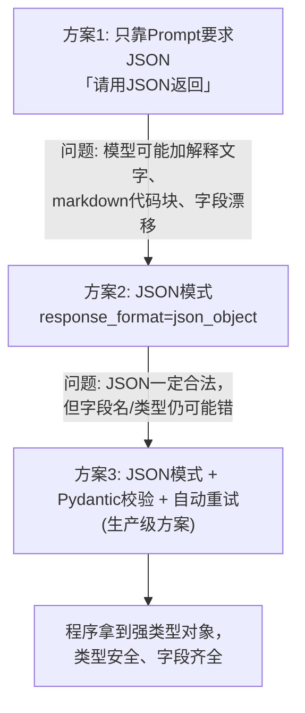
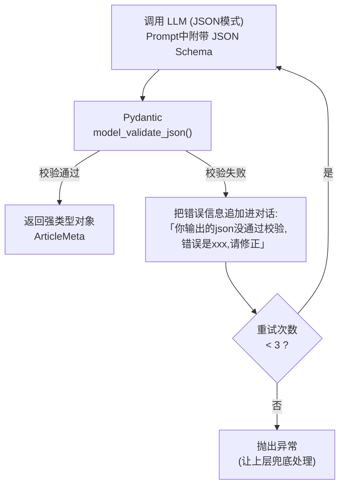

# （三）结构化输出

> 聊天机器人输出文字给「人」看就够了，但工程系统需要的是**可直接解析的数据结构**。本章解决一个看似简单、实则处处是坑的问题：如何让模型 100% 稳定地输出合法、合规的 JSON。

## 本章目标

- 理解「只靠 Prompt 要 JSON」为什么不可靠
- 掌握 JSON 模式（`response_format={"type": "json_object"}`）
- 掌握 Pydantic 数据校验，以及「校验失败自动重试」的生产级模式
- 为实战项目打基础：博客文章元数据提取（标题/分类/标签/摘要）

## 一、为什么结构化输出如此重要？

回顾我们的最终目标——博客 AI 聊天框的接口要返回：

```json
{
  "answer": "这篇内容主要讲的是...",
  "sources": [{"title": "...", "url": "...", "score": 0.91}],
  "recommendedArticles": [{"title": "...", "url": "..."}]
}
```

前端要渲染推荐卡片，靠的就是这个结构。**模型输出哪怕多一个字、少一个引号，前端就白屏。** 结构化输出是 LLM 和工程系统之间的「接口契约」。

## 二、三种方案的可靠性阶梯



### 方案 2 的两个注意点

```python
response = client.chat.completions.create(
    model=MODEL,
    messages=[...],
    response_format={"type": "json_object"},  # 关键参数
)
```

1. **Prompt 里必须出现 "json" 这个词**，否则 API 直接报错（DeepSeek 与 OpenAI 的规则一致）
2. 最好在 system 里给出**字段示例**，否则字段名仍可能漂移（`tags` vs `tag_list`）

### 方案 3 的完整流程（本章核心）



两个关键技巧：

- **把 Pydantic 的 JSON Schema 直接放进 Prompt**：`ArticleMeta.model_json_schema()`，模型照着 Schema 输出，准确率大幅提升
- **校验失败时把错误信息喂回模型**：模型有很强的自我修正能力，通常 1 次重试就能修好

### Pydantic 速览（前端类比：运行时的 TypeScript interface + zod）

```python
class ArticleMeta(BaseModel):
    title: str = Field(description="文章标题，10~30个字")
    category: str = Field(description="分类，只能是 frontend / backend / ai 之一")
    tags: list[str] = Field(min_length=2, max_length=4)
    summary: str = Field(max_length=60)
```

你作为前端工程师可以这样理解：Pydantic ≈ TypeScript 的 `interface` + `zod` 的运行时校验。后面学 FastAPI 时会发现它的请求/响应模型也全是 Pydantic。

## 三、动手实践

```bash
cd "01-LLM基础/（三）结构化输出/project"
uv sync
uv run python main.py
```

| 文件 | 说明 |
| --- | --- |
| `project/llm_client.py` | 客户端封装（同前两章） |
| `project/main.py` | 三个递进演示：纯 Prompt → JSON 模式 → Pydantic 校验 + 重试 |

## 四、动手作业

1. 给 `ArticleMeta` 增加一个 `difficulty: int` 字段（1~5 的整数，用 `Field(ge=1, le=5)` 约束），观察模型能否正确输出
2. 把 `category` 改成 `Literal["frontend", "backend", "ai"]` 类型（需要 `from typing import Literal`），体会枚举约束
3. 故意把 Schema 里的 `summary` 限制改成 `max_length=10`，观察重试机制是如何工作的

## 官方文档与延伸阅读

- [OpenAI Structured Outputs 指南](https://platform.openai.com/docs/guides/structured-outputs)
- [DeepSeek JSON Output 文档](https://api-docs.deepseek.com/zh-cn/guides/json_mode)
- [Pydantic 官方文档](https://docs.pydantic.dev/latest/)
- [Pydantic Models 概念讲解](https://docs.pydantic.dev/latest/concepts/models/)

## 下一章预告

现在模型能输出标准的数据结构了，但它还只能「说」不能「做」——不知道今天的日期、不能查数据库、不能执行计算。下一章 **《（四）Function Calling 工具调用》** 给模型装上「手」，这是从「聊天机器人」迈向「Agent」最关键的一步。
