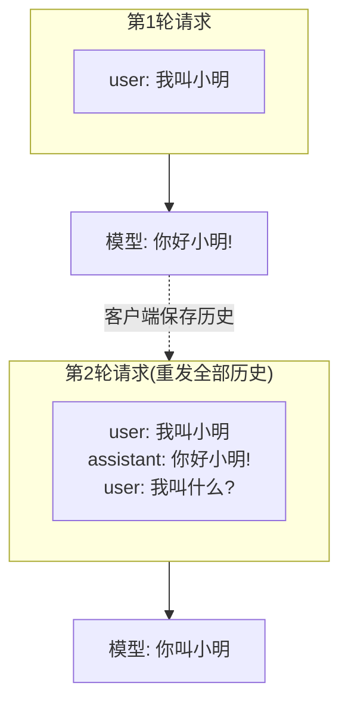

# （五）流式输出与多轮对话

> 本章是 01 模块的收官：解决两个真实聊天产品必备的体验问题——「逐字打字」的流式输出，以及「记住上文」的多轮对话。学完本章，你就拥有了博客 AI 聊天框后端的全部基础能力。

## 本章目标

- 掌握流式输出（`stream=True`）的原理和实现
- 理解 SSE 与你博客聊天框的关系
- 戳破关键认知：**模型本身没有记忆**，多轮对话靠重发历史实现
- 实现一个带「记忆裁剪」的会话管理器 `ChatSession`

## 一、流式输出：别让用户盯着转圈

非流式 vs 流式的体验差异：

```mermaid
sequenceDiagram
    participant U as 用户
    participant S as 服务端
    participant LLM as 模型

    rect rgb(60, 30, 30)
        Note over U,LLM: 非流式: 用户干等全程
        U->>S: 提问
        S->>LLM: 请求(stream=False)
        Note over LLM: 生成全部500个token<br/>耗时8秒...
        LLM-->>S: 完整回答
        S-->>U: 8秒后一次性显示
    end

    rect rgb(30, 50, 30)
        Note over U,LLM: 流式: 首字仅需几百毫秒
        U->>S: 提问
        S->>LLM: 请求(stream=True)
        LLM-->>S: chunk: "流"
        S-->>U: 立即显示"流"
        LLM-->>S: chunk: "式输出"
        S-->>U: 显示"式输出"
        Note over U: 逐字看到回答,体验流畅
    end
```



代码上只有两处变化：

```python
stream = client.chat.completions.create(..., stream=True)   # ① 开启流式
for chunk in stream:                                         # ② 逐块读取
    delta = chunk.choices[0].delta.content                   # 增量文本（可能为 None）
```

### 和你博客聊天框的关系

完整链路是：**模型流式生成 → Python 后端逐块转发（SSE）→ 浏览器 EventSource/fetch 逐块渲染**。你做前端时大概率用过 SSE 或 WebSocket，实战模块（07）会用 FastAPI 的 `StreamingResponse` 实现 SSE 端点，前端逻辑你完全熟悉。

## 二、多轮对话：模型其实没有记忆

**HTTP API 是无状态的。** 模型不可能「记得」上一次请求说过什么。所谓多轮对话，是客户端把完整历史每次重发一遍：



由此引出一个工程问题：**历史越长，token 消耗越多、响应越慢，还可能撑爆上下文窗口。** 所以必须做「记忆管理」，本章用最简单的策略——只保留最近 N 轮：

```python
class ChatSession:
    MAX_TURNS = 8
    def _build_messages(self):
        trimmed = self.history[-self.MAX_TURNS * 2:]   # 只留最近8轮
        return [{"role": "system", "content": self.system_prompt}, *trimmed]
```

> 更聪明的策略（按 token 数裁剪、把旧对话摘要压缩）在 03-Agent 模块的《（四）Agent 记忆与多轮状态》中实现。

## 三、动手实践

```bash
cd "01-LLM基础/（五）流式输出与多轮对话/project"
uv sync
uv run python main.py
```

| 文件 | 说明 |
| --- | --- |
| `project/llm_client.py` | 客户端封装（同前几章） |
| `project/main.py` | ① 流式打字机效果 ② 「模型没有记忆」三连实验 ③ 交互式聊天（`ChatSession`） |

演示 3 是交互式的：`/exit` 退出，`/clear` 清空记忆。建议实验：先告诉它你的名字，`/clear` 之后再问——验证记忆确实被清空。

## 四、动手作业

1. 把 `MAX_TURNS` 改成 `1`，连续聊几句，体会「记忆被裁掉」是什么效果
2. 给 `ChatSession` 增加一个 `token 估算`：粗略按「1 汉字 ≈ 1 token」统计当前历史的 token 数并在每轮打印
3. 思考题：如果用户同时打开两个浏览器标签页聊天，后端该怎么区分两个会话？（提示：session_id —— 实战模块会实现）

## 官方文档与延伸阅读

- [OpenAI Streaming 指南](https://platform.openai.com/docs/guides/streaming-responses)
- [DeepSeek 多轮对话文档（中文）](https://api-docs.deepseek.com/zh-cn/guides/multi_round_chat)
- [MDN：Server-Sent Events（你做前端肯定眼熟）](https://developer.mozilla.org/zh-CN/docs/Web/API/Server-sent_events)
- [OpenAI：管理上下文窗口](https://platform.openai.com/docs/guides/conversation-state)

## 模块小结与下一章预告

至此你已掌握：API 调用、Prompt 工程、结构化输出、工具调用、流式与多轮对话——这是所有 LLM 应用的「五件套」基本功。

动手部分到此告一段落，本模块还剩最后一章纯文档：**《（六）名词地图》**——用一张分层图讲清 Function Calling、MCP、Skill、Agent Harness、上下文工程这些高频名词的关系，给后续模块装上「生态导航」。

之后进入 **《02-RAG》**：现在模型还有一个致命短板——**它不知道你博客里写了什么**，问它「我的博客里有没有讲 Vite 迁移的文章」只能编（幻觉）。RAG 把你的博客文章变成「外接知识库」，让模型基于真实内容回答——这正是你实战项目的核心。
