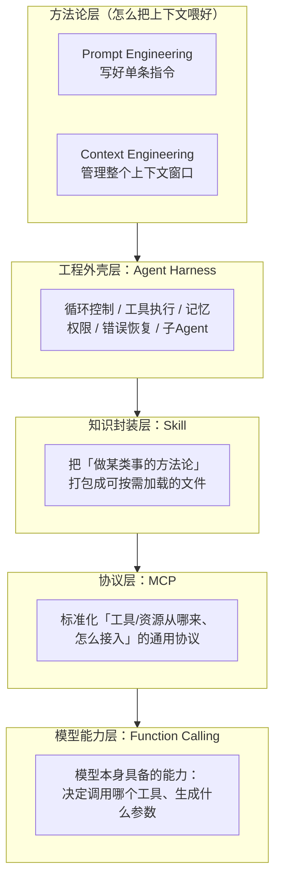
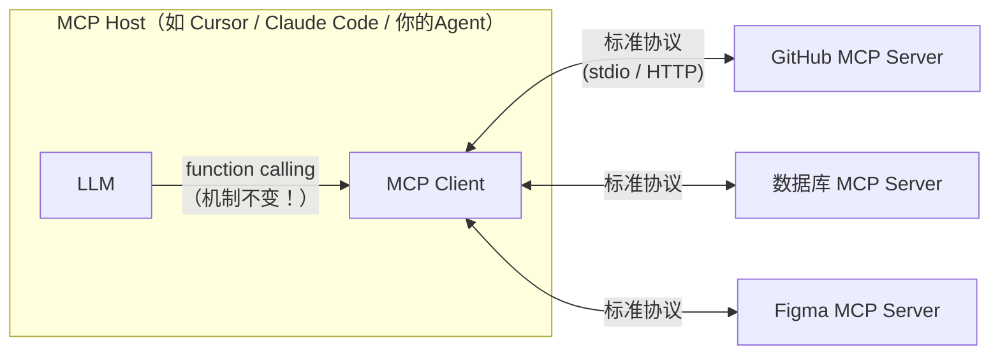
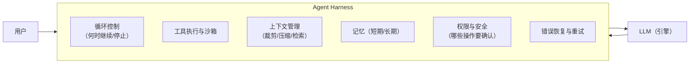

# （六）名词地图：Function Calling、MCP、Skill 与 Agent Harness

> 纯文档章（无 project）。Agent 生态的名词在以每季度一批的速度冒出来：MCP、Skill、Harness、Tool Use、上下文工程……它们经常被混着用，导致两个极端：要么觉得「都是营销词不用学」，要么觉得「不接 MCP 就不算 Agent」。本章给你一张**分层地图**——每个名词在栈里的位置、解决什么问题、彼此什么关系。后续模块再遇到它们时，你脑中有图，不会迷路。

## 一、一张图看懂：它们在栈里的位置

一句话版本：

| 名词 | 一句话定位 | 类比前端 |
| --- | --- | --- |
| **Function Calling** | 模型决定「调什么工具、传什么参数」的**模型层能力** | 浏览器的事件循环（底层机制） |
| **MCP** | 工具和数据源「怎么接入」的**标准化协议** | USB-C / npm registry |
| **Skill** | 「怎么做某类事」的**流程知识打包** | 团队的 runbook / 脚手架模板 |
| **Agent Harness** | 围绕模型的**整套工程外壳** | 框架（React 之于 JS） |
| **Prompt / Context Engineering** | 喂给模型什么内容的**方法论** | 代码规范 / 架构设计 |

## 二、Function Calling：一切的地基（已在（四）章实战）

快速回顾（详见 [（四）FunctionCalling工具调用](../（四）FunctionCalling工具调用/README.md)）：

- 你把工具的 **JSON Schema**（名字、描述、参数）随请求发给模型
- 模型**不执行**任何东西，只返回「我想调 `get_weather`，参数是 `{"city": "上海"}`」
- **执行是你的代码做的**，把结果再喂回去，模型继续生成

两个术语澄清：

1. **Tool Use ≈ Function Calling**——OpenAI 习惯叫 function calling，Anthropic 习惯叫 tool use，机制完全一样。课程统一用「工具调用」
2. 它是**模型在训练时学会的能力**（输出特定格式的结构化意图），不是外挂——这就是为什么它在「模型能力层」，是其他一切名词的地基：MCP 接进来的工具、Skill 里调用的脚本、Harness 里的工具循环，底层全是 function calling

## 三、MCP：工具接入的「USB-C」

**MCP（Model Context Protocol，模型上下文协议）**，Anthropic 2024 年 11 月开源，现已成为行业事实标准（OpenAI、Google、Cursor 等均已支持）。

### 它解决什么问题？

没有 MCP 时：你想让 Agent 操作 GitHub、查数据库、读 Figma，每个集成都要**自己写工具函数**（就像我们 03 模块做的那样），M 个应用 × N 个数据源 = M×N 份胶水代码。

MCP 把它变成 M+N：数据源方实现一次 **MCP Server**，任何支持 MCP 的应用（**MCP Client/Host**）都能直接用——就像设备厂商只要做 USB-C 口，不用为每台电脑单独做线。

### MCP Server 提供三种原语

| 原语 | 是什么 | 例子 |
| --- | --- | --- |
| **Tools** | 可调用的操作（模型决定调用） | `create_issue`、`query_database` |
| **Resources** | 可读取的数据（应用决定加载） | 文件内容、数据库 schema |
| **Prompts** | 预置的提示词模板（用户选择触发） | 「/审查这个PR」 |

### 关键认知：MCP 不替代 Function Calling

最常见的误解是「MCP 是更高级的 function calling」。错——**MCP 管的是工具从哪来、怎么发现、怎么传输；模型决定调用哪个工具依然靠 function calling**。MCP Client 拿到 server 的工具清单后，转成 JSON Schema 喂给模型，后面的流程和你在（四）章手写的一模一样。

### 什么时候用 MCP，什么时候自己写工具？

- **自己写工具**（本课程的方式）：工具是你业务私有的（如 BlogAgent 的「检索博客」）、追求最低延迟与完全控制——一个函数的事，不需要协议
- **用 MCP**：想接入**现成生态**（GitHub/Slack/数据库等上千个现成 server）、或想把你的工具**暴露给别人的 Agent 用**（07-（八）提过：把 BlogAgent 的检索能力做成 MCP server，Cursor/Claude 都能直接调你的博客知识库）

### MCP 的坑

| 坑 | 说明 |
| --- | --- |
| 供应链风险 | 装第三方 MCP server = 引入可执行代码，和 npm 包同级别的信任问题 |
| 提示注入面扩大 | server 返回的内容会进上下文——恶意 server 可以在工具结果里夹带指令 |
| 工具数量爆炸 | 挂 10 个 server 可能带来 200 个工具，模型选择准确率骤降、token 暴涨（03 模块讲过工具描述的成本） |

## 四、Skill：把「方法论」打包成可加载的知识

**Skill（Agent Skills）**，Anthropic 2025 年提出的模式（Claude Skills），现被多家 Agent 产品采用：把「完成某类任务的流程知识」组织成一个文件夹——核心是一个 `SKILL.md`（说明书），可附带脚本、模板、参考资料。

### 它和工具的区别（最容易混的一对）

| | 工具（Tool） | Skill |
| --- | --- | --- |
| 本质 | **能力**：一个可调用的函数 | **方法论**：怎么组合使用能力完成任务 |
| 形态 | 代码 + JSON Schema | Markdown 文档（可附脚本） |
| 例子 | `query_database(sql)` | 「怎么做数据库迁移评审：先看 X，再查 Y，注意 Z」 |
| 类比 | 给你一把电钻 | 给你一份「打家具的装配说明书」 |

### 关键机制：渐进式加载（Progressive Disclosure）

Skill 不是全文塞进 system prompt——那样 token 立刻爆炸。Agent 启动时只加载每个 skill 的**一句话描述**（几十 token），判断任务相关时才读完整的 `SKILL.md`，需要时才执行附带脚本。这是**上下文工程**的典型实践：按需出现，用完即走。

> 你正在用的 Cursor 就是这么干的——它的 Agent 带着一批 skills（每个只占一行描述），遇到对应任务才完整读取。

### 什么时候写 Skill？

当你发现自己**反复在 prompt 里粘贴同一段「操作指南」**时——比如「我们团队的发布流程」「这个仓库的代码规范」——就该沉淀成 skill。它填补了「微调太重、prompt 太碎」之间的空白：不改模型、不写代码，用文档教会 Agent 你的工作方式。

## 五、Agent Harness：模型是引擎，Harness 是整车

**Agent Harness（直译「挽具」，业界也叫 agentic harness / harness engineering）**：围绕 LLM 的**整套工程外壳**——同一个模型，套上不同的 harness，能力天差地别。这正是 2025 年后行业的共识转向：**模型能力趋同后，竞争力在 harness 里**。

一个完整的 harness 通常包含：

### 你其实一直在学 harness engineering

这个词听起来新，但回看课程目录——**你已经在亲手造 harness 了**：

| harness 组件 | 课程对应 |
| --- | --- |
| 循环控制 | 03-（二）手写 ReAct 循环、迭代上限 |
| 工具执行与安全 | 03-（三）工具设计与白名单校验 |
| 上下文管理 | 03-（四）滑动窗口+摘要压缩 |
| 记忆 | 05-（五）checkpointer、08 模块长期记忆 |
| 错误恢复 | 07-（六）检索重试与兜底拒答 |
| 多 Agent 编排 | 09 模块 Supervisor/Handoff |

层级关系：**03 模块手写的 ReAct 循环是最小 harness；LangGraph 是搭 harness 的框架；Claude Code / Cursor 是成熟的 harness 产品**。所谓 harness engineering，就是这些组件的设计与打磨——模型你改不了，harness 才是你的主场。

## 六、Prompt Engineering vs Context Engineering

最后澄清方法论层的一对词：

- **Prompt Engineering**（02 章学过）：把**单条指令**写清楚——角色、分隔符、Few-shot、CoT
- **Context Engineering**（2025 年起的主流提法）：管理**整个上下文窗口**——什么信息、什么时机、以什么形式进入上下文，包括检索（RAG）、记忆注入、工具结果裁剪、skill 的渐进加载……

前者是后者的子集。你会发现课程里大量内容其实都是 context engineering：02 模块的 RAG（检索进上下文）、03-（四）的记忆裁剪（什么留在上下文）、08 模块的记忆召回注入（top-k + 阈值，不全量倾倒）、09 模块的摘要回传（worker 过程不进共享上下文）——**「Agent 的能力上限由模型决定，实际表现由上下文质量决定」**。

## 七、名词速查表（遇到新词回来对号入座）

| 名词 | 层 | 一句话 |
| --- | --- | --- |
| Function Calling / Tool Use | 模型能力 | 模型输出「调什么工具+什么参数」的结构化意图 |
| MCP | 协议 | 工具/数据源接入的标准协议（USB-C） |
| MCP Server / Client / Host | 协议 | 提供方 / 连接器 / 宿主应用 |
| Skill | 知识封装 | 方法论打包成按需加载的文档（+脚本） |
| Agent Harness | 工程外壳 | 循环+工具+上下文+记忆+权限的整车工程 |
| Prompt Engineering | 方法论 | 写好单条指令 |
| Context Engineering | 方法论 | 管理整个上下文窗口的内容与时机 |
| ReAct | 模式 | 推理+行动交替的 Agent 循环（03-二） |
| RAG | 模式 | 检索增强生成（02 模块） |

## 八、本章的坑与对策（认知层面的坑）

| 坑 | 表现 | 纠正 |
| --- | --- | --- |
| 名词崇拜 | 「不接 MCP 就不算 Agent」 | MCP 只解决工具接入的标准化；私有工具直接写函数更简单 |
| MCP 当魔法 | 以为接了 MCP 模型就「会用」工具了 | 选工具、填参数依然是 function calling + 工具描述质量的事 |
| Skill 当微调 | 以为 skill 能改变模型能力 | skill 只是按需加载的上下文，模型还是那个模型 |
| 忽视 harness | 只关注换更强的模型 | 同一模型在不同 harness 下表现差数倍；先审视你的循环/上下文/工具 |
| 什么都塞上下文 | prompt 越堆越长，效果反而降 | context engineering 的核心是「按需出现」，不是「全部给到」 |

## 九、动手作业（概念辨析，不用写代码）

1. 用自己的话向同事解释：「为什么说 MCP 不是 function calling 的替代品？」（提示：一个管接入，一个管决策）
2. 盘点你正在用的 AI 工具（Cursor / Claude Code / 其他）：找出它的 harness 里哪些组件你能感知到（权限确认？上下文压缩提示？工具调用展示？）
3. 把你团队一个反复口头交代的流程（如「上线检查清单」）试着写成一份 `SKILL.md` 的结构（描述 + 步骤 + 注意事项），体会「方法论文档化」
4. 思考题：07 模块的 BlogAgent 如果要把「博客检索」暴露成 MCP server，三种原语（tools/resources/prompts）各应该提供什么？

## 官方文档与延伸阅读

- [MCP 官方文档](https://modelcontextprotocol.io/)
- [Anthropic：Introducing the Model Context Protocol](https://www.anthropic.com/news/model-context-protocol)
- [Anthropic：Agent Skills 工程实践](https://www.anthropic.com/engineering/equipping-agents-for-the-real-world-with-agent-skills)
- [Anthropic：Effective context engineering for AI agents](https://www.anthropic.com/engineering/effective-context-engineering-for-ai-agents)
- [OpenAI：Function calling 指南](https://platform.openai.com/docs/guides/function-calling)

## 下一步

名词地图建好了，进入 [02-RAG](../../02-RAG/README.md)——你将动手实践 context engineering 最重要的形态：检索增强生成。
