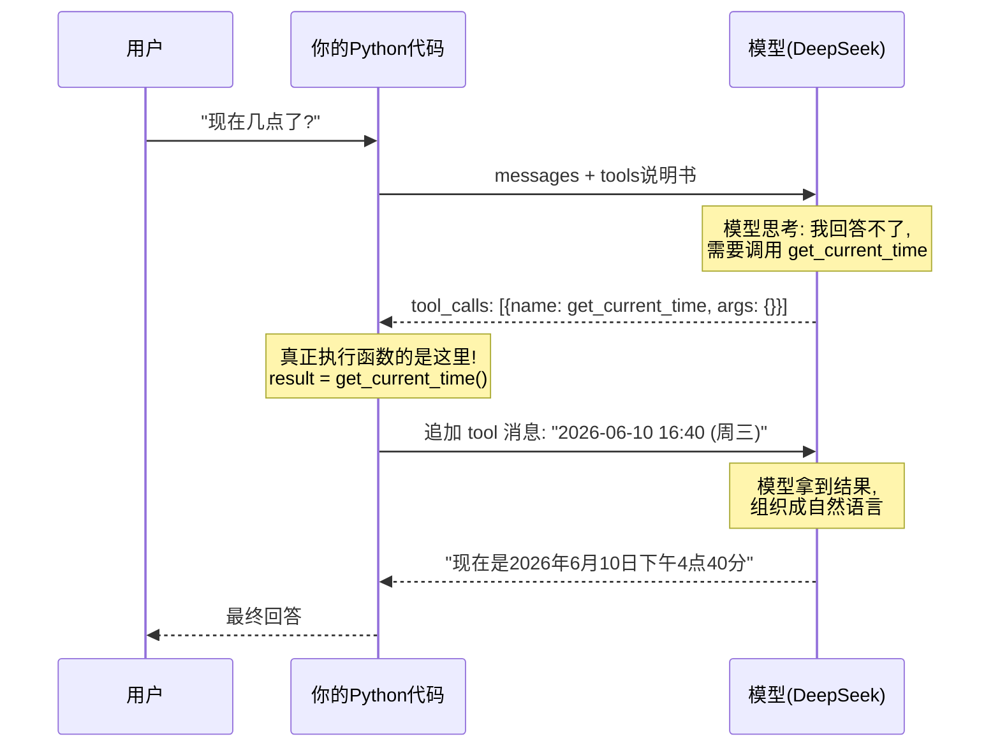
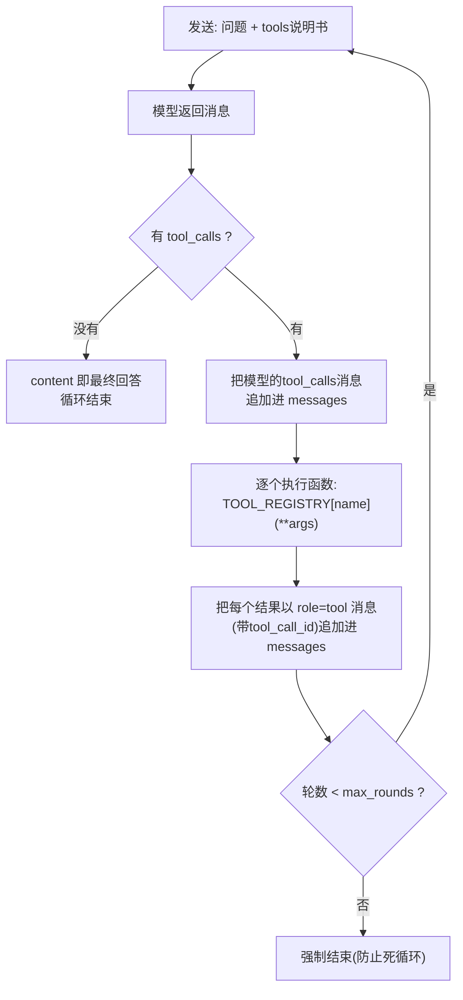

# （四）Function Calling 工具调用

> LLM 只会「生成文字」：它不知道现在几点、不会精确计算、查不了你的数据库。Function Calling 给模型装上「手」——这是从聊天机器人迈向 Agent 最关键的一步，也是本套课程承上启下的核心章节。

## 本章目标

- 理解 Function Calling 的本质：**模型只「请求」调用，执行永远在你的代码里**
- 学会编写工具说明书（tools schema）并理解 description 的重要性
- 掌握完整的工具调用闭环：请求 → 执行 → 回传 → 最终回答
- 实现多工具、多轮调用循环——这就是 Agent 的雏形

## 一、最容易误解的一点：模型并不执行函数



记住这个分工：

| 角色 | 职责 |
| --- | --- |
| 模型 | 决定「要不要调用工具、调用哪个、传什么参数」 |
| 你的代码 | 真正执行函数、把结果回传、控制循环 |

## 二、三个核心要素

### 1. 工具说明书（tools schema）

模型看不到你的 Python 代码，它只能看到这份 JSON 说明书：

```python
{
    "type": "function",
    "function": {
        "name": "calculate",
        "description": "计算数学表达式的精确结果。涉及数字计算时必须使用本工具，不要心算。",
        "parameters": {            # JSON Schema 格式（上一章刚学过！）
            "type": "object",
            "properties": {
                "expression": {"type": "string", "description": "如 '38 * 17 + 5'"}
            },
            "required": ["expression"],
        },
    },
}
```

> **description 写得越清楚，模型调用得越准。** 写 description 本身就是 Prompt 工程——这是 Agent 开发中最重要的「工具设计」能力，03 模块会专门讲。

### 2. tool_calls 响应结构

模型决定调用工具时，返回的消息长这样：

```python
message.content      # None —— 没有文字回答
message.tool_calls   # [{id: "call_xx", function: {name: "calculate", arguments: '{"expression": "38*17+5"}'}}]
# 此时 finish_reason == "tool_calls"
```

注意 `arguments` 是 **JSON 字符串**，要先 `json.loads()` 再传给函数。

### 3. 工具调用循环（本章最重要的代码）



三个新手必踩的坑（代码里都有对应处理）：

1. **忘记把模型的 tool_calls 消息追加进历史** → 下一轮模型「失忆」，API 直接报错
2. **忘记 tool_call_id** → 一轮多个调用时，模型分不清哪个结果对应哪个请求
3. **没有 max_rounds 上限** → 模型反复调用工具，死循环烧钱

## 三、动手实践

```bash
cd "01-LLM基础/（四）FunctionCalling工具调用/project"
uv sync
uv run python main.py
```

| 文件 | 说明 |
| --- | --- |
| `project/llm_client.py` | 客户端封装（同前几章） |
| `project/main.py` | 3 个工具（查时间/计算器/模拟搜博客）+ 完整调用循环 `run_with_tools()` |

特别留意演示 3：一个问题（"今天星期几？博客里有讲 vite 的文章吗？"）触发模型**自主规划**连续调用两个工具——这种自主性就是 Agent 的核心特征。

## 四、动手作业

1. 新增一个工具 `get_word_count(text: str)`，统计文本字数，并设计它的 schema
2. 把 `calculate` 工具的 description 故意改得含糊（如只写「一个工具」），观察模型还会不会正确调用——体会 description 的价值
3. 问一个需要「先算再查」的复合问题，观察模型的规划顺序

## 官方文档与延伸阅读

- [DeepSeek Function Calling 文档（中文）](https://api-docs.deepseek.com/zh-cn/guides/function_calling)
- [OpenAI Function Calling 指南](https://platform.openai.com/docs/guides/function-calling)
- [JSON Schema 官方入门](https://json-schema.org/learn/getting-started-step-by-step)
- [Anthropic：Tool use 最佳实践（思想通用）](https://docs.anthropic.com/en/docs/build-with-claude/tool-use/overview)

## 下一章预告

到目前为止，每次运行都是「一问一答」，而且用户要等模型把所有字生成完才能看到回答。下一章 **《（五）流式输出与多轮对话》** 解决两个真实产品必备的体验问题：像 ChatGPT 一样逐字打字输出，以及让模型「记住」前面聊过的内容——这两点正是你博客聊天框要用到的。
