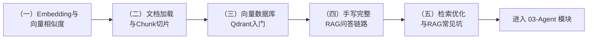

# 模块 02：RAG（检索增强生成）

> 你的实战项目「博客知识库 Agent」的第一核心能力不是 Agent，而是 RAG 质量。本模块从第一性原理（向量相似度）出发，一步步搭出完整的博客问答系统——不依赖任何 RAG 框架，每一行代码你都明白为什么。

## 学习路径

| 章节 | 核心知识点 | 产出 |
| --- | --- | --- |
| （一）Embedding与向量相似度 | 向量化、余弦相似度、语义 vs 关键词 | 手写迷你语义搜索 |
| （二）文档加载与Chunk切片 | md/json/js 统一解析、切片策略、元数据设计 | 博客文章预处理流水线 |
| （三）向量数据库Qdrant入门 | collection/point/payload、检索、过滤 | 掌握向量库四大操作 |
| （四）手写完整RAG问答链路 | 索引构建、RAG Prompt、来源引用、推荐文章 | **可交互的博客问答系统** |
| （五）检索优化与RAG常见坑 | top_k/阈值/查询改写/拒答策略 | 调优方法论 + 坑清单 |

## 本模块的技术选型

| 组件 | 选择 | 原因 |
| --- | --- | --- |
| Embedding | FastEmbed + bge-small-zh-v1.5（本地） | 免费离线、中文效果好、不依赖 PyTorch（DeepSeek 无 Embedding API） |
| 向量数据库 | Qdrant | 学习用内存模式零安装，生产用 Docker，代码完全一致 |
| LLM | DeepSeek（复用 01 模块封装） | 仅第四、五章的生成环节需要 |

## 与实战项目的关系

本模块第四章的代码结构（loader → chunker → embedder → indexer → 问答）就是实战模块（07）博客 Agent 的骨架，区别只在：数据源从本地 `data/` 换成 GitHub 仓库、触发方式从手动换成 Webhook、接口从命令行换成 FastAPI。**把本模块学扎实，实战模块就是水到渠成。**

## 前置条件

- 完成 01-LLM基础 模块（第四、五章会用到 `llm_client.py` 和 Prompt 工程技巧）
- 首次运行会自动从 HuggingFace 下载约 90MB 的向量模型（已配置国内镜像）

## 预计耗时

每章 2~3 小时（含动手作业），整个模块约 1.5~2 周（业余时间）。
