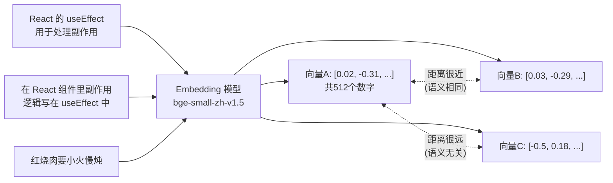
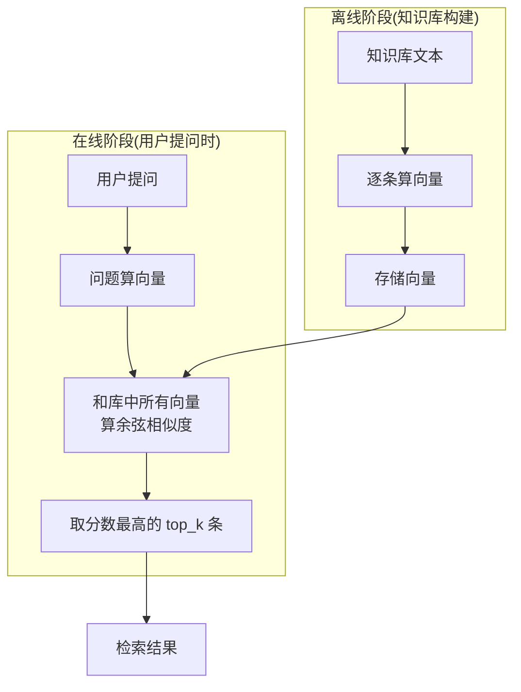

# （一）Embedding 与向量相似度

> 这是 RAG 模块的第一章，也是整个 RAG 技术的「第一性原理」：**语义相近的文本，转成向量后距离也相近**。本章不调用 LLM、不用任何框架，从零理解向量检索。

## 本章目标

- 理解 Embedding（文本向量化）是什么、为什么它能表示语义
- 掌握余弦相似度的计算和经验阈值
- 亲手实现一个最迷你的语义搜索引擎——RAG 检索的核心原型
- 认识本课程使用的本地向量模型 FastEmbed + bge-small-zh-v1.5

## 一、Embedding：把文字变成「语义空间中的坐标」

Embedding 模型把任意一段文本映射成一个固定长度的数字向量（本课程用的模型输出 512 维）：



关键认知：

- 单看向量里的某个数字毫无意义，**向量之间的距离才蕴含语义关系**
- Embedding 捕捉的是**语义**而非**关键词**——「构建太慢」能匹配到「webpack 迁移 Vite」，尽管两者没有一个共同的词。这是它优于传统关键词搜索（BM25）的根本原因

## 二、余弦相似度：衡量两个向量有多「像」

\[
\text{cos}(\theta) = \frac{\vec{a} \cdot \vec{b}}{|\vec{a}| \times |\vec{b}|}
\]

只关心向量的「方向」是否一致，不关心长度。取值范围 \([-1, 1]\)：

| 取值 | 含义 | bge 中文模型经验值 |
| --- | --- | --- |
| 接近 1.0 | 语义几乎相同 | > 0.75 高度相关 |
| 中间值 | 有一定关联 | 0.5 ~ 0.75 弱相关 |
| 接近 0 | 语义无关 | < 0.5 基本无关 |

> 这些阈值在第五章「检索优化」会直接用于**拒答策略**：检索分数太低就老实告诉用户「博客里没写过」。

## 三、迷你语义搜索：RAG 检索的原型

记住这个四步流程，后面所有 RAG 系统都是它的放大版：



本章用「逐条暴力计算」实现它——简单直白，但文章多了就慢。第三章会引入**向量数据库 Qdrant** 解决规模化问题。

## 四、为什么选 FastEmbed + bge-small-zh-v1.5？

| 考量 | 说明 |
| --- | --- |
| 免费离线 | 本地 ONNX 推理，不耗 API 额度，没有网络延迟（DeepSeek 不提供 Embedding API） |
| 轻量 | 不依赖庞大的 PyTorch，模型仅约 90MB，Mac 上运行轻快 |
| 中文效果 | bge 系列是智源开源的中文向量模型，中文语义检索质量优秀 |
| 512 维 | 维度数后面建 Qdrant collection 时必须保持一致，记住这个数字 |

> 首次运行会从 HuggingFace 下载模型，国内网络已在根目录 `.env.example` 里配置了镜像 `HF_ENDPOINT=https://hf-mirror.com`（代码里也做了兜底）。
>
> 以后想换成 API 型 Embedding（如阿里云 DashScope 的 text-embedding-v3），只需替换 `embedder.py` 的实现，接口签名不变——这就是封装的意义。

## 五、动手实践

```bash
cd "02-RAG/（一）Embedding与向量相似度/project"
uv sync
uv run python main.py    # 首次运行需下载约90MB模型
```

| 文件 | 说明 |
| --- | --- |
| `project/embedder.py` | Embedding 封装：加载 .env（镜像配置）、懒加载模型、`embed_texts()/embed_one()`。**后续 RAG 章节都会带上它** |
| `project/main.py` | ① 文本变向量 ② 相似度矩阵实验 ③ 迷你语义搜索 |

## 六、动手作业

1. 在演示 2 中加入两句你自己博客的真实标题，观察它们和其他句子的相似度
2. 把演示 3 的 query 换成「数据库容器化部署」，预测哪篇文章会排第一，再运行验证
3. 思考题：「苹果发布了新手机」和「苹果富含维生素」相似度会高吗？运行验证，并思考为什么（提示：上下文消歧）

## 官方文档与延伸阅读

- [FastEmbed 官方文档](https://qdrant.github.io/fastembed/)
- [BAAI bge-small-zh-v1.5 模型主页](https://huggingface.co/BAAI/bge-small-zh-v1.5)
- [OpenAI Embeddings 指南（概念讲解经典）](https://platform.openai.com/docs/guides/embeddings)
- [MTEB 中文向量模型排行榜（选型参考）](https://huggingface.co/spaces/mteb/leaderboard)

## 下一章预告

现在你能对「一句话」做向量检索了，但博客文章动辄几千字——整篇文章算一个向量，语义会被严重稀释（一篇讲 10 个主题的文章，向量是 10 个主题的「平均值」）。下一章 **《（二）文档加载与 Chunk 切片》** 解决 RAG 质量的第一道关卡：如何把 md / json / js 三种格式的文章解析、切成大小合适的语义片段。
