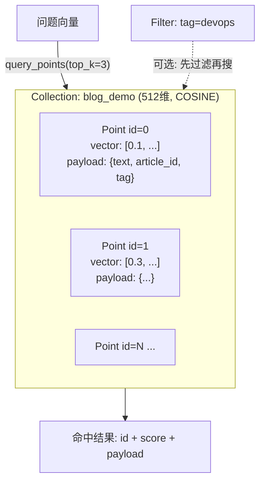
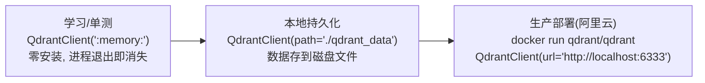

# （三）向量数据库 Qdrant 入门

> 第一章「逐条暴力算相似度」在文章多了之后会越来越慢，而且向量存在内存里、进程一退出就没了。向量数据库解决规模化与工程化问题——本章学习 Qdrant 的四个核心操作，它们覆盖了 RAG 系统 95% 的向量库使用场景。

## 本章目标

- 理解向量数据库解决什么问题（ANN 索引、持久化、过滤）
- 掌握 Qdrant 四大核心操作：建集合、写入、检索、过滤检索
- 理解 payload 元数据与上一章 chunk 元数据的对应关系
- 了解三种部署形态：内存模式 → 本地文件 → Docker 服务

## 一、为什么需要向量数据库

| 痛点（暴力计算） | 向量数据库的解法 |
| --- | --- |
| 文章多了线性变慢（O(n) 全量计算） | HNSW 等 ANN 索引，毫秒级近似最近邻检索 |
| 向量存内存，进程退出即丢失 | 持久化存储 |
| 无法「先按标签过滤再搜索」 | payload 元数据过滤与向量检索原生结合 |
| 更新一条要重建全部 | 按 id 增删改（upsert/delete）——动态知识库的基础 |

## 二、Qdrant 核心概念（类比关系数据库）

| Qdrant | 类比 MySQL | 说明 |
| --- | --- | --- |
| Collection | 表 | 一组向量的集合，创建时声明**维度**和**距离度量** |
| Point | 行 | 一条数据 = `id` + `vector` + `payload` |
| payload | 其他列 | 任意 JSON 元数据，检索时随结果返回 |
| query_points | SELECT ... ORDER BY 相似度 LIMIT k | 向量检索 |
| Filter | WHERE | 元数据过滤，可与向量检索组合 |



两个必须记住的点：

1. **collection 的维度必须等于 Embedding 模型的输出维度**（bge-small-zh-v1.5 = 512），不一致直接报错
2. **upsert 按 id 覆盖**——文章更新后用相同 id 重写即可，这是实战模块「动态 RAG」的基础

## 三、三种部署形态（代码完全一样，只改连接参数）



本章用内存模式专注学 API；下一章改用本地持久化模式（`path=`）；实战模块部署 Docker 服务端：

```bash
# 实战模块会用到（现在不需要执行）
docker run -p 6333:6333 -p 6334:6334 -v $(pwd)/qdrant_storage:/qdrant/storage qdrant/qdrant
# 自带 Web 控制台：http://localhost:6333/dashboard
```

## 四、动手实践

```bash
cd "02-RAG/（三）向量数据库Qdrant入门/project"
uv sync
uv run python main.py
```

| 文件 | 说明 |
| --- | --- |
| `project/embedder.py` | 与第一章相同的 Embedding 封装 |
| `project/main.py` | 四个演示：建集合 / upsert / 检索 / 过滤检索 |

## 五、动手作业

1. 把演示 3 的 `limit` 改成 6（等于全部点数），观察 score 从高到低的完整分布
2. 给 payload 增加一个 `year` 字段（如 2025），写一个「只搜 2025 年文章」的过滤检索
3. 用相同的 id 再 upsert 一条不同文本的点，验证「覆盖」行为（检索看旧文本是否消失）

## 官方文档与延伸阅读

- [Qdrant 官方文档](https://qdrant.tech/documentation/)
- [Qdrant Quickstart（本地模式）](https://qdrant.tech/documentation/quickstart/)
- [Qdrant Semantic Search 101 教程](https://qdrant.tech/documentation/beginner-tutorials/search-beginners/)
- [Qdrant Filtering 文档（过滤语法全集）](https://qdrant.tech/documentation/concepts/filtering/)
- [HNSW 算法图解（理解 ANN 为什么快）](https://www.pinecone.io/learn/series/faiss/hnsw/)

## 下一章预告

材料全部就绪：第一章会算向量、第二章会切文章、本章会用向量数据库。下一章 **《（四）手写完整 RAG 问答链路》** 把它们串成一条龙：加载博客文章 → 切片 → 向量化 → 入库 → 用户提问 → 检索 → LLM 生成带来源的回答——你的博客知识库问答第一次真正跑起来。
