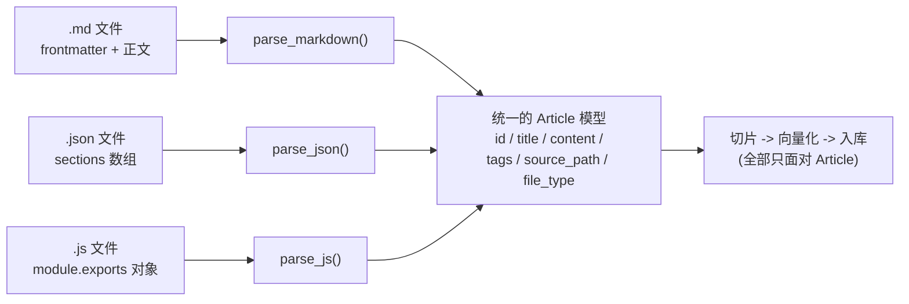
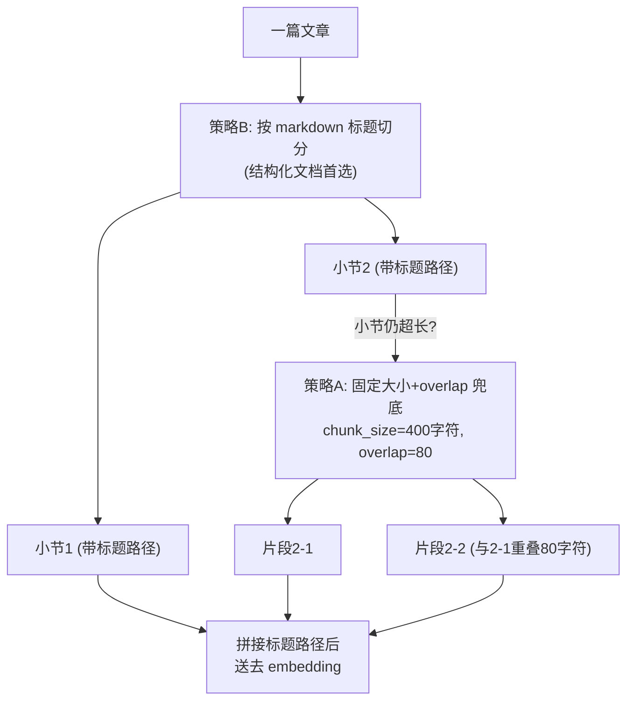

# （二）文档加载与 Chunk 切片

> RAG 系统的质量上限，在数据预处理阶段就被决定了。「Garbage in, garbage out」——切片切得差，后面检索、生成做得再好也救不回来。本章处理的 md / json / js 三种格式，正是你博客 GitHub 仓库的真实场景。

## 本章目标

- 把三种格式的文章统一解析成标准的 `Article` 数据模型
- 理解「为什么不能整篇文章直接 embedding」
- 掌握两种切片策略：固定大小+重叠、按标题层级切分
- 设计 chunk 的元数据——这是后面「来源引用」和「推荐文章」的基础

## 一、第一步：统一数据模型

不同格式的文章，先全部解析成同一个结构，后续所有处理只面对它：



三种解析器的思路：

| 格式 | 解析方式 |
| --- | --- |
| `.md` | 手写极简 frontmatter 解析（两条 `---` 之间的 key: value），正文即 markdown |
| `.json` | `json.loads` 后把 `sections` 数组还原成 markdown（`## heading` + 段落），与 md 共用后续逻辑 |
| `.js` | Python 无法执行 JS，用正则提取 `module.exports` 的字段（content 约定放在反引号模板字符串里） |

> 实战模块会讨论 js 解析的升级方案：起一个 Node 子进程执行后输出 JSON。

## 二、为什么必须切片（Chunking）？

整篇文章直接 embedding 有三个致命问题：

1. **语义稀释**：一篇讲 5 个主题的文章，向量是 5 个主题的「平均值」，哪个主题都搜不准
2. **token 浪费**：检索命中后要把内容塞进 Prompt，整篇塞既贵又挤占上下文窗口
3. **定位粒度**：用户问的往往是文章中「某一小节」的内容

核心权衡只有一句话：**切得太大语义稀释，切得太小上下文残缺。**

## 三、两种切片策略



### 策略 A：固定大小 + 重叠（overlap）

- `chunk_size=400` 字符：中文场景 300~500 较常用（注意 bge-small 模型输入上限 512 token）
- `overlap=80` 字符：相邻片段重叠一段，防止完整句子恰好被切断在边界上，两边都「断章取义」
- 实现细节：优先在句号/换行等自然边界断开，而不是拦腰硬切

### 策略 B：按标题层级切分（本课程主力策略）

把 `##`/`###` 标题作为天然的语义边界，并维护**标题路径**（`heading_path`）：

```text
切片文本 = "webpack 迁移 Vite 实录 > 三个迁移大坑 > 坑一：CommonJS 依赖处理
           老项目里有不少 require 写法的依赖包……"
```

**把标题路径拼进切片文本一起 embedding** 是一个低成本高收益的技巧：用户提问的表述往往和标题接近（"迁移 Vite 有什么坑？"），标题是高质量的语义信号。

## 四、Chunk 元数据设计

```python
@dataclass
class Chunk:
    article_id: str        # 来自哪篇文章 -> 用于「推荐文章链接」
    title: str             # 文章标题
    content: str           # 切片文本（embedding 的输入）
    chunk_index: int       # 文内序号
    heading_path: list[str]  # 在文章的哪个小节 -> 用于「来源定位」
    tags: list[str]
```

设计原则：检索命中一个 chunk 后，必须能立刻回答「**它来自哪篇文章、在文章哪个位置**」——这是博客 Agent 返回 `sources` 和 `recommendedArticles` 的数据基础。

## 五、动手实践

```bash
cd "02-RAG/（二）文档加载与Chunk切片/project"
uv sync
uv run python main.py
```

| 文件 | 说明 |
| --- | --- |
| `project/data/` | 6 篇模拟博客文章：4 篇 `.md`、1 篇 `.json`、1 篇 `.js`（模拟你的真实仓库） |
| `project/loader.py` | 三种格式的解析器 + 统一的 `Article` 模型 |
| `project/chunker.py` | 两种切片策略 + `Chunk` 元数据设计 |
| `project/main.py` | 三个演示：统一解析 / 策略对比 / 全量切片产物 |

## 六、动手作业

1. 往 `data/` 里加一篇你自己博客的真实 md 文章，运行看切片结果是否合理
2. 把 `chunk_size` 改成 100 再运行演示 3，观察 chunk 数量和内容完整性的变化，体会切片粒度的权衡
3. 给 `Chunk` 增加一个 `char_count` 字段，在演示 3 的表格中展示

## 官方文档与延伸阅读

- [Pinecone：Chunking Strategies 经典长文](https://www.pinecone.io/learn/chunking-strategies/)
- [LangChain Text Splitters 概念（了解工业界的切片抽象）](https://python.langchain.com/docs/concepts/text_splitters/)
- [MDN：使用 frontmatter 的文档约定（YAML front matter）](https://jekyllrb.com/docs/front-matter/)

## 下一章预告

切片已经备好，但上一章「逐条暴力算相似度」的检索方式撑不起规模化（你的博客文章会越来越多）。下一章 **《（三）向量数据库 Qdrant 入门》** 引入专业的向量数据库：毫秒级近似最近邻检索、元数据过滤、持久化存储。
