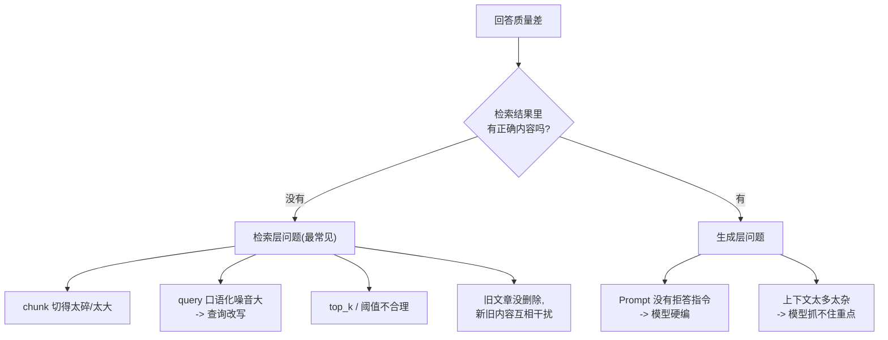
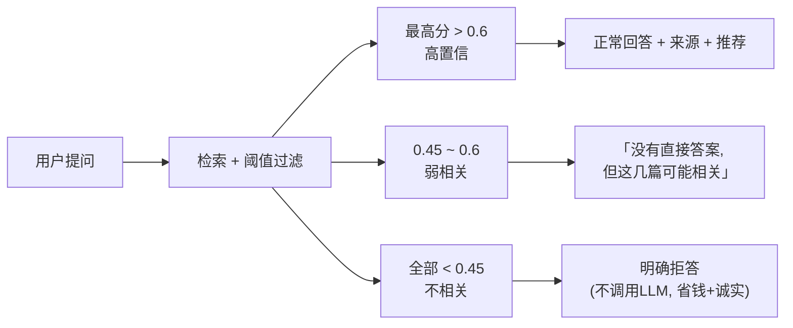

# （五）检索优化与 RAG 常见坑

> RAG 系统出问题时，**90% 的原因在检索，不在生成**。模型回答得不好，多半是因为喂给它的上下文就是错的。本章用 4 个实验掌握最重要的检索调优手段，并系统盘点 RAG 的常见坑——这是面试和实际工作中最能体现 RAG 功力的部分。

## 本章目标

- 通过实验理解 top_k、score 阈值的权衡与「三档回答策略」
- 掌握查询改写（Query Rewrite）——成本最低、收益最明显的优化
- 了解 bge 模型的查询指令前缀等「模型特定技巧」
- 建立 RAG 排查问题的检查清单

## 一、先建立排查思维：问题出在哪一层？



**排查 RAG 永远先看检索结果，再看模型回答。** 这就是为什么上一章的代码会把检索分数打印出来。

## 二、四个实验对应的调优手段

### 实验 1：top_k 的权衡

| top_k | 问题 |
| --- | --- |
| 太小（1） | 召回不足，关键信息可能在第 2、3 名里 |
| 太大（8+） | 弱相关内容混进上下文，干扰模型、浪费 token |

经验起点：**top_k=3~5 + 分数阈值过滤**。没有万能值，必须按自己的数据实测（08 评估模块教你科学地测）。

### 实验 2：score 阈值与三档回答策略

相关问题和无关问题的检索分数之间通常有明显「鸿沟」，阈值就卡在鸿沟中间：



### 实验 3：查询改写（Query Rewrite）

真实用户提问：「那个，我记得你之前写过一篇讲打包贼慢的优化的文章来着？」——语气词和废话会严重拉低向量相似度。

解法：先用 LLM 把问题改写成检索友好的查询（「前端构建工具 打包速度优化」），再去检索。代价是一次额外的 LLM 调用（延迟 +几百ms），收益通常远大于成本。多轮对话场景还需要改写时**补全指代**（「它怎么配置？」→「Vite 怎么配置？」）。

### 实验 4：模型特定技巧——bge 查询指令前缀

bge 中文模型官方约定：短查询检索长文档时，查询侧加前缀 `为这个句子生成表示以用于检索相关文章：`（文档侧不加）。小幅但稳定的提升。**用任何 Embedding 模型前先读模型卡（model card）。**

## 三、RAG 常见坑清单（收藏级）

1. **chunk 切得差**：太碎导致上下文残缺、太大导致语义稀释（第二章的权衡）
2. **metadata 不完整**：检索命中了却无法溯源到文章/小节，来源引用做不了
3. **top_k 一把梭**：从不实验，直接抄网上的数字
4. **query 不改写**：口语化、带指代的问题直接拿去检索
5. **旧数据不删除**：文章更新后旧向量还在库里，新旧版本互相干扰（实战模块用稳定 ID + 删除逻辑解决）
6. **相似文章互相干扰**：多篇文章讲同一主题时，检索结果全是同一篇的切片——可按 `article_id` 做多样性约束
7. **没有拒答机制**：检索为空还让模型硬答，幻觉的最大来源
8. **凭感觉调优**：没有评估集，改了参数不知道是变好还是变坏（06 模块解决）

## 四、动手实践

```bash
cd "02-RAG/（五）检索优化与RAG常见坑/project"
uv sync
uv run python main.py    # 实验3需要 LLM，其余离线可跑
```

| 文件 | 说明 |
| --- | --- |
| `project/main.py` | 四个实验：top_k / 阈值与拒答 / 查询改写 / 指令前缀 |
| 其余文件 | 与第四章相同的 RAG 基础设施（自包含复制） |

## 五、动手作业

1. 用 5 个你自己想的问题跑实验 2，统计「相关/无关」的分数分布，为这套数据定出你自己的阈值
2. 把实验 3 的改写 Prompt 改成「同时生成 3 个不同表述的查询」，分别检索后合并去重（这就是 Multi-Query 技巧）
3. 思考题：查询改写增加了一次 LLM 调用的延迟，聊天产品里怎么缓解？（提示：流式输出的首字时间、改写用更小的模型）

## 官方文档与延伸阅读

- [bge 模型使用说明（查询指令前缀的出处）](https://huggingface.co/BAAI/bge-small-zh-v1.5#using-with-fastembed)
- [LangChain：Query Transformations 博文](https://blog.langchain.dev/query-transformations/)
- [Qdrant：Hybrid Search 文档（关键词+向量混合检索，进阶）](https://qdrant.tech/documentation/concepts/hybrid-queries/)
- [Anthropic：Contextual Retrieval（切片上下文增强，进阶必读）](https://www.anthropic.com/news/contextual-retrieval)

## 模块小结与下一模块预告

02 模块完成！你已经能独立构建一个质量过关的 RAG 问答系统了。

但目前的流程是**固定的**：不管用户问什么都先检索再回答——用户说「谢谢」也要去向量库里搜一圈。下一模块 **《03-Agent》** 引入质变：让模型**自主决定**「要不要检索、检索什么、检索几次、要不要换个关键词重试」——从「流水线」进化成「有判断力的助手」。
