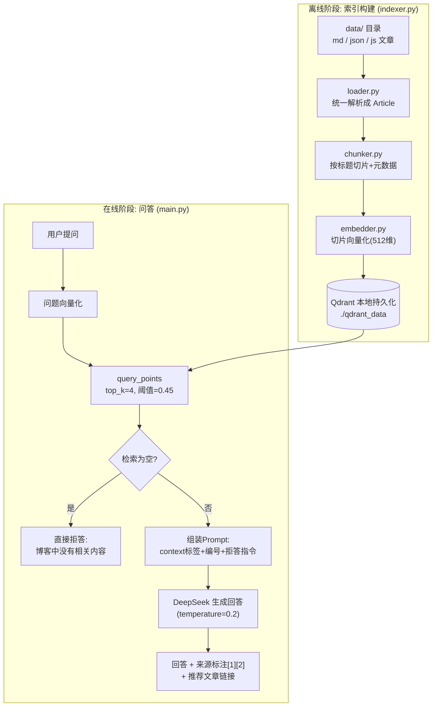

# （四）手写完整 RAG 问答链路

> 本章是 02 模块的里程碑：把前三章的所有积木（embedding、切片、向量库）和 01 模块的 LLM 能力拼成一条完整的 RAG 流水线。运行起来后，你将第一次体验「模型基于你的博客内容回答问题，并给出来源和推荐文章」——这就是你实战项目的核心原型。

## 本章目标

- 打通 RAG 的两个阶段：离线索引构建 + 在线问答
- 掌握 RAG Prompt 的三个关键设计：上下文隔离、来源标注、拒答指令
- 实现「推荐文章」逻辑：检索结果按文章去重排序
- 理解「稳定 Point ID」的设计——为后面动态更新知识库埋下伏笔

## 一、全景架构图（务必看懂再写代码）



## 二、在线阶段的三个核心设计

### 1. RAG Prompt 的写法（01 模块技巧的集中应用）

```text
system: 你是技术博客的AI助手。严格根据 <context> 中的片段回答。
        规则：
        1. 只使用 <context> 中的信息，不要编造          ← 抑制幻觉的核心
        2. 回答时用 [1][2] 标注信息来源                  ← 可溯源
        3. 上下文不足时诚实说「没有找到相关内容」          ← 拒答指令
user:   <context>
        [1] 出自文章《webpack迁移Vite实录》的「坑一」小节：...
        [2] 出自文章《...》：...
        </context>
        用户问题：前端构建太慢怎么办？
```

三个设计缺一不可：**`<context>` 标签隔离**（防注入）、**编号引用**（前端可以渲染成可点击的引用角标）、**明确拒答指令**（宁可说不知道，不要编）。

### 2. 检索为空的兜底

`score_threshold=0.45`：低于阈值的命中直接丢弃。全部被丢弃时**不调用 LLM**，直接返回「没有找到相关内容」——这是 RAG 系统诚实性的底线，也避免无意义的 token 消耗。

### 3. 推荐文章 = 检索结果按文章去重

多个切片可能来自同一篇文章：按 `article_id` 去重，取该文章所有命中切片的**最高分**作为推荐分，按分排序后拼接出博客 URL。这正是你博客聊天框要展示的 `recommendedArticles` 数据。

## 三、离线阶段的关键细节：稳定 Point ID

```python
def stable_point_id(article_id: str, chunk_index: int) -> str:
    return str(uuid.uuid5(uuid.NAMESPACE_URL, f"{article_id}#{chunk_index}"))
```

用 `uuid5`（基于内容的确定性 UUID）：同一篇文章的同一个切片，**永远生成同一个 ID**。重新索引时 upsert 自动覆盖旧数据而不是追加重复数据。文章更新 → 重新切片 → 相同 ID 覆盖入库，这就是实战模块「动态 RAG」的雏形。

## 四、动手实践

```bash
cd "02-RAG/（四）手写完整RAG问答链路/project"
uv sync
uv run python main.py        # 首次运行自动构建索引，然后进入交互问答
uv run python indexer.py     # （可选）文章变更后手动重建索引
```

| 文件 | 说明 |
| --- | --- |
| `project/data/` | 6 篇示例文章（同第二章） |
| `project/loader.py` `chunker.py` `embedder.py` | 前几章建立的能力（自包含复制） |
| `project/llm_client.py` | 01 模块建立的 LLM 封装 |
| `project/indexer.py` | 离线阶段：构建索引（可单独运行） |
| `project/main.py` | 在线阶段：交互式问答（检索 → 生成 → 来源 → 推荐） |

推荐试这些问题，并观察检索分数（`[dim]` 灰色部分）：

- 为什么 useEffect 在开发环境会执行两次？（高分命中）
- 前端项目构建太慢怎么优化？（语义匹配，问题里没有 vite/webpack 字样）
- 今天天气怎么样？（应该触发拒答）

## 五、动手作业

1. 问一个「博客里没有」的技术问题（如 Rust 所有权），验证拒答是否生效；再把 `SCORE_THRESHOLD` 改成 0，观察会发生什么（弱相关内容被强行用来回答——体会阈值的价值）
2. 往 `data/` 加一篇你自己的真实博客文章，运行 `indexer.py` 重建索引后提问验证
3. 把 `BLOG_URL_TEMPLATE` 改成你的真实博客域名格式

## 官方文档与延伸阅读

- [OpenAI RAG / Retrieval 最佳实践](https://platform.openai.com/docs/guides/retrieval)
- [Qdrant：构建 RAG 系统教程](https://qdrant.tech/documentation/rag-deepseek/)
- [Anthropic：Reducing hallucinations 指南](https://docs.anthropic.com/en/docs/test-and-evaluate/strengthen-guardrails/reduce-hallucinations)

## 下一章预告

系统能跑了，但「能跑」和「好用」之间还差一个调优阶段：top_k 取多少合适？阈值定多少？用户的口语化提问检索不到怎么办？下一章 **《（五）检索优化与 RAG 常见坑》** 用实验的方式回答这些问题——这也是面试和实际工作中最能体现 RAG 功力的部分。
