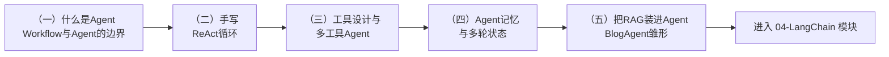

# 模块 03：Agent

> 「Agent」是这套课程的主角，但我们直到第三个模块才正式讲它——因为没有 01 的工具调用和 02 的 RAG 打底，学 Agent 只能停留在「调框架」的层面。本模块不用任何框架，手写 Agent 的每一个零件，最后组装出你实战项目的第一个完整原型：BlogAgent。

## 学习路径

| 章节 | 核心知识点 | 产出 |
| --- | --- | --- |
| （一）什么是Agent | 增强型LLM / Workflow / Agent 三层定义、5种Workflow模式 | 概念地基（纯理论章节） |
| （二）手写ReAct循环 | Thought/Action/Observation、文本协议、stop序列 | 不用任何 API 特性的原始 Agent |
| （三）工具设计与多工具Agent | @tool装饰器、注册表、错误自我纠正、安全边界 | 可复用的 Agent 类 + 工具设计方法论 |
| （四）Agent记忆与多轮状态 | 滑动窗口、LLM摘要压缩、token预算 | 两级记忆管理器 |
| （五）BlogAgent雏形 | RAG工具化、自主决策、记忆与工具循环组装 | **实战项目的核心原型** |

## 本模块的核心观点

1. **不要为了用 Agent 而用 Agent**——Workflow 能解决的问题（步骤可枚举），Workflow 永远是更便宜、更可控的方案
2. **Agent = 循环 + 工具 + 自主决策**——核心循环不到 100 行代码，神秘感到此为止
3. **工具设计是 Agent 工程最被低估的技能**——Agent 的能力上限取决于工具的质量，而不只是模型
4. **错误也是信息**——工具报错喂给模型，它会自我纠正；这是 Agent 健壮性的来源

## 前置条件

- 完成 01-LLM基础（特别是第四章 Function Calling）
- 完成 02-RAG（第五章会直接复用其全部基础设施）

## 预计耗时

每章 2~3 小时（第一章纯阅读约 1 小时），整个模块约 1.5 周（业余时间）。
