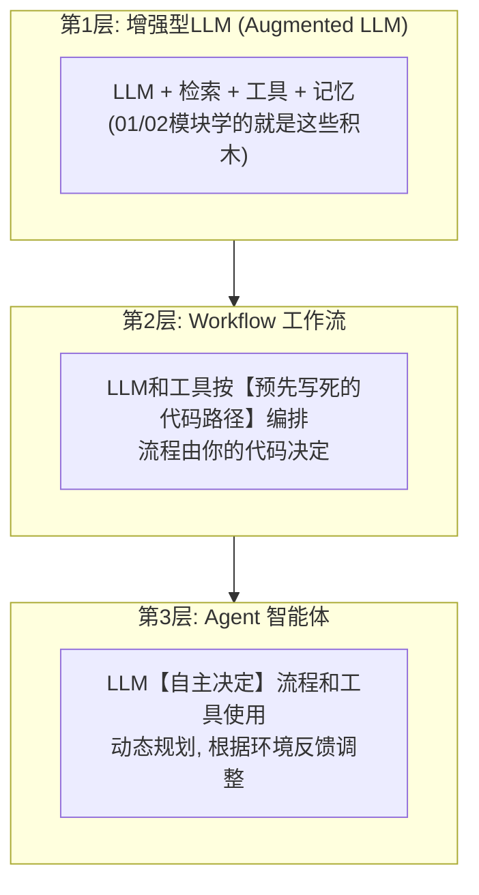
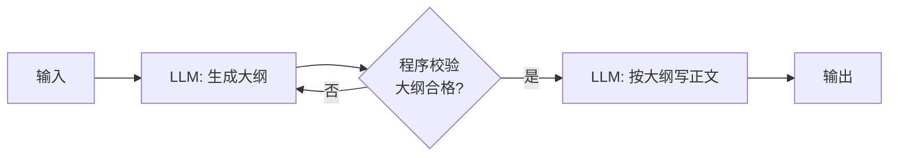
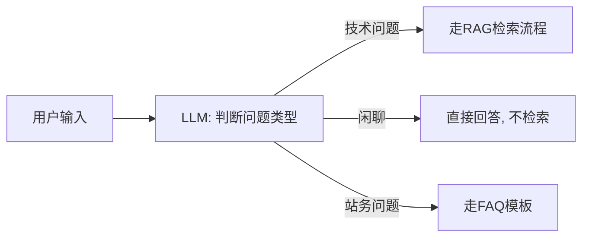
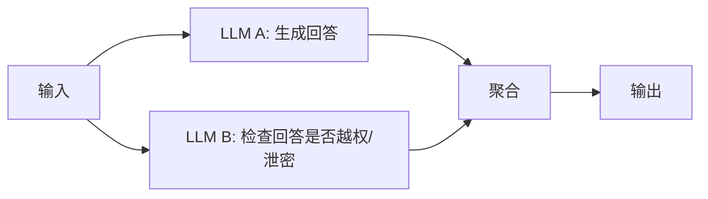
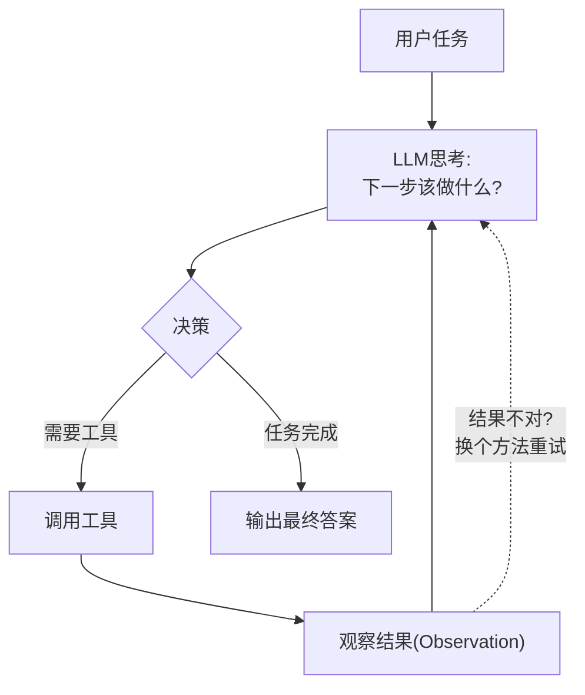
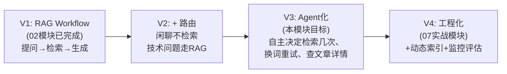

# （一）什么是 Agent：Workflow 与 Agent 的边界

> 这是一个纯概念章节（没有配套代码），却可能是整个模块最重要的一章。「Agent」这个词在网上被严重滥用——搞清楚它的准确边界，你就能避开 90% 的学习弯路，也能在技术选型时做出正确判断。本章的核心思想来自 Anthropic 的经典文章《Building effective agents》，强烈建议精读原文。

## 本章目标

- 准确区分三个概念：增强型 LLM、Workflow、Agent
- 认识 5 种经典 Workflow 模式（它们能解决大部分问题！）
- 建立判断标准：什么时候该用 Workflow，什么时候才需要 Agent
- 对照你的博客项目，规划「从 Workflow 演进到 Agent」的路径

## 一、三个概念的准确定义

| | Workflow | Agent |
| --- | --- | --- |
| 流程由谁决定 | **你的代码**（if/else、固定步骤） | **LLM 自己**（每一步都由模型决策） |
| 可预测性 | 高，每次走一样的路径 | 低，路径动态变化 |
| 成本与延迟 | 可控 | 不可控（可能多轮循环） |
| 调试难度 | 容易 | 难 |
| 适合场景 | 任务步骤明确、可枚举 | 步骤无法预知、需要探索 |

> Anthropic 原文的定义：「Workflows are systems where LLMs and tools are orchestrated through predefined code paths. Agents are systems where LLMs dynamically direct their own processes and tool usage.」

**02 模块第四章写的 RAG 问答就是一个标准的 Workflow**：提问 → 检索 → 生成，固定三步，每次都一样。它不是 Agent，但它已经很有用了——这正是本章想传递的第一个观点：**不要为了「用上 Agent」而用 Agent。**

## 二、5 种经典 Workflow 模式

Anthropic 总结的 5 种模式，按复杂度递增。**大多数生产系统用前三种就够了。**

### 1. 提示链（Prompt Chaining）：把任务拆成串行步骤

适合：任务能拆成「每步都更简单」的子任务（如：先大纲后正文、先翻译后润色）。

### 2. 路由（Routing）：先分类，再分流

适合：输入有明显类别，且各类别的最优处理方式不同。**你的博客聊天框就该用它**——用户说「谢谢」不应该去向量库里搜一圈。

### 3. 并行化（Parallelization）：同时跑多个 LLM 再聚合

两种用法：**分片**（把大任务切给多个 LLM 同时做）和**投票**（同一任务跑多次取多数）。

### 4. 协调者-执行者（Orchestrator-Workers）

中心 LLM 动态拆解任务，分发给多个执行 LLM，再汇总结果。和并行化的区别：子任务**不是预先定义的**，由协调者按输入动态决定。

### 5. 评估者-优化者（Evaluator-Optimizer）

一个 LLM 生成，另一个 LLM 按明确标准评估打回重做，循环直到达标。适合：有明确评估标准、且迭代确实能提升质量的场景（如翻译润色、代码生成+测试）。

## 三、那 Agent 到底长什么样？

Agent 的本质是一个**循环**：LLM 在循环中自主决定下一步做什么，根据工具返回的真实反馈调整计划，直到判断任务完成：

是不是很眼熟？**01 模块第四章的 `run_with_tools()` 循环就是 Agent 的雏形**——区别只在于：那时工具只有几个、任务简单；当工具变多、任务变复杂、需要多步规划时，同样的循环就「涌现」出 Agent 的行为。

判断你需要 Agent 的信号：

- 任务步骤**无法预先枚举**（用户的问题千奇百怪，处理路径不可穷举）
- 需要**根据中间结果调整策略**（第一次检索没找到 → 换关键词再试）
- 愿意为灵活性付出**成本、延迟、可预测性**的代价

## 四、对照你的博客项目：演进路径

这个「先 Workflow 后 Agent」的演进顺序就是 Anthropic 的核心建议：**find the simplest solution possible**——从最简单的方案开始，只在确实需要时增加复杂度。

## 五、动手作业（思考题）

1. 用本章的判断标准分析：「GitHub 文章更新 → 自动重建索引」应该做成 Workflow 还是 Agent？为什么？（提示：步骤是否可枚举）
2. 你的博客聊天框收到这三类输入：「谢谢」「useEffect为什么执行两次」「帮我把博客文章全删了」——分别该走什么路径？画出你的路由设计
3. 精读 Anthropic 原文（下方链接），找出文中「不要使用 Agent 框架」论述的两个理由

## 官方文档与延伸阅读

- [Anthropic：Building effective agents（本章思想来源，必读）](https://www.anthropic.com/research/building-effective-agents)
- [Anthropic：Building effective agents 中文翻译参考](https://docs.anthropic.com/zh-CN/docs/build-with-claude/agents)
- [OpenAI：A practical guide to building agents（PDF 指南）](https://cdn.openai.com/business-guides-and-resources/a-practical-guide-to-building-agents.pdf)
- [LangGraph：Workflows and Agents（看工业框架如何实现这些模式）](https://langchain-ai.github.io/langgraph/tutorials/workflows/)

## 下一章预告

概念清楚了，动手造一个。下一章 **《（二）手写 ReAct 循环》** 不依赖任何框架、甚至不用 Function Calling API，纯靠 Prompt 实现 Agent 的鼻祖模式——ReAct（Reason + Act）。亲手写过一遍循环，你对 Agent 的理解会从「知道」变成「懂得」。
