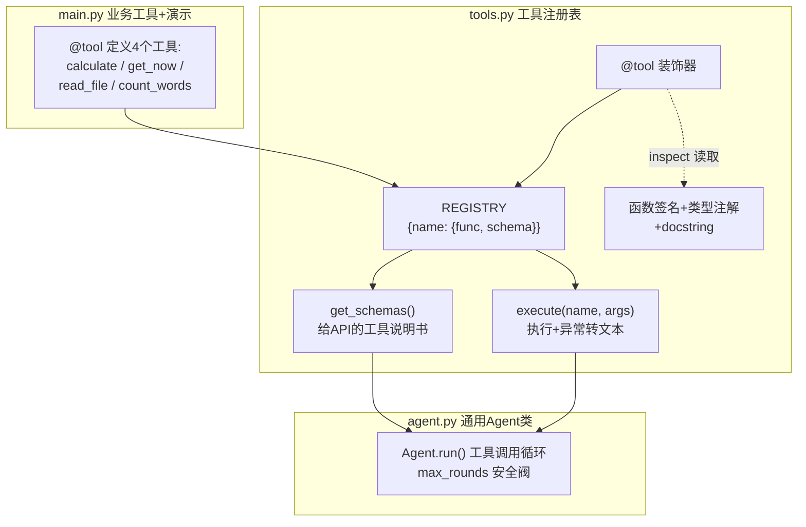
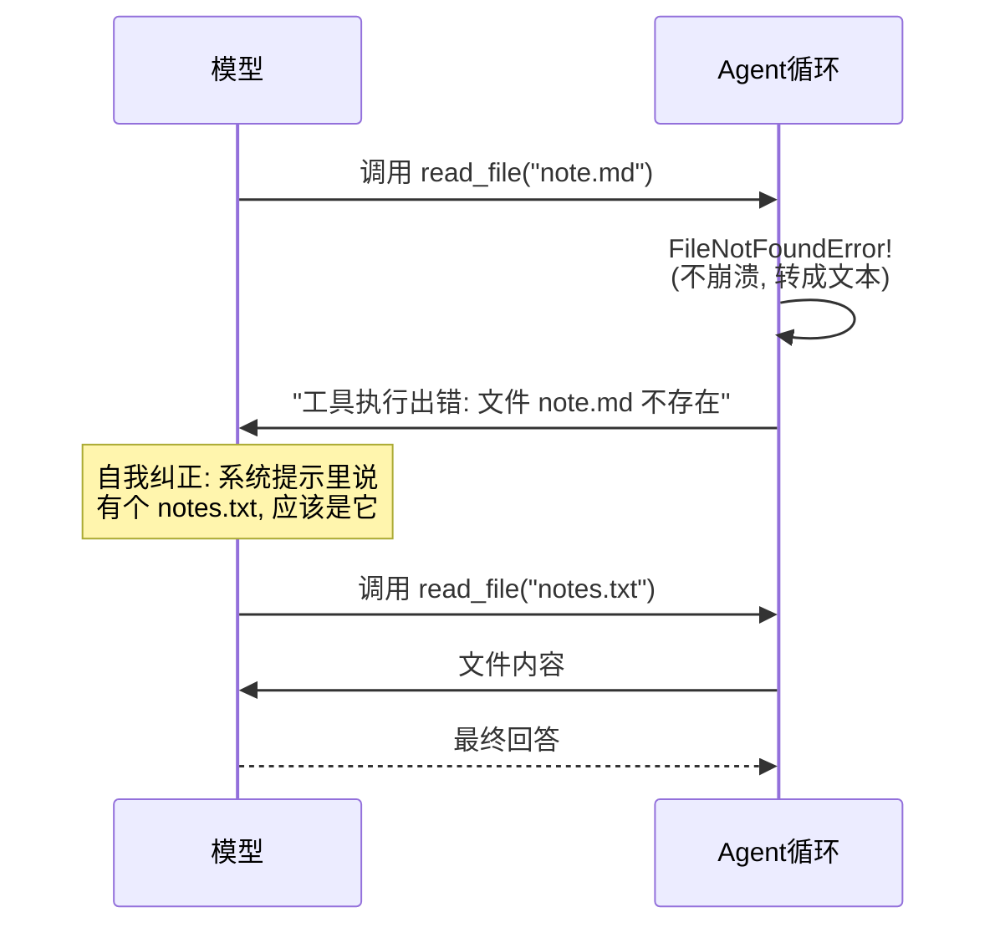

# （三）工具设计与多工具 Agent

> 上一章的文本协议帮你看清了 Agent 循环的本质，本章回到生产级写法：Function Calling + 工具注册表 + 错误自我纠正。**工具设计是 Agent 工程中最被低估的技能**——Agent 的能力上限，往往不取决于模型多强，而取决于工具设计得多好。

## 本章目标

- 用 Function Calling 重写 Agent 循环（结构化、可靠）
- 实现 `@tool` 装饰器 + 注册表：写函数即得 schema，永不失同步
- 掌握「错误也是信息」的设计哲学：工具报错喂给模型自我纠正
- 学习工具设计的核心原则（命名、描述、参数、安全边界）

## 一、本章架构：三个文件各司其职



### @tool 装饰器：代码即文档

```python
@tool(param_desc={"filename": "文件名（相对于项目目录），如 'notes.txt'"})
def read_file(filename: str) -> str:
    """读取项目目录下指定文本文件的内容。用户要求查看、总结、分析某个文件时使用。"""
    ...
```

装饰器用 `inspect` 模块读取函数签名，自动生成上一模块手写的那份 JSON schema：函数名 → 工具名、docstring → 描述、类型注解 → 参数类型、无默认值 → required。**函数改了，schema 自动跟着变**——手写 schema「忘了同步」的 bug 从根上消失。

## 二、「错误也是信息」：Agent 工程最重要的设计哲学

工具执行失败时，新手的做法是让程序崩溃或返回 500。正确的做法：

```python
def execute(name: str, arguments: dict) -> str:
    try:
        return str(REGISTRY[name]["func"](**arguments))
    except Exception as e:
        return f"工具执行出错：{type(e).__name__}: {e}"   # 错误转成文本喂给模型
```



模型的自我纠正能力很强，但有个前提：**错误信息要写得「对模型有用」**。对比一下：

- 差：`Error: ENOENT`
- 好：`文件 note.md 不存在。请确认文件名是否正确。`

错误信息也是 Prompt 工程的一部分。

## 三、工具设计核心原则（收藏级）

1. **命名**：动词开头、见名知意。`search_blog` 好于 `blog_tool`
2. **描述**：docstring 回答「什么场景该用我」，而不是复述函数名。模型靠它做工具选择
3. **参数**：越少越好；每个参数给清晰描述和示例值（`param_desc`）
4. **粒度**：一个工具做一件事。「搜索+总结+翻译」三合一的工具，模型用不好
5. **安全边界**：工具内部做防御——本章 `read_file` 的路径穿越校验就是例子：

```python
if not str(path).startswith(str(BASE_DIR.resolve())):
    raise PermissionError("禁止访问项目目录以外的文件")
```

> 想一想：Agent 的输入来自用户，用户可能让它读 `../../.env`。**工具是 Agent 的权限边界**，每个有副作用的工具都要假设「参数可能是恶意的」。

6. **幂等性优先**：查询类工具随便重试；写入/删除类工具要慎重（实战模块会引入确认机制）

## 四、动手实践

```bash
cd "03-Agent/（三）工具设计与多工具Agent/project"
uv sync
uv run python main.py
```

| 文件 | 说明 |
| --- | --- |
| `project/tools.py` | `@tool` 装饰器、注册表、`execute()` 异常转文本 |
| `project/agent.py` | 通用 `Agent` 类（Function Calling 循环 + 安全阀 + 过程日志） |
| `project/main.py` | 4 个工具定义 + 3 个演示（schema 生成 / 多工具协作 / 错误自我纠正） |
| `project/notes.txt` | 演示用的示例文件 |

重点观察演示 3：模型读取不存在的 `note.md` 失败后，如何根据错误信息自动改用 `notes.txt` 重试。

## 五、动手作业

1. 用 `@tool` 新增一个 `list_files()` 工具（列出项目目录的文件），然后再跑演示 3——观察模型是否会先 list 再 read（工具多了，纠正策略会更聪明）
2. 把 `read_file` 的错误信息改成英文缩写风格（如 `ENOENT`），对比模型纠正成功率的变化
3. 思考题：如果某个工具是 `delete_article(article_id)`，你会加哪些防护？（提示：确认机制、白名单、软删除）

## 官方文档与延伸阅读

- [Anthropic：Writing effective tools for AI agents（工具设计最佳实践，必读）](https://www.anthropic.com/engineering/writing-tools-for-agents)
- [OpenAI Function Calling 指南](https://platform.openai.com/docs/guides/function-calling)
- [Python inspect 模块文档（装饰器实现的原理）](https://docs.python.org/zh-cn/3/library/inspect.html)

## 下一章预告

现在的 Agent 每次 `run()` 都是「失忆」的——任务做完，对话历史就丢了。但真实的聊天场景需要连续对话：「我的博客用什么部署？」「那**它**的数据怎么备份？」——这个「它」需要记忆才能理解。下一章 **《（四）Agent 记忆与多轮状态》** 给 Agent 装上短期记忆，并解决「历史太长撑爆上下文」的工程问题。
