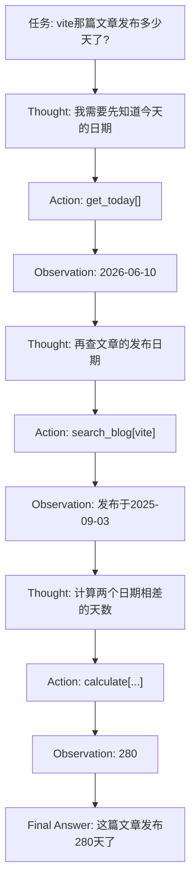
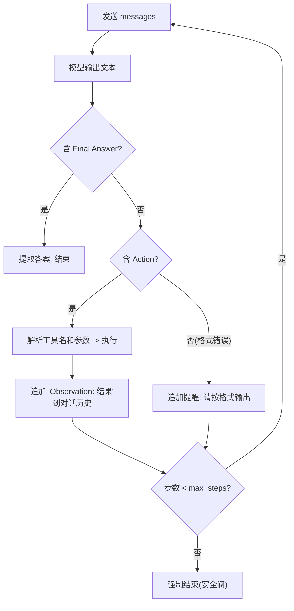

# （二）手写 ReAct 循环

> ReAct（**Re**ason + **Act**）是 Agent 的鼻祖模式，2022 年的论文奠定了今天几乎所有 Agent 框架的基本形态。本章故意不用 Function Calling API、不用任何框架，纯靠 Prompt 文本协议手写一个 ReAct Agent——亲手写过一遍循环，你对 Agent 的理解才会从「知道」变成「懂得」。

## 本章目标

- 理解 ReAct 的核心思想：思考（Thought）→ 行动（Action）→ 观察（Observation）循环
- 用纯 Prompt 文本协议实现 Agent 循环（解析文本、执行工具、回灌结果）
- 掌握 `stop` 序列防止模型「自导自演」的经典技巧
- 理解 Function Calling API 在背后帮你做了什么

## 一、ReAct：让模型「边想边做」

论文的核心洞察：单独的推理（CoT）会脱离现实——模型在脑内推演，错了也不知道；单独的行动没有规划——盲目调用工具。**把两者交替进行**，模型在每次行动后都能根据真实反馈修正思路：



注意：**这个执行顺序没有写在任何代码里**，完全由模型自主规划——这正是上一章定义的 Agent 行为。

## 二、文本协议：用 Prompt 约定输出格式

本章不用 Function Calling API，而是在 System Prompt 里约定一个「文本协议」：

```text
需要使用工具时：
Thought: <思考>
Action: <工具名>[<输入参数>]

可以回答时：
Thought: <总结>
Final Answer: <最终回答>
```

我们的代码用正则解析模型输出：

```python
ACTION_RE = re.compile(r"Action:\s*(\w+)\[(.*?)\]", re.S)
FINAL_RE = re.compile(r"Final Answer:\s*(.*)", re.S)
```

### 关键技巧：用 stop 序列防止模型「自导自演」

模型生成 `Action: ...` 后，经常会**自己接着编一个假的 Observation** 继续往下写（它毕竟是个补全机器）。解法是请求时设置：

```python
stop=["Observation:"]   # 模型一旦想生成 "Observation:" 就立刻截断
```

这样保证 Observation 永远来自**真实的工具执行**，而不是模型的幻觉。

## 三、ReAct 主循环的结构



两个工程细节值得注意：

1. **工具名写错也作为 Observation 喂回**（"不存在名为 xxx 的工具"），模型有很强的自我纠正能力
2. **max_steps 安全阀**：防止「调用 → 失败 → 再调用」的死循环烧钱

## 四、ReAct 文本协议 vs Function Calling

| | 文本协议 ReAct（本章） | Function Calling（01模块四章） |
| --- | --- | --- |
| 参数传递 | 正则从文本里抠，容易出格式问题 | 结构化 JSON，模型经过专门训练 |
| 可靠性 | 依赖模型听话程度 | API 层面保证格式 |
| 透明度 | 全程可见，教学价值极高 | SDK 封装了细节 |
| 实际生产 | 基本被淘汰 | **主流方案** |

结论：**理解用文本协议，生产用 Function Calling。** 下一章就把这个循环迁移到 Function Calling 上，并解决「工具变多了怎么管理」的问题。

## 五、动手实践

```bash
cd "03-Agent/（二）手写ReAct循环/project"
uv sync
uv run python main.py
```

| 文件 | 说明 |
| --- | --- |
| `project/llm_client.py` | LLM 封装（同 01 模块） |
| `project/main.py` | ReAct System Prompt + 文本解析 + 主循环 + 3 个工具 |

运行后重点观察每一步的 Panel 输出：模型的 Thought 是怎么根据上一步 Observation 调整的。

## 六、动手作业

1. 把问题换成「博客里有讲 docker 的文章吗？它发布多久了？」，观察模型的规划顺序有何不同
2. 故意把 `search_blog` 改成永远返回「没有找到相关文章」，观察模型会重试几次、最终如何收场（体会 max_steps 的意义）
3. 给协议增加一个 `Reflect:` 步骤（行动失败时要求模型先反思原因再决定下一步），修改 System Prompt 实现它

## 官方文档与延伸阅读

- [ReAct 论文原文（arXiv 2210.03629）](https://arxiv.org/abs/2210.03629)
- [ReAct 论文官方项目页（含示例）](https://react-lm.github.io/)
- [Lilian Weng：LLM Powered Autonomous Agents（经典综述博文）](https://lilianweng.github.io/posts/2023-06-23-agent/)
- [Anthropic：Building effective agents（复习 agent 循环一节）](https://www.anthropic.com/research/building-effective-agents)

## 下一章预告

文本协议跑通了，但有两个工程问题：① 正则解析不可靠，参数复杂时容易出错；② 工具一多，手写 schema 又累又容易和代码不同步。下一章 **《（三）工具设计与多工具 Agent》** 用 Function Calling 重写循环，并实现一个「工具注册表」：写一个 Python 函数 + 装饰器，schema 自动生成。
