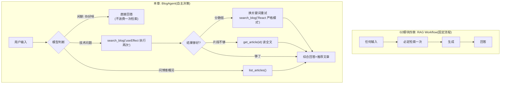

# （五）把 RAG 装进 Agent：BlogAgent 雏形

> 本章是 03 模块的里程碑，也是整个课程前半程的收官：把 02 模块的 RAG（检索）和本模块的工具循环、记忆组装成你实战项目的第一个完整原型——**BlogAgent**。从此，「检索」不再是写死的流程，而是模型手中的一个工具。

## 本章目标

- 理解「RAG Workflow → RAG Agent」升级的本质：检索从固定流程变成可选工具
- 设计 BlogAgent 的三件套工具：`search_blog` / `get_article` / `list_articles`
- 掌握「记忆只存干净问答、不存工具细节」的上下文管理技巧
- 跑通一个能自主决策的博客问答 Agent

## 一、Workflow vs Agent：同一个问题的两种处理方式



注意右边的所有分支路径**都没有写在代码里**——代码只提供了三个工具和一个循环，路径是模型根据每次输入自主规划的。这正是第一章定义的 Agent。

## 二、工具设计：把 RAG 拆成「能力积木」

| 工具 | 职责 | 设计要点 |
| --- | --- | --- |
| `search_blog(query)` | 语义检索文章片段 | 描述里写明「回答博客问题前必须先调用」和「分数低可换词重试」——**行为引导写进工具描述** |
| `get_article(article_id)` | 读文章全文 | 检索片段不够时深入阅读；全文截断 2000 字符防撑爆上下文 |
| `list_articles()` | 列出全部文章 | 覆盖「你的博客都写了什么」这类检索解决不了的全局问题 |

两个值得品味的细节：

1. **检索为空时的返回文案**：`"没有检索到相关内容。可以换个关键词重试，或如实告诉用户……"`——这不是给人看的，是给模型看的**下一步行动指引**（上一章「错误也是信息」的延伸）
2. **`search_blog` 的返回里带 `article_id` 和相关度分数**：模型靠它们决定要不要 `get_article` 深入、以及推荐哪篇文章

## 三、记忆管理的实战技巧：别把工具细节存进记忆

一轮提问可能产生好几条 tool_calls 消息和检索结果（动辄上千 token），但它们**没有跨轮价值**。BlogAgent 的处理：

```python
# 工具循环用的是临时 messages（用完即弃）
# 记忆里只存「干净」的问答对
self.history.append({"role": "user", "content": user_input})
self.history.append({"role": "assistant", "content": answer})
```

下一轮用户问「那**它**和 Vue 比呢？」时，模型看到的是简洁的问答历史，指代照样能理解，token 却省了一个数量级。

## 四、动手实践

```bash
cd "03-Agent/（五）把RAG装进Agent：BlogAgent雏形/project"
uv sync
uv run python main.py    # 首次运行自动构建索引
```

| 文件 | 说明 |
| --- | --- |
| `project/blog_tools.py` | 三件套工具（基于 02 模块的 RAG 基础设施） |
| `project/main.py` | `BlogAgent` 类：工具循环 + 跨轮记忆 + 交互 CLI |
| `project/tools.py` | 第三章的 `@tool` 注册表（原样复用） |
| 其余文件 | 02 模块的 RAG 基础设施（loader/chunker/embedder/indexer/data） |

**必做实验**——依次输入三类内容，观察 `[决策]` 日志的差异：

1. `你好呀` → 应该不调用任何工具
2. `useEffect 为什么执行两次？` → 应该调 `search_blog`
3. `你的博客都写了哪些主题？` → 应该调 `list_articles`
4. 进阶：`前端打包慢怎么办？另外推荐一篇讲部署的文章` → 观察模型会不会检索两次

## 五、动手作业

1. 给 `search_blog` 增加一个 `tag` 可选参数（按标签过滤检索，02 模块三章学过 Filter），并更新工具描述让模型知道何时使用
2. 连续追问测试记忆：先问 useEffect，再问「那它的清理函数呢？」——验证指代理解
3. 思考题：当前每次 `chat()` 都把 SYSTEM_PROMPT 里的回答格式约定重发一遍。如果想让回答变成结构化 JSON（01 模块三章），应该改哪里？动手改出一个返回 `{"answer": ..., "recommendedArticles": [...]}` 的版本——这就是实战模块 API 的雏形

## 官方文档与延伸阅读

- [Anthropic：Building effective agents（重读「Agents」一节，现在感受完全不同）](https://www.anthropic.com/research/building-effective-agents)
- [Qdrant：Agentic RAG 概念文章](https://qdrant.tech/articles/agentic-rag/)
- [DeepSeek Function Calling 文档](https://api-docs.deepseek.com/zh-cn/guides/function_calling)

## 模块小结与下一模块预告

03 模块完成！回顾你亲手写过的东西：ReAct 循环、工具注册表、错误自我纠正、两级记忆、RAG 工具化——**市面上所有 Agent 框架的核心，你都已经手写过一遍了。**

接下来的 **04-LangChain / 05-LangGraph** 模块会教你用工业级框架重写 BlogAgent。学框架的最佳时机正是现在——你会清楚地看到框架在帮你做什么（少写样板代码、流程持久化、可视化调试），也能识别什么时候**不需要**框架。
