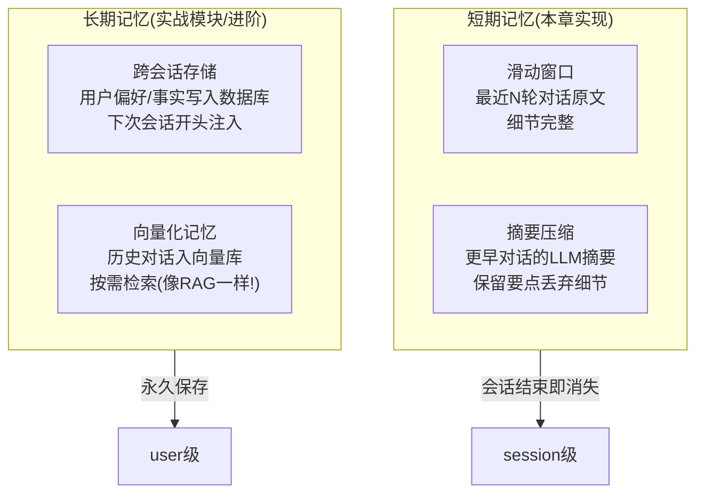
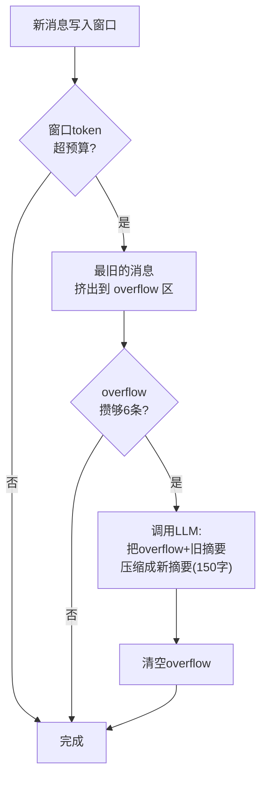

# （四）Agent 记忆与多轮状态

> 上一章的 Agent 每次 `run()` 都是「失忆」的。真实的聊天场景里，用户会说「**它**怎么配置？」「**刚才说的**那篇文章」——没有记忆，这些话全都无法理解。本章实现一套两级记忆管理：滑动窗口保细节，摘要压缩保要点。

## 本章目标

- 复习并深化「模型无记忆，记忆靠重发」的本质
- 理解记忆无限增长的三个代价：token 费用、响应速度、上下文窗口上限
- 实现两级记忆策略：滑动窗口 + LLM 摘要压缩
- 了解长期记忆（跨会话）的思路

## 一、记忆的层次



## 二、两级策略的工作原理

每次请求发给模型的上下文结构：

```text
┌────────────────────────────────────────────┐
│ system prompt（人设和规则）                  │
│ [早前对话的摘要]: 用户叫小明, 前端工程师,     │  ← 第二级：旧对话压缩成一条
│   博客用Vite+阿里云, 选了Qdrant和FastAPI…   │
│ user: 监控用什么？        ┐                 │
│ assistant: 推荐Prometheus │ 第一级：         │  ← 最近N轮对话原文
│ user: 那它怎么配置？      ┘ 滑动窗口         │
└────────────────────────────────────────────┘
```

流程：



两个实现细节：

1. **token 估算不需要精确**：裁剪场景用经验公式（中文约 0.6 token/字）从严估算即可，不必引入分词器依赖
2. **摘要 Prompt 要指明保留什么**：「用户身份、明确偏好、关键事实、未完成任务」——这些丢了对话就「断片」了

## 三、攒够再压缩：为什么不是每条都压？

摘要压缩本身要调用一次 LLM（有延迟和费用）。每挤出一条就压一次，成本高且摘要质量差；攒够一批（本章设为 6 条）再压，**把 N 次调用合并成 1 次**。这是工程里常见的「批处理换成本」思路。

## 四、动手实践

```bash
cd "03-Agent/（四）Agent记忆与多轮状态/project"
uv sync
uv run python main.py
```

| 文件 | 说明 |
| --- | --- |
| `project/memory.py` | `ConversationMemory`：滑动窗口 + 摘要压缩 + token 估算 |
| `project/main.py` | ① 跨轮指代演示 ② 观察压缩发生（窗口故意调小） ③ 交互式聊天 |

演示 2 是本章精华：窗口被故意调小到 400 token，几轮对话后你能亲眼看到「记忆压缩完成」的提示，并验证**最早说的名字依然能被想起来**（摘要的功劳）。

交互模式支持 `/stats`（查看记忆状态和当前摘要）、`/clear`（清空记忆）。

## 五、动手作业

1. 把 `summarize_threshold` 改成 2，观察压缩频率和摘要质量的变化，体会「批处理」的权衡
2. 故意在第一句话里埋一个具体数字（如「我的博客有 217 篇文章」），多聊十轮后问它——验证摘要会不会丢失精确数字（通常会！），思考怎么解决（提示：重要事实单独存结构化字段）
3. 思考题：你的博客聊天框每个访客一个会话，记忆应该存在哪里？（提示：内存 dict？Redis？sessionId 怎么设计？——实战模块见）

## 官方文档与延伸阅读

- [OpenAI：Conversation state 管理](https://platform.openai.com/docs/guides/conversation-state)
- [LangGraph：Memory 概念文档（短期/长期记忆的工业级抽象）](https://langchain-ai.github.io/langgraph/concepts/memory/)
- [Anthropic：Context engineering 实践（上下文窗口管理）](https://www.anthropic.com/engineering/effective-context-engineering-for-ai-agents)

## 下一章预告

积木已经齐了：02 模块的 RAG（检索博客）、本模块的工具循环（第三章）和记忆（本章）。下一章 **《（五）把 RAG 装进 Agent：BlogAgent 雏形》** 把它们组装成你实战项目的第一个完整原型——能自主决定「要不要检索、检索什么、要不要换关键词重试」的博客问答 Agent。
