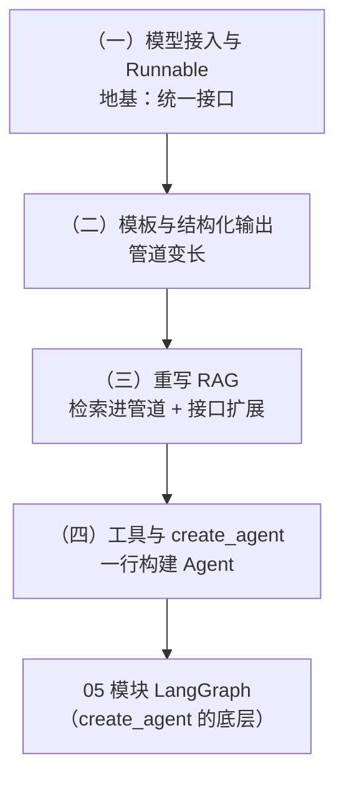

# 模块 04：LangChain

> 手写完 LLM 调用、RAG、Agent 循环之后，你已经「配得上」用框架了。本模块学 LangChain 1.x——因为亲手写过底层，你将看懂每个抽象的来历，也知道它出问题时去哪排查。

## 为什么是现在才学框架？

```mermaid
flowchart LR
    hand["01~03 模块<br/>手写底层"] -->|"知其所以然"| frame["04 模块<br/>LangChain 框架"]
    frame -->|"create_agent 底层是图"| graph["05 模块<br/>LangGraph"]
    frame -.对照.-> hand
```

直接学框架的人：API 会调，出问题两眼一抹黑。<br>
先手写后学框架的你：每个 API 都能对应到自己写过的代码，知道它封装了什么、没封装什么。

本模块每章 README 都有固定栏目「**框架 vs 手写对照**」——这是全模块的灵魂。

> 版本提醒：本课程教 **LangChain 1.x**（2025 年发布的大版本）。网上大量旧教程还在用 `LLMChain`、`initialize_agent` 等已废弃 API，看到直接关掉。

## 章节导览

| 章节 | 核心内容 | 对照的手写代码 |
| --- | --- | --- |
| （一）核心概念与模型接入 | `ChatDeepSeek`、invoke/stream/batch、Runnable 与 `\|` 管道 | 01 模块 `llm_client.py` |
| （二）Prompt 模板与结构化输出 | `ChatPromptTemplate`、few-shot 模板、`with_structured_output` | 01 模块二、三章的手写校验重试 |
| （三）用 LangChain 重写 RAG | `Document`、文本切分器、**自实现 Embeddings 接口**、`QdrantVectorStore` | 02 模块全链路 |
| （四）工具与 create_agent | `@tool`、`create_agent`、流式中间步骤、自我纠正 | 03 模块的注册表与 Agent 循环 |

## 学习路径



## 学习建议

- 每章把对照的手写代码开在旁边看，「框架做了什么」会一目了然
- 本模块技术选型与全课程一致：DeepSeek（`langchain-deepseek`）、FastEmbed 本地向量、Qdrant
- 第三章的 `FastEmbedEmbeddings` 是全模块最有含金量的代码——「实现框架接口」是从使用者到扩展者的分水岭

## 环境要求

- 每章 `project/` 独立 `uv sync`；LLM Key 配置在仓库根目录 `.env`（参考根 README）
- 第三章首次运行会复用之前下载的 FastEmbed 模型缓存（无需重新下载）

预计学习时间：4~6 小时（每章 1~1.5 小时）
