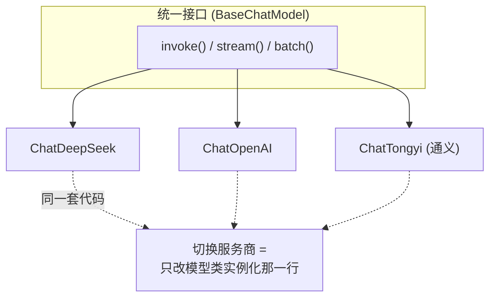
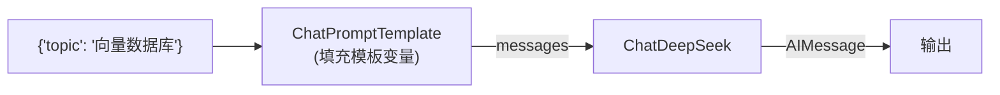

# （一）LangChain 核心概念与模型接入

> 恭喜你以「正确的姿势」进入框架世界——手写过 LLM 调用、RAG、Agent 循环之后再学 LangChain，每个抽象你都能立刻对应到自己写过的代码。本章学习 LangChain 1.x 的地基：模型抽象与 Runnable 接口。

## 本章目标

- 理解 LangChain 1.x 的定位与包结构（`langchain` / `langchain-core` / `langchain-classic`）
- 用 `ChatDeepSeek` 接入模型，掌握 `invoke / stream / batch` 三件套
- 理解 Runnable 接口与 `|` 管道操作符——LangChain 的「乐高接口」
- 建立「框架 vs 手写」的对照思维

## 一、LangChain 1.x：先搞清楚版本与包

LangChain 在 2025 年发布了 1.0 大版本，做了大刀阔斧的精简（网上大量旧教程已过时，**看到 `from langchain.chains import LLMChain` 这类写法直接关掉**）：

| 包 | 作用 |
| --- | --- |
| `langchain-core` | Runnable、消息、模板等核心抽象 |
| `langchain` | 精简后的主包，核心是 `create_agent`（第四章） |
| `langchain-deepseek` 等 | 各模型服务商的官方集成包 |
| `langchain-classic` | 1.0 之前的旧功能（兼容用，新项目别碰） |

## 二、模型抽象：一套接口调用所有模型



### 框架 vs 手写对照（本章核心表格）

| 能力 | 01 模块手写版 | LangChain 版 |
| --- | --- | --- |
| 一次调用 | `client.chat.completions.create(...)` 再取 `choices[0].message.content` | `model.invoke(messages).content` |
| 消息 | `{"role": "system", ...}` 字典 | `SystemMessage / HumanMessage / AIMessage` 对象 |
| 流式 | 自己判断 `delta.content` 是否为 None | `for chunk in model.stream(...)` |
| 并发批量 | 自己开 `ThreadPoolExecutor` | `model.batch([...])` 一行 |
| 失败重试 | 自己写 for 循环 | `max_retries=2` 参数 |
| token 统计 | 手动读 `response.usage` | `reply.usage_metadata` 自动解析 |

> 配置约定：本课程显式传入根 `.env` 的 `LLM_API_KEY`（见 `lc_client.py`），不依赖框架默认读取的 `DEEPSEEK_API_KEY`，保持「一个 .env 管全部章节」。

## 三、Runnable：LangChain 的「乐高接口」

LangChain 中几乎一切组件（模板、模型、解析器、检索器）都实现 **Runnable** 接口，因此都可以用 `|` 拼接：

```python
chain = prompt | model          # 拼出来的管道也是 Runnable
chain.invoke({"topic": "向量数据库"})
chain.stream(...)               # 管道自动支持流式
chain.batch([...])              # 管道自动支持批量
```



前端类比：Runnable 之于 LangChain，就像「一切皆组件」之于 React——统一接口带来自由组合。

## 四、动手实践

```bash
cd "04-LangChain/（一）核心概念与模型接入/project"
uv sync
uv run python lc_client.py   # 环境自检
uv run python main.py
```

| 文件 | 说明 |
| --- | --- |
| `project/lc_client.py` | `ChatDeepSeek` 封装（对照 01 模块的 `llm_client.py`） |
| `project/main.py` | 四个演示：invoke / stream / batch / Runnable 管道 |

## 五、动手作业

1. 给 `demo_3_batch` 计时（`time.time()`），再把 `model.batch` 换成 for 循环逐个 `invoke`，对比总耗时
2. 把 `ChatDeepSeek` 的 `max_retries` 设为 0，断网运行观察异常——体会框架内置重试的价值
3. 思考题：`chain = prompt | model` 中，prompt 的输出类型和 model 的输入类型是怎么「对上」的？（提示：都是 messages）

## 官方文档与延伸阅读

- [LangChain 1.0 发布公告（理解版本变迁）](https://www.langchain.com/blog/langchain-langgraph-1dot0)
- [ChatDeepSeek 集成文档](https://docs.langchain.com/oss/python/integrations/chat/deepseek)
- [LangChain Messages 概念](https://docs.langchain.com/oss/python/langchain/messages)
- [Runnable 接口文档](https://python.langchain.com/api_reference/core/runnables.html)

## 下一章预告

管道目前只有两节（prompt | model），输出还是自然语言。下一章 **《（二）Prompt 模板与结构化输出》** 把 01 模块的 Prompt 工程和结构化输出迁移到 LangChain：few-shot 模板化、`with_structured_output()` 一行替代你手写的「校验 + 重试」循环。
