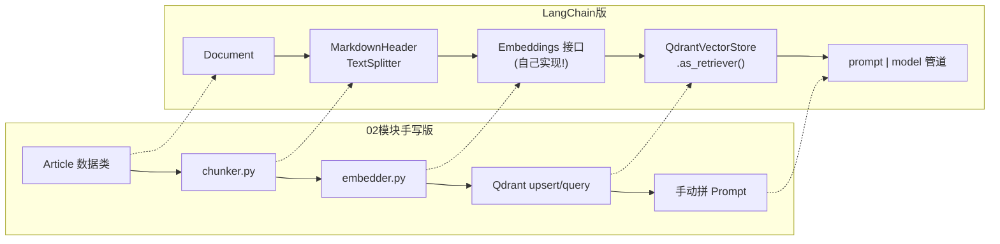
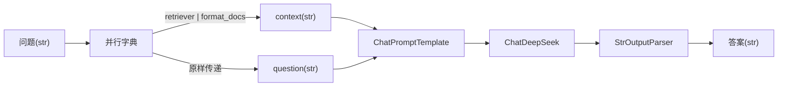

# （三）用 LangChain 重写 RAG

> 02 模块你手写了完整 RAG：loader → chunker → embedder → Qdrant → Prompt 组装。本章用 LangChain 组件重走一遍同样的路，并完成一次真正的「框架扩展」——亲手实现 `Embeddings` 接口，把本地 FastEmbed 模型接入 LangChain 生态。

## 本章目标

- 掌握 `Document`：LangChain 世界的「带元数据文本」统一货币
- 用 `MarkdownHeaderTextSplitter` 替代手写 chunker（思路完全一致）
- **自己实现 `Embeddings` 接口**——学会框架的扩展之道
- 用 `QdrantVectorStore` + `as_retriever()` 拼出完整 RAG 管道

## 一、逐环对照：手写 RAG vs LangChain RAG



| 环节 | 手写版 | LangChain 版 | 备注 |
| --- | --- | --- | --- |
| 数据模型 | `Article` dataclass | `Document` | `page_content` + `metadata` |
| 加载 | `loader.py` | 本章直接复用！ | 自己写的代码不亏 |
| 切片 | 按标题切+标题路径 | `MarkdownHeaderTextSplitter` | 思路一致，标题进 metadata |
| 向量化 | `embedder.py` | `Embeddings` 接口 | **本章自己实现** |
| 入库+检索 | 手动 upsert/query | `from_documents()` / `as_retriever()` | 一行入库 |

## 二、本章重头戏：实现 Embeddings 接口

LangChain 的 `Embeddings` 抽象只要求两个方法：

```python
class FastEmbedEmbeddings(Embeddings):
    def embed_documents(self, texts: list[str]) -> list[list[float]]: ...  # 入库侧
    def embed_query(self, text: str) -> list[float]: ...                   # 查询侧
```

两个关键认知：

1. **为什么接口要拆成两个方法？** 02 模块五章学过：bge 模型查询侧要加指令前缀，文档侧不加。接口拆开正是给实现者留这种差异化空间——我们的实现里就把查询前缀用上了（白捡的检索质量提升）。
2. **这就是框架的「扩展之道」**：框架没集成你要的东西时，找到它的最小接口（往往就是个抽象类），实现它，就能融入整个生态。前端类比：写一个符合规范的 webpack loader。

## 三、retriever 进管道：RAG 链的数据流

`as_retriever()` 把向量库变成 Runnable，于是检索可以直接进管道：



```python
chain = {"context": retriever | format_docs, "question": lambda x: x} | prompt | model | StrOutputParser()
```

dict 字面量在管道里表示「并行求值」：同一个输入（问题）分两路，一路去检索拼上下文，一路原样保留，汇合后填进模板。

## 四、动手实践

```bash
cd "04-LangChain/（三）用LangChain重写RAG/project"
uv sync
uv run python main.py    # 第1~3步离线可跑；第4步需要 LLM Key
```

| 文件 | 说明 |
| --- | --- |
| `project/fastembed_embeddings.py` | **本章核心**：自己实现的 Embeddings 组件 |
| `project/main.py` | 四步流水线：Document → 切片 → 入库 → RAG 管道 |
| `project/loader.py` `project/data/` | 02 模块的解析器与示例文章（原样复用） |

## 五、动手作业

1. 在 `step_3` 后追加一次 `vector_store.similarity_search("数据库部署", k=3, filter=...)`，用 Qdrant 过滤条件只搜某个 tag（查 langchain-qdrant 文档找 filter 写法）
2. 把 `FastEmbedEmbeddings.embed_query` 里的前缀去掉，对比同一查询的检索分数——复现 02 模块五章的实验
3. 思考题：`MarkdownHeaderTextSplitter` 没有处理「单节超长」的情况，我们手写的 chunker 处理了——怎么补？（提示：对超长切片再过一遍 `RecursiveCharacterTextSplitter`）

## 官方文档与延伸阅读

- [Retrieval / RAG 概念](https://docs.langchain.com/oss/python/langchain/retrieval)
- [文本切分器文档](https://docs.langchain.com/oss/python/integrations/splitters)
- [langchain-qdrant 集成文档](https://docs.langchain.com/oss/python/integrations/vectorstores/qdrant)
- [Embeddings 接口 API](https://python.langchain.com/api_reference/core/embeddings/langchain_core.embeddings.embeddings.Embeddings.html)

## 下一章预告

RAG 是「固定流程」，下一章 **《（四）工具与 create_agent》** 回到 Agent：`@tool` 装饰器对照你手写的工具注册表，`create_agent` 一行替代你手写的循环——并揭晓它的底层正是 05 模块的主角 LangGraph。
