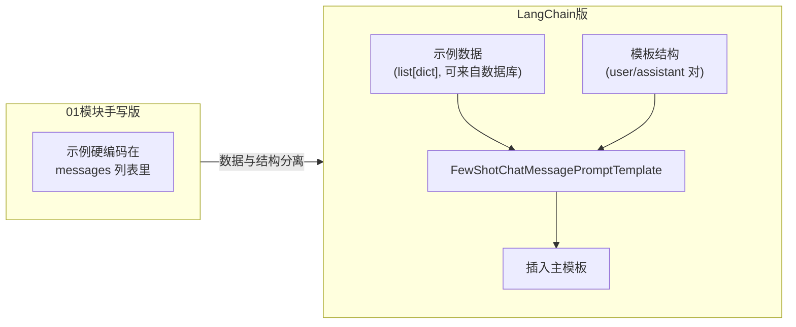

# （二）Prompt 模板与结构化输出

> 本章把 01 模块的两项核心能力（Prompt 工程、结构化输出）迁移到 LangChain。最大的爽点：你在 01 模块三章手写的约 40 行「JSON 校验 + 错误喂回 + 重试」，框架里是一行 `with_structured_output()`。

## 本章目标

- 掌握 `ChatPromptTemplate`：提示词从字符串拼接升级为可复用组件
- 掌握 few-shot 模板化：示例数据与模板结构分离
- 掌握 `with_structured_output()`：一行得到 Pydantic 对象
- 理解它底层用的是 Function Calling（而不是 JSON 模式）

## 一、Prompt 模板：为什么不直接用 f-string？

| | f-string 拼接（手写） | ChatPromptTemplate |
| --- | --- | --- |
| 变量管理 | 散落在代码各处 | 模板集中声明 `{question}` |
| 复用 | 复制粘贴 | 模板是对象，可导入/入库/版本化 |
| 组合 | 手动拼字符串 | 模板可嵌套（few-shot 块插入） |
| 管道 | 不是 Runnable | 是 Runnable，可直接 `prompt \| model` |

few-shot 的进化尤其值得注意：



数据与结构分离后，才可能做「按用户问题动态挑选最相似的示例」这类高级优化。

## 二、with_structured_output：一行替代你手写的循环

```python
class ArticleMeta(BaseModel):
    title: str = Field(description="文章标题")
    tags: list[str] = Field(min_length=2, max_length=4)
    ...

meta = model.with_structured_output(ArticleMeta).invoke("提取元数据：...")
# meta 直接就是 ArticleMeta 对象！
```

### 框架 vs 手写对照

| 步骤 | 01 模块三章手写版 | with_structured_output |
| --- | --- | --- |
| 让模型按格式输出 | JSON 模式 + Schema 放进 Prompt | 底层走 **Function Calling**（把 Schema 当作工具参数，更稳） |
| 解析 | `json.loads` | 内置 |
| 校验 | `model_validate_json` | 内置 |
| 失败重试 | 手写错误喂回循环 | 内置（配合 `max_retries`） |

> 为什么 Function Calling 比 JSON 模式更稳？模型对「工具参数」的格式遵循经过专门强化训练；这也解释了一个限制：`deepseek-reasoner` 不支持工具调用，因此也用不了 `with_structured_output`——课程统一用 `deepseek-chat`。

排查思维（手写过的人才有）：结构化输出失败时，先检查 Schema 是否太复杂、字段 `description` 是否说人话——这和你手写时调 Prompt 是同一件事。

## 三、动手实践

```bash
cd "04-LangChain/（二）Prompt模板与结构化输出/project"
uv sync
uv run python main.py
```

| 文件 | 说明 |
| --- | --- |
| `project/main.py` | 四个演示：模板 / few-shot 模板化 / 结构化输出 / 完整管道 |
| `project/lc_client.py` | 上一章的模型封装（自包含复制） |

注意演示 3 用的 `ArticleMeta` 与 01 模块三章完全相同——建议两边代码开着对照看。

## 四、动手作业

1. 给 `ArticleMeta` 加一个 `difficulty: int = Field(ge=1, le=5)` 字段，验证结构化输出的约束能力
2. 把 demo_2 的示例扩充到 4 条，其中混入一条「错误风格」的示例（大写标签），观察模型跟随哪种风格
3. 用 `chain.batch()` 把 demo_4 改成批量处理 3 篇文章——上一章的 batch 与本章管道的组合应用

## 官方文档与延伸阅读

- [LangChain Prompt Templates 文档](https://docs.langchain.com/oss/python/langchain/prompt-templates)
- [Structured Output 指南](https://docs.langchain.com/oss/python/langchain/structured-output)
- [Few-shot prompting 概念](https://python.langchain.com/docs/concepts/few_shot_prompting/)

## 下一章预告

模板、模型、解析都齐了，下一章 **《（三）用 LangChain 重写 RAG》** 重写 02 模块的整条链路：`Document` / 文本切分器 / 向量库接入 / Retriever，并亲手实现一个 `Embeddings` 接口把我们的本地 FastEmbed 接进 LangChain 生态——学会「框架没提供时如何自己扩展」。
