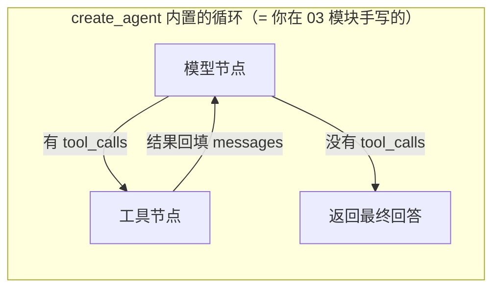

# （四）工具与 create_agent

> 03 模块你手写了 `@tool` 装饰器、工具注册表、Function Calling 循环和错误自我纠正。本章看 LangChain 1.x 的官方答案——你会发现官方实现和你手写的几乎一模一样。这正是本课程「先手写后框架」路线的回报时刻。

## 本章目标

- 用 LangChain 的 `@tool` 定义工具，与手写版逐项对照
- 用 `create_agent` 一行构建 Agent（LangChain 1.x 的主入口 API）
- 用 `stream_mode="values"` 流式观察 Agent 的每个中间步骤
- 验证框架内置的「错误自我纠正」机制
- 理解 `create_agent` 的底层就是 LangGraph——为 05 模块做铺垫

## 一、@tool：官方版与你的手写版「殊途同归」

| 机制 | 03 模块手写版 | LangChain `@tool` |
| --- | --- | --- |
| 工具名 | 函数名 | 函数名（`calculate.name`） |
| 描述 | docstring 第一行 | docstring（`calculate.description`） |
| 参数 schema | 类型注解 + `param_desc` 字典 | 类型注解 + docstring 的 Args 段 |
| 注册表 | 全局 `REGISTRY` 字典 | `tools=[...]` 列表传入 |

设计良好的框架 API，往往就是「无数人手写之后沉淀的共识」。你手写过，所以你一眼就懂它为什么长这样。

## 二、create_agent：一行替代手写循环

```python
agent = create_agent(model=..., tools=[...], system_prompt="...")
result = agent.invoke({"messages": [("user", "问题")]})
result["messages"][-1].content   # 最终回答
```



注意输入输出都是 `{"messages": [...]}` 这个字典——这其实是一张**图的状态**。`create_agent` 返回的就是一张编译好的 LangGraph 图，所以它天然支持流式、持久化、人工介入（05 模块全讲）。

## 三、两个值得停下来体会的演示

**流式中间步骤（demo 3）**：手写版我们靠 `verbose=True` 打印日志；框架版 `agent.stream(..., stream_mode="values")` 把每一步的完整状态吐出来，生产环境可以直接接 SSE 推给前端「Agent 正在调用工具…」的过程动画。

**错误自我纠正（demo 4）**：故意让模型写出非法表达式 → 工具抛异常 → 框架把异常文本作为 ToolMessage 喂回 → 模型修正参数重试。这正是 03 模块三章手写的「错误即信息」哲学，框架同样内置。

## 四、动手实践

```bash
cd "04-LangChain/（四）工具与create_agent/project"
uv sync
uv run python main.py   # 演示 1 离线可跑，其余需要 LLM Key
```

| 文件 | 说明 |
| --- | --- |
| `project/main.py` | 四个演示：@tool / create_agent / 流式步骤 / 自我纠正 |
| `project/lc_client.py` | 模型封装（自包含复制） |

## 五、动手作业

1. 给 `search_blog` 加一个 `limit: int = 3` 参数（带默认值），观察生成的 schema 如何表达可选参数
2. 把 demo_2 的 `system_prompt` 删掉再跑，对比模型使用工具的积极性——复习「系统提示词对 Agent 行为的引导作用」
3. 思考题：`create_agent` 的循环没有 `max_rounds` 参数怎么办？查文档找找它对应的控制手段（提示：递归限制 `recursion_limit`）

## 官方文档与延伸阅读

- [LangChain Agents 文档（create_agent）](https://docs.langchain.com/oss/python/langchain/agents)
- [Tools 概念与 @tool 装饰器](https://docs.langchain.com/oss/python/langchain/tools)
- [Streaming 文档](https://docs.langchain.com/oss/python/langchain/streaming)

## 下一章预告

`create_agent` 很方便，但它是「固定形状」的图：模型↔工具来回跳。如果你想要「先路由、再检索、质量不行就重写查询」这种自定义流程呢？进入 **05 模块 LangGraph**——亲手画图，把流程的每个节点、每条边都掌控在自己手里。
