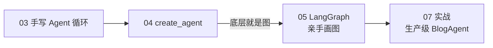
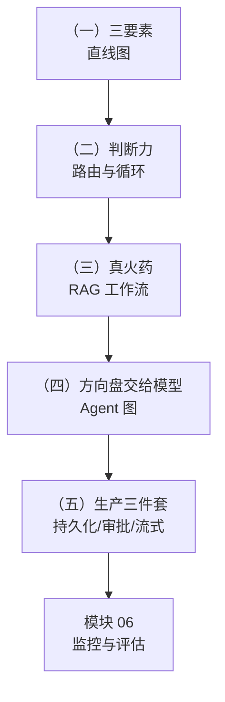

# 模块 05：LangGraph

> `create_agent` 一行很爽，但它是「固定形状」的。真实生产的 Agent 流程需要自定义路由、循环、人工审批、持久会话——这正是 LangGraph 的领域。本模块从图的三要素学到生产级三件套，最终做出 BlogAgent 的图化版。

## LangGraph 在课程中的位置

世界观就三样东西：**State（共享状态）、Node（节点函数）、Edge（连线）**。掌握它们，任何复杂 Agent 流程都只是「画图」。

## 章节导览

| 章节 | 核心内容 | 关键 API |
| --- | --- | --- |
| （一）StateGraph 基础 | 三要素、建图四步、图画出自己 | `StateGraph` `add_node/edge` `draw_mermaid` |
| （二）条件路由与循环 | 路由分支、评估-优化循环（带重试上限） | `add_conditional_edges` |
| （三）LangGraph 版 RAG 工作流 | 轻量 Corrective RAG：检索不行自动换词重试 | 复用 02 模块全套基建 |
| （四）LangGraph Agent 与工具 | 手工搭出 create_agent 的内脏、BlogAgent 图化版 | `bind_tools` `ToolNode` `tools_condition` |
| （五）持久化、人工介入与流式 | 跨进程会话记忆、危险操作审批、三种流式 | `checkpointer` `interrupt` `stream` |

## 学习路径

## 核心心法

- **Workflow vs Agent 在图上一眼分清**：规则路由 = Workflow（节点多、路径明确）；模型决定 + 回边循环 = Agent。03 模块一章的结论「能用 Workflow 就别用 Agent」在图的世界依然成立
- **循环必须有上限**：没有上限的循环 = 烧钱的死循环
- **checkpointer 只管存、不管压缩**：03 模块手写的滑动窗口/摘要在框架时代依然要用

## 环境要求

- 每章 `project/` 独立 `uv sync`；三、四章首次运行会自动构建本地向量索引
- 一章的演示 1/2、五章的 interrupt 演示离线可跑，其余需要 LLM Key

预计学习时间：6~8 小时（每章 1~1.5 小时）
