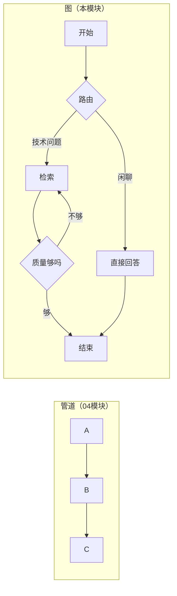

# （一）StateGraph 基础

> 上一模块结尾揭晓：`create_agent` 返回的就是一张 LangGraph 图。本章把这张「图」拆开从零学起——LangGraph 的世界观只有三样东西：**状态、节点、边**。掌握它们，任何复杂的 Agent 流程都只是「画图」。

## 本章目标

- 理解 StateGraph 三要素：State（TypedDict 共享状态）、Node（函数）、Edge（连线）
- 掌握建图四步：声明状态 → `add_node` → `add_edge` → `compile()`
- 会用 `draw_mermaid()` 让图输出自己的流程图
- 用图实现「提示链」工作流（03 模块一章讲过的模式，这次真正落地）

## 一、为什么需要「图」？

04 模块的管道（`prompt | model | parser`）是**一条直线**，数据只能向前流。但真实流程需要：分支（技术问题走 RAG、闲聊直接答）、循环（质量不行重试）、多路汇合。直线表达不了，**图**可以。



## 二、三要素拆解

| 要素 | 是什么 | 代码形态 | 前端类比 |
| --- | --- | --- | --- |
| State | 全图共享的数据 | `TypedDict` | Redux store |
| Node | 处理状态的一步 | 普通函数：`state -> 要更新的字段` | reducer（部分更新） |
| Edge | 节点间的连线 | `add_edge("a", "b")` | 路由配置 |

节点函数**只返回想更新的字段**，LangGraph 负责合并进状态——和 React `setState` 的部分更新一个思路：

```python
def add_one(state: CounterState) -> dict:
    return {"count": state["count"] + 1}   # 不用返回完整状态
```

建图四步：

```python
builder = StateGraph(CounterState)      # 1. 声明状态结构
builder.add_node("add_one", add_one)    # 2. 加节点
builder.add_edge(START, "add_one")      # 3. 连边（START 入口 / END 出口）
graph = builder.compile()               # 4. 编译 —— 产物是 Runnable！
```

`compile()` 的产物支持 `invoke / stream / batch`——04 模块的 Runnable 知识全部继续生效，这就是「同一套乐高」。

## 三、代码即文档：draw_mermaid

```python
print(graph.get_graph().draw_mermaid())
```

图能输出自己的 mermaid 流程图源码。流程复杂之后，这是排查「图连错了」的利器，也可以直接贴进项目文档——本课程文档里的 mermaid 图，以后可以由代码自动生成。

## 四、动手实践

```bash
cd "05-LangGraph/（一）StateGraph基础/project"
uv sync
uv run python main.py   # 演示 1、2 离线可跑；演示 3 需要 LLM Key
```

| 演示 | 内容 |
| --- | --- |
| 演示 1 | 纯 Python 最小图（无 LLM），看清状态流动机制 |
| 演示 2 | `draw_mermaid()` 输出流程图 |
| 演示 3 | 提示链工作流：大纲 → 草稿 → 润色，用 `stream_mode="updates"` 观察每个节点 |

## 五、动手作业

1. 给演示 1 加一个 `square` 节点（平方）接在 `double` 之后，预测最终 count 再运行验证
2. 把演示 3 的 stream_mode 改成 `"values"`，对比两种模式输出的差异（updates=增量，values=全量）
3. 思考题：`WriterState` 里的 4 个字段，如果两个节点同时更新同一个字段会发生什么？（下一章的「并行」会回答）

## 官方文档与延伸阅读

- [LangGraph 1.x 文档首页](https://docs.langchain.com/oss/python/langgraph/overview)
- [Graph API 指南（StateGraph/节点/边）](https://docs.langchain.com/oss/python/langgraph/graph-api)
- [LangGraph 设计理念（为什么是图）](https://docs.langchain.com/oss/python/langgraph/why-langgraph)

## 下一章预告

本章的图还是「直线」，只是换了种写法。下一章 **《（二）条件路由与循环》** 给图加上判断力：`add_conditional_edges` 实现「闲聊不检索、技术问题走 RAG」的路由，以及「质量不达标就重写」的循环——图区别于管道的核心能力。
