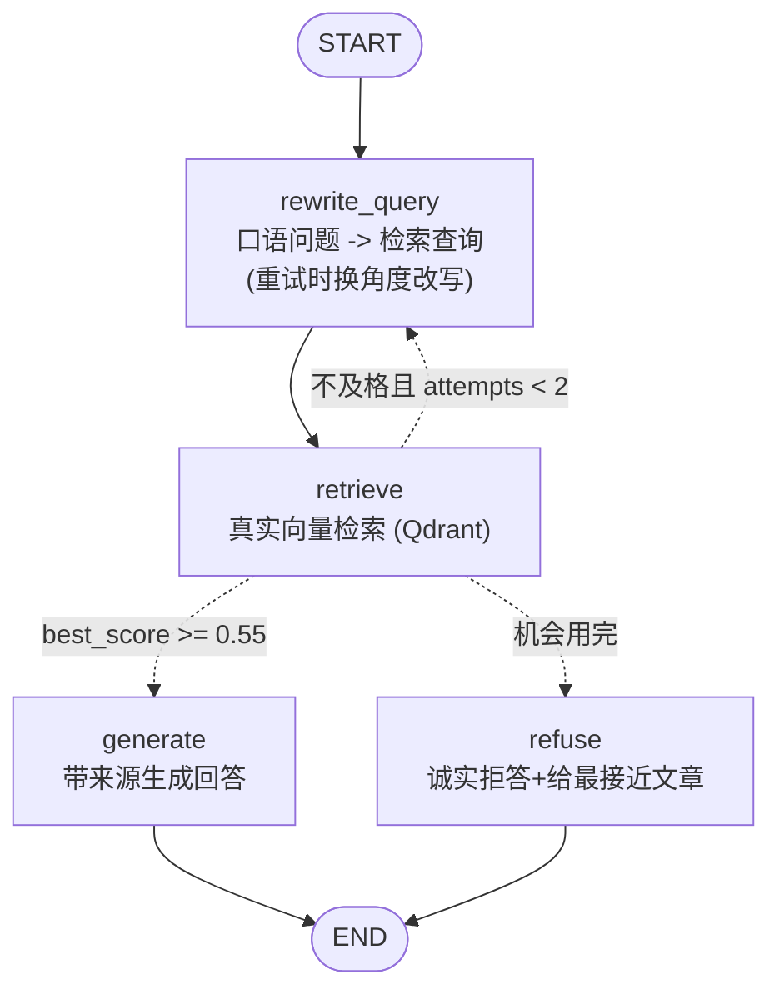

# （三）LangGraph 版 RAG 工作流

> 02 模块五章你学了一堆检索调优手段（查询改写、score 阈值、拒答策略），但它们是一次性的「直线」流程。本章把它们组装成一张**会自我纠正的图**：检索不到相关内容时，自动换种说法重试——这就是轻量版的 Corrective RAG。

## 本章目标

- 把 02 模块的调优手段「图化」：改写 → 检索 → 评分 → 重试/生成/拒答
- 理解 Corrective RAG（纠错式 RAG）的思想
- 复用 02 模块全套基建（loader/chunker/embedder/indexer）——一行不用改
- 体会「图」带来的质变：检索失败从「直接摆烂」变成「自动补救」

## 一、完整工作流



与 02 模块四章手写 RAG 的核心区别就一处：**评分不及格不再直接拒答，而是带着「已试过哪些查询」的信息回到改写节点换个角度再试**。

## 二、三个关键设计

**1. 状态里存 `tried_queries`**：重写节点看到已试过的查询，才能「换个角度」而不是改出重复的——循环要有效，反馈必须进状态（上一章的经验在真实场景的应用）。

**2. 评分用向量分数而不是 LLM**：`grade` 用检索分数 + 阈值（0.55，02 模块五章的实验值）做判断，零成本零延迟。更彻底的做法是让 LLM 逐条判断「这段内容真的能回答问题吗」（标准 Corrective RAG 的做法），代价是每次检索多一次 LLM 调用——成本与质量的权衡，按场景选。

**3. 循环上限 `MAX_ATTEMPTS = 2`**：换两次说法还检索不到，说明知识库里真没有，老实拒答。拒答时给出最接近的文章——「没找到」也要有用户价值。

## 三、框架 vs 手写对照

| 能力 | 02 模块手写版 | 本章图版 |
| --- | --- | --- |
| 查询改写 | 单独的实验脚本 | `rewrite_query` 节点，可循环触发 |
| score 阈值拒答 | if/else 写死在主流程 | `grade_route` 路由函数，流程可见 |
| 检索失败 | 直接拒答 | 自动换说法重试 2 次后才拒答 |
| 流程可视化 | 看代码脑补 | `draw_mermaid()` 自动输出 |

## 四、动手实践

```bash
cd "05-LangGraph/（三）LangGraph版RAG工作流/project"
uv sync
uv run python main.py   # 需要 LLM Key；首次运行自动构建本地索引
```

脚本会跑两个问题：一个正常技术问题（一次检索及格 → generate），一个博客里没有的问题（重试后仍不及格 → refuse）。注意观察控制台打印的「改写查询」和「最高分」的变化过程。

| 文件 | 说明 |
| --- | --- |
| `project/main.py` | 本章核心：RAG 工作流图 |
| `project/loader.py` 等 4 个文件 + `data/` | 02 模块基建，原样复用 |

## 五、动手作业

1. 把 `SCORE_THRESHOLD` 调到 0.75 再跑，观察正常问题是否也开始触发重试——重新体会阈值的灵敏度
2. 给 `RagState` 加一个 `sources: list` 字段，让 `generate` 节点把引用的 `article_id` 结构化地存进去（为实战的 API 返回格式做准备）
3. 进阶：把 `grade_route` 改成 LLM 评分——用 `with_structured_output` 让模型对 top1 命中输出 `relevant: bool`，对比两种评分方式的判断差异

## 官方文档与延伸阅读

- [LangGraph RAG 教程（含 Corrective RAG）](https://docs.langchain.com/oss/python/langgraph/agentic-rag)
- [Corrective RAG 论文（CRAG）](https://arxiv.org/abs/2401.15884)

## 下一章预告

本章的图是「固定流程」——走哪条路是我们用规则定死的。下一章 **《（四）LangGraph Agent 与工具》** 把方向盘交给模型：手工搭出「模型节点 + 工具节点」的 Agent 图，看清 `create_agent` 的内部构造，并做出 BlogAgent 的图化版。
