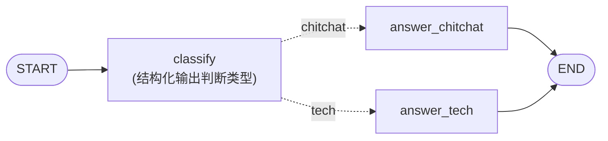
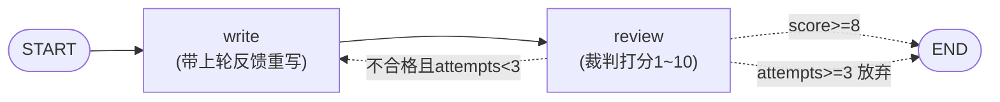

# （二）条件路由与循环

> 上一章的图还是直线。本章学 `add_conditional_edges`——给图加上「判断力」，落地 03 模块一章讲过的两个 Workflow 模式：**路由（Routing）** 和 **评估-优化循环（Evaluator-Optimizer）**。这两个模式正是你实战 BlogAgent 的骨架。

## 本章目标

- 掌握条件边 `add_conditional_edges`：由「路由函数」决定下一站
- 用结构化输出做路由判断（枚举值永远合法）
- 把条件边指回上游节点，构成带重试上限的循环
- 牢记 Agent 工程铁律：**没有上限的循环 = 烧钱的死循环**

## 一、条件边：路由函数决定下一站

普通边是写死的（`add_edge("a", "b")`），条件边由一个**路由函数**在运行时决定：

```python
def route_by_category(state) -> str:      # 读状态，返回下一个节点名
    return "answer_tech" if state["category"] == "tech" else "answer_chitchat"

builder.add_conditional_edges("classify", route_by_category, ["answer_chitchat", "answer_tech"])
```

注意路由函数**不是节点**：它不修改状态，只「看一眼状态，指个方向」。



工程细节：路由判断节点用 `with_structured_output(RouteDecision)`，其中 `category: Literal["chitchat", "tech"]`——枚举约束保证路由值永远合法，不会因为模型多说一个字导致 KeyError。这是 04 模块结构化输出在图里的标准用法。

## 二、循环：条件边指回上游

把条件边的目标指回上游节点，就构成循环。评估-优化模式的完整闭环：



三个工程要点：

1. **反馈要进状态**：`write` 节点读取上一轮的 `feedback` 才能「针对性改进」，否则只是盲目重试
2. **重试上限**：`attempts >= 3` 必须有，否则模型评分一直不过就会无限烧钱
3. **裁判也是 LLM**：用结构化输出拿到 `score` + `feedback`，这是 06 模块「LLM as Judge」评估思想的预演

条件边的两种写法：列表 `["a", "b"]`（路由函数直接返回节点名）或字典 `{"retry": "write", "good": END}`（路由值到节点的映射，语义更清晰）。

## 三、动手实践

```bash
cd "05-LangGraph/（二）条件路由与循环/project"
uv sync
uv run python main.py   # 两个演示都需要 LLM Key
```

运行时注意观察：演示 1 会先打印 `draw_mermaid()` 的图结构（条件边是虚线）；演示 2 能看到每一稿口号、评分和反馈的完整循环过程。

## 四、动手作业

1. 给路由加第三个分支 `dangerous`（涉及删除数据等危险操作），路由到一个固定回复「该操作需要管理员权限」的节点
2. 把演示 2 的合格线从 8 改成 10，观察是不是几乎每次都跑满 3 稿——体会「评估标准」对成本的直接影响
3. 思考题：演示 2 的裁判和写手是同一个模型，会有什么问题？（提示：自己给自己打分的偏差；06 模块会讲用独立评估集来校准）

## 官方文档与延伸阅读

- [Graph API：条件边](https://docs.langchain.com/oss/python/langgraph/graph-api#conditional-edges)
- [Anthropic《Building effective agents》Workflow 模式](https://www.anthropic.com/research/building-effective-agents)（重读 Routing 与 Evaluator-Optimizer 两节）

## 下一章预告

路由和循环都会了，下一章 **《（三）LangGraph 版 RAG 工作流》** 把它们装上真火药：改写查询 → 真实检索（复用 02 模块全套基建）→ 相关性评分 → 不合格换词重检 → 生成带来源的回答——一个轻量版的「Corrective RAG」。
