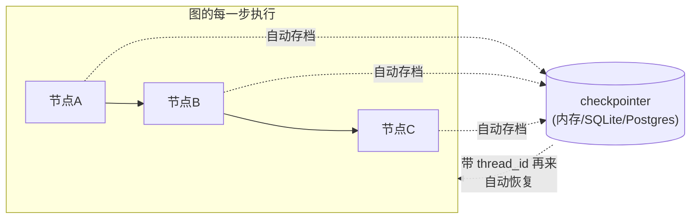
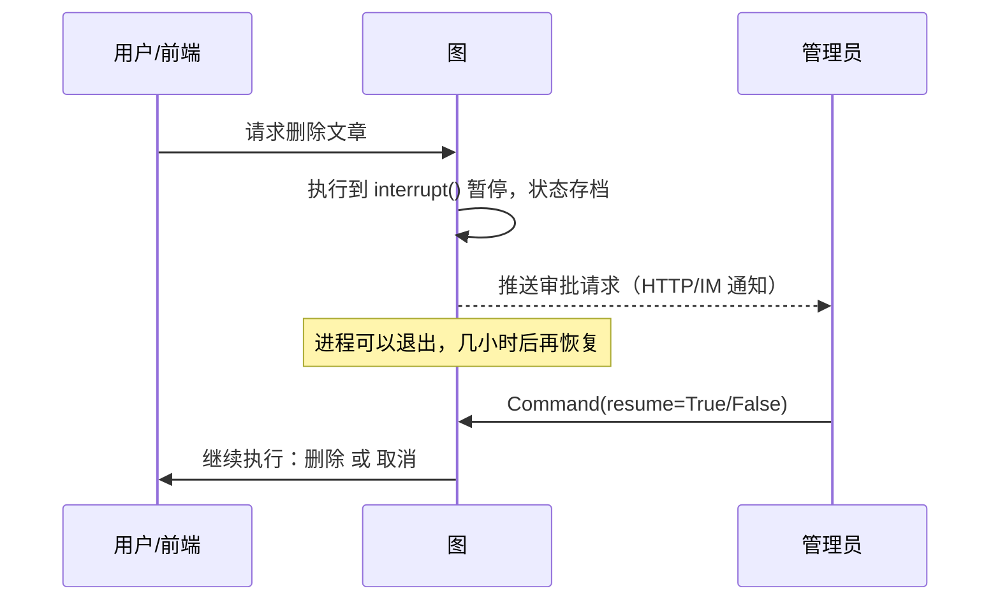

# （五）持久化、人工介入与流式

> 05 模块收官章。前四章的图都有三块短板：进程一重启记忆就没、危险操作没法「请示人类」、执行过程对外是黑盒。本章的三件套——checkpointer、interrupt、stream——正是生产级 Agent 与 demo 的分水岭。

## 本章目标

- 理解 checkpointer 机制：图的每一步自动「存档」，`thread_id` 隔离会话
- 用 SQLite checkpointer 实现**跨进程**的持久记忆（重启不丢）
- 用 `interrupt` / `Command(resume=...)` 实现危险操作的人工审批
- 掌握三种 stream 模式，知道实战时各用在哪

## 一、checkpointer：游戏存档机制



```python
graph = builder.compile(checkpointer=SqliteSaver(conn))      # 编译时挂上
graph.invoke(input, {"configurable": {"thread_id": "alice"}})  # 调用时带会话号
```

### 框架 vs 手写对照（03 模块四章）

| 能力 | 手写 ConversationMemory | checkpointer |
| --- | --- | --- |
| 保存历史 | 自己维护 Python 列表 | 每步自动存档 |
| 多用户隔离 | 自己建字典管理多个实例 | `thread_id` 一个参数 |
| 重启进程 | **记忆全丢** | SQLite/Postgres 后端，记忆还在 |
| 滑动窗口/摘要 | 手写裁剪逻辑 | 仍需自己做（框架只管存，不管压缩）|

注意最后一行：checkpointer 解决「存哪里」，不解决「上下文过长」——你手写的滑动窗口 + 摘要压缩在框架时代依然要用（实战 07 模块会结合两者）。

## 二、interrupt：危险操作先请示人类

`interrupt()` 在节点内部把整张图**暂停**：状态已存档，进程甚至可以退出；直到有人 `Command(resume=答复)` 恢复，`interrupt()` 才带着答复返回继续执行。



关键认知：**暂停与恢复可以发生在两个不同的 HTTP 请求、甚至两次进程启动之间**——这就是它必须依赖 checkpointer 的原因。03 模块手写的循环根本做不到「暂停几小时」。

## 三、三种 stream 模式：给前端的三种直播信号

| 模式 | 吐出什么 | 实战用途 |
| --- | --- | --- |
| `values` | 每步后的完整状态 | 调试 |
| `updates` | 每步的增量（哪个节点干了什么） | 「Agent 正在检索…」过程提示 |
| `messages` | LLM 逐 token 输出 | 打字机效果，对接 SSE（07 模块） |

## 四、动手实践

```bash
cd "05-LangGraph/（五）持久化人工介入与流式/project"
uv sync
uv run python main.py   # 演示 3（interrupt）离线可跑；其余需要 LLM Key
```

**重点体验演示 2**：运行一次后**重新运行脚本**——AI 还记得你上次说的名字和项目（记忆存在 `chat_memory.db` 里）。这是手写版做不到的。

## 五、动手作业

1. 给演示 1 加第三个 thread，用 `graph.get_state(config)` 查看某个线程当前存档的完整状态
2. 把演示 3 的审批改成交互式：用 `input()` 让你自己输入 y/n 再 resume
3. 进阶：把第四章的 BlogAgent 图加上 SqliteSaver，做一个真正「记得住的」博客助手（这就是 07 模块六章的雏形）

## 官方文档与延伸阅读

- [持久化（Persistence/checkpointer）文档](https://docs.langchain.com/oss/python/langgraph/persistence)
- [Human-in-the-loop（interrupt）文档](https://docs.langchain.com/oss/python/langgraph/interrupts)
- [Streaming 文档（三种模式）](https://docs.langchain.com/oss/python/langgraph/streaming)

## 下一章预告

至此你能构建带记忆、可审批、可流式的生产级 Agent 了。但上线之后呢？回答得好不好、慢不慢、烧了多少钱——你需要「仪表盘」。进入 **模块 06：监控与评估**，从结构化日志开始，一路到 OpenTelemetry 链路追踪、Prometheus + Grafana 看板和 Ragas 质量评估。
