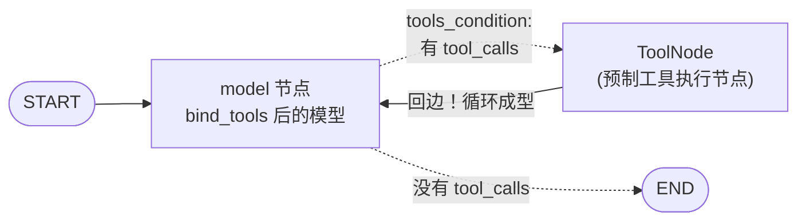

# （四）LangGraph Agent 与工具

> 04 模块用 `create_agent` 一行构建了 Agent，本章把它「开膛破肚」：用模型节点 + `ToolNode` + `tools_condition` 手工搭出一模一样的图。搭完你会彻底明白：**Agent = 一张带回边的图**。最后给 BlogAgent 接上真实 RAG 工具，做出它的图化版。

## 本章目标

- 用 `bind_tools` + `ToolNode` + `tools_condition` 手工搭建 Agent 图
- 理解预制状态 `MessagesState` 的「追加合并」机制（Reducer 初体验）
- 分清 Workflow 与 Agent 在图上的形态区别
- BlogAgent 图化版：模型自主决定检索策略

## 一、Agent 图的三个零件



| 零件 | 作用 | 对照手写代码 |
| --- | --- | --- |
| `bind_tools(tools)` | 把工具 schema 挂到模型上 | 01 模块四章 `tools=` 参数 |
| `ToolNode(tools)` | 执行 tool_calls、产出 ToolMessage、异常转错误信息 | 03 模块的 `execute()`（含错误即信息） |
| `tools_condition` | 有 tool_calls 去工具节点，否则 END | 03 模块循环里的那个 `if` |
| `tools → model` 回边 | 工具结果回到模型 | 03 模块 `while` 循环本身 |

## 二、MessagesState 与 Reducer（重要概念）

上一章的状态字段是「覆盖」更新，但消息历史需要「追加」。预制的 `MessagesState` 内部用 **Reducer** 声明了合并方式：节点返回 `{"messages": [新消息]}` 时自动 append 而非覆盖。

```python
class MessagesState(TypedDict):
    messages: Annotated[list, add_messages]   # add_messages 就是 Reducer
```

前端类比：Redux 的 reducer——状态怎么合并，由字段自己声明。需要自定义状态时（比如再加个 `sources` 字段），照这个模式写即可。

## 三、Workflow vs Agent：图上一眼分清

| | 第三章 RAG Workflow | 本章 Agent |
| --- | --- | --- |
| 谁决定走向 | 我们写的路由规则（score 阈值） | 模型自己（要不要调工具、调哪个） |
| 图的形态 | 节点多、路径明确 | 节点少、靠回边循环 |
| 可预测性 | 高（适合生产主链路） | 低但灵活（适合开放任务） |
| 03 模块一章的结论 | 「能用 Workflow 就别用 Agent」 | 在图的世界依然成立 |

实战的 BlogAgent（07 模块）会是**混合体**：主链路用 Workflow 保证可控，开放性问题交给 Agent 子图。

## 四、动手实践

```bash
cd "05-LangGraph/（四）LangGraphAgent与工具/project"
uv sync
uv run python main.py   # 需要 LLM Key；首次运行自动构建索引
```

| 文件 | 说明 |
| --- | --- |
| `project/main.py` | 手工搭 Agent 图 + BlogAgent 图化版（流式观察决策） |
| `project/blog_tools.py` | `@tool` 版博客工具（search_blog / list_articles，真实检索） |
| `project/loader.py` 等 + `data/` | 02 模块基建，原样复用 |

注意观察第二个问题：模型会自己决定先调 `search_blog`，拿到结果后再组织回答——没有任何一行代码规定它「必须先检索」。

## 五、动手作业

1. 给 `blog_tools.py` 加一个 `get_article(article_id: str)` 工具（返回全文，03 模块五章写过），观察模型何时会用它
2. 把 `tools → model` 的回边删掉再跑——观察 Agent「断了循环」之后的行为，加深对回边的理解
3. 思考题：`ToolNode` 异常时把错误信息作为 ToolMessage 返回（而不是抛出），为什么这个设计对 Agent 至关重要？（复习 03 模块三章「错误即信息」）

## 官方文档与延伸阅读

- [LangGraph 工具调用文档（ToolNode）](https://docs.langchain.com/oss/python/langgraph/use-tools)
- [Agentic RAG 教程](https://docs.langchain.com/oss/python/langgraph/agentic-rag)
- [MessagesState 与 Reducer](https://docs.langchain.com/oss/python/langgraph/graph-api#state)

## 下一章预告

BlogAgent 还有最后一块短板：重启进程记忆就没了，也没法在执行危险操作前「请示人类」。下一章 **《（五）持久化、人工介入与流式》** 是 05 模块收官：checkpointer 跨进程会话、`interrupt` 人工审批、三种流式模式——生产级 Agent 的最后三件套。
