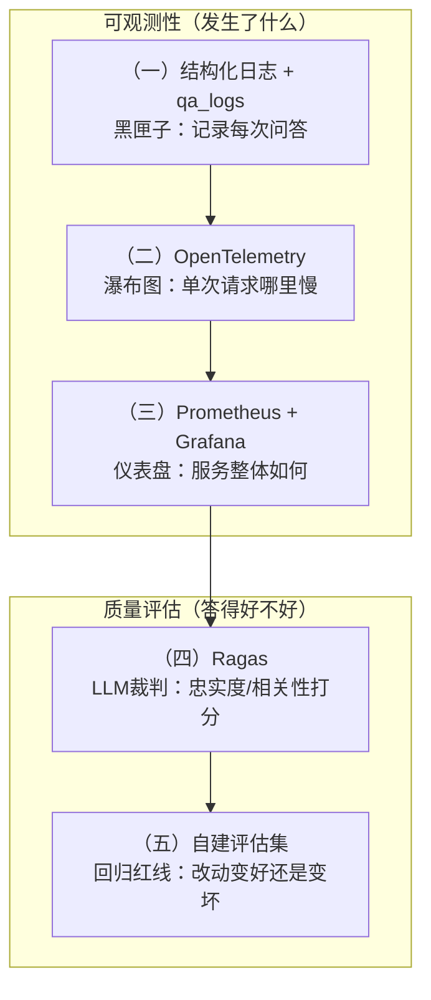
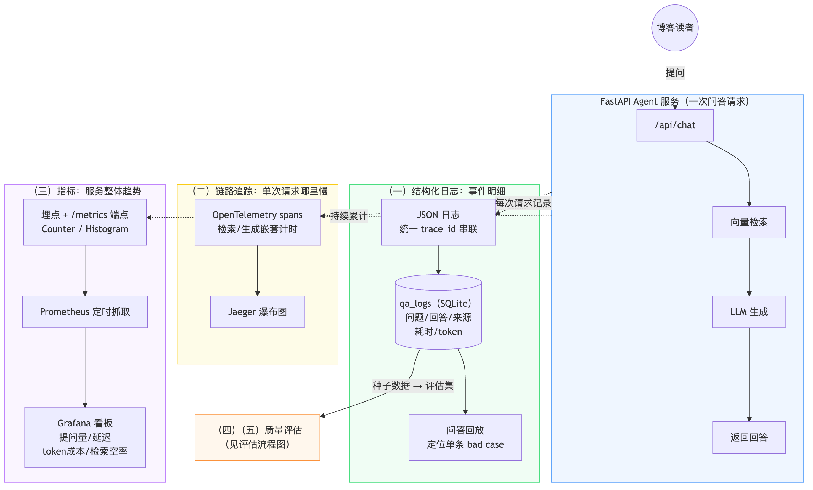
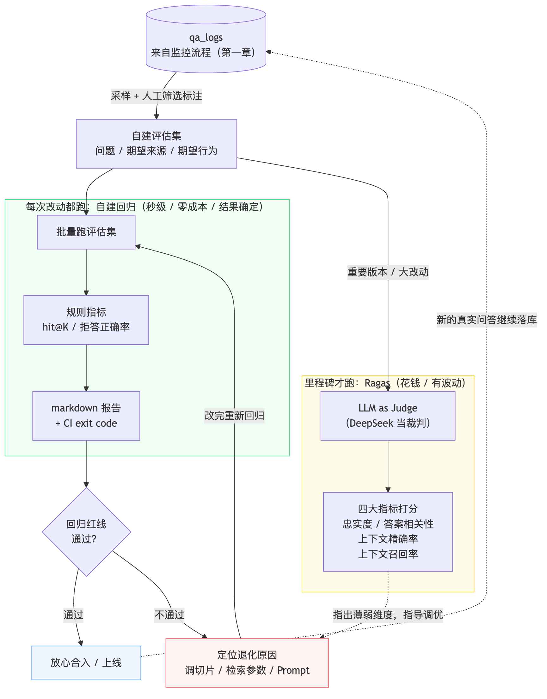

# 模块 06：监控与评估

> 「没有评估集和指标，连这次改动是变好还是变坏都说不清。」本模块把 Agent 服务从「能跑」升级为「可观测、可评估、可回归」——这是 demo 和工程系统的真正分界线。

## 体系总览：五章五块拼图

## 监控流程图（一 ~ 三章：可观测性）

一次问答请求进来后，同时走三条观测通道，各管一摊、互不替代：

- **结构化日志（绿色）**：每次问答以 JSON 形式落入 qa_logs，靠统一 trace_id 串联，用于回放和定位单条 bad case——它同时也是后续评估集的种子数据来源
- **链路追踪（黄色）**：OpenTelemetry 给检索/生成等阶段打嵌套 span，到 Jaeger 看瀑布图，回答「这一次请求慢在哪一步」
- **指标（紫色）**：Counter/Histogram 持续累计，Prometheus 定时抓取 `/metrics`，Grafana 看板回答「服务整体趋势如何」——包括 LLM 应用特有的 token 成本与检索空率

## 评估流程图（四 ~ 五章：质量评估）

评估是一个闭环，分便宜和贵两层：

- **入口**：从 qa_logs 采样真实问答，人工筛选标注成自建评估集（问题 / 期望来源 / 期望行为）
- **每次改动都跑（绿色）**：自建回归，秒级、零成本、结果确定，产出 hit@K、拒答正确率与 markdown 报告，CI exit code 即「回归红线」
- **里程碑才跑（黄色）**：Ragas 用 LLM 当裁判给忠实度等四大指标打分，全面但花钱且有波动，用来指出薄弱维度、指导调优方向
- **闭环**：回归不通过 → 调切片/检索参数/Prompt → 重新回归；上线后新的真实问答继续落入 qa_logs，反哺评估集

> 流程图源文件：[`assets/monitoring-flow.mmd`](./assets/monitoring-flow.mmd)、[`assets/evaluation-flow.mmd`](./assets/evaluation-flow.mmd)（mermaid 格式）。改动后可重新渲染：`npx -y @mermaid-js/mermaid-cli -i assets/monitoring-flow.mmd -o assets/monitoring-flow.png -w 1500 -s 2 -b white`

## 章节导览

| 章节 | 核心内容 | 离线可跑 | 需要 Docker |
| --- | --- | --- | --- |
| （一）结构化日志与 qa_logs | JSON 日志、trace_id、问答落库与回放 | ✅ 全程 | — |
| （二）OpenTelemetry 链路追踪 | span 嵌套、属性、Jaeger 瀑布图 | ✅ 全程 | Jaeger（可选） |
| （三）Prometheus 与 Grafana | Counter/Histogram 埋点、/metrics、预配置看板 | ✅ 全程 | ✅ 监控栈 |
| （四）Ragas 入门（v0.4） | LLM as Judge、四大指标、自实现 Embedding 接口 | 需 LLM Key | — |
| （五）自建评估集与自动化回归 | hit@K/拒答正确率、markdown 报告、CI exit code | ✅ 全程 | — |

## 三个核心心法

1. **可观测性三件套各管一摊**：日志管「事件明细」、追踪管「单次请求的层级耗时」、指标管「服务整体趋势」——不是三选一，生产系统全要
2. **LLM 应用的特色指标**：token 消耗（成本）和检索空率/top_score（质量）必须从第一天就埋——这是普通 Web 服务没有的维度
3. **两层评估体系**：便宜的自建回归每次改动跑（秒级、零成本、确定），贵的 Ragas 里程碑跑（全面但有波动）——并且评估集的种子数据就来自第一章的 qa_logs

## 环境要求

- 二、三章用到本地 Docker（Jaeger / Prometheus / Grafana），compose 文件已备好，起停各一条命令
- 四章需要 LLM Key（DeepSeek 作裁判）；一、二、三、五章全程离线可跑

预计学习时间：6~8 小时（每章 1~1.5 小时）
