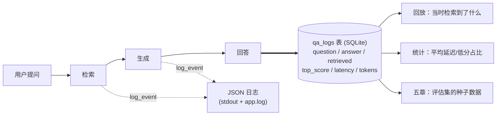

# （一）结构化日志与 qa_logs

> 监控模块的第一章不讲任何高大上的工具，只做一件朴素但决定成败的事：**给每一次问答装上黑匣子**。没有记录，你连「用户都问了什么、答得好不好」都不知道，更谈不上优化。

## 本章目标

- 理解 print 与结构化日志的本质区别（人读 vs 机器读）
- 用 `trace_id` 串联一次请求的所有日志事件
- 设计并落地 `qa_logs` 表：问答全过程结构化入库
- 体验黑匣子的回报：历史回放、平均延迟、检索质量统计

## 一、print 的天花板，JSON 日志的起点

```text
print:  检索完成，找到3条结果，最高分0.62，耗时45ms
JSON :  {"ts":"...","event":"retrieve.done","trace_id":"a1b2c3","hits":3,"top_score":0.62,"latency_ms":45}
```

| | print | JSON 结构化日志 |
| --- | --- | --- |
| 人能读 | ✅ | ✅（稍差） |
| 按字段过滤/聚合 | ❌ 只能肉眼+grep | ✅ `top_score < 0.5 的事件有多少` |
| 进日志系统（Loki/ELK） | ❌ | ✅ 直接消费 |
| 串联一次请求 | ❌ | ✅ trace_id |

**trace_id 是本章最重要的概念**：一次问答产生 N 条日志（开始/检索/生成/结束），它们共享同一个随机 ID。排查问题时按 trace_id 过滤，整个请求的来龙去脉一目了然——这也是下一章 OpenTelemetry「链路追踪」思想的最朴素形态。

## 二、qa_logs 表：评估体系的原材料



字段设计的两个要点：

1. **`retrieved` 存完整检索结果（JSON）**：答错时第一件事就是回放「当时模型看到了什么资料」——90% 的 RAG 问题出在检索（02 模块五章的结论），不存检索结果就无从排查
2. **`top_score` 单独成列**：高频查询的字段要从 JSON 里抽出来建列，才能高效做 `WHERE top_score < 0.5` 这类质量监控

> 日志（事件流）和 qa_logs（业务记录）是互补的：日志细、记录全。生产系统两者都要。

## 三、动手实践

```bash
cd "06-监控与评估/（一）结构化日志与qa_logs/project"
uv sync
uv run python main.py   # 全程离线可跑：没配 Key 时自动用模拟回答演示完整链路
```

| 文件 | 说明 |
| --- | --- |
| `project/qa_logger.py` | 本章核心：JsonFormatter / log_event / qa_logs 表 / Timer |
| `project/main.py` | 三个演示：日志对比 → 带黑匣子的问答 → 回放与统计 |
| `project/loader.py` 等 + `data/` | 02 模块基建，原样复用 |

运行后看看产物：`cat app.log`（JSON 日志文件）、`qa_logs.db`（可用 PyCharm 的 Database 工具打开）。

## 四、动手作业

1. 多跑几次 `main.py`，然后写一条 SQL：统计每个问题被问过几次（`GROUP BY question`）
2. 给 `log_event` 增加 `level` 参数支持 warning/error，在「检索 top_score < 0.45」时打一条 warning
3. 思考题：`qa_logs` 还缺一个对产品迭代极重要的字段——用户对回答满不满意。怎么补？（提示：前端点赞/点踩回传，`user_feedback` 列；07 模块会实现）

## 官方文档与延伸阅读

- [Python logging 官方文档](https://docs.python.org/zh-cn/3.10/library/logging.html)
- [The Twelve-Factor App：日志即事件流](https://12factor.net/zh_cn/logs)
- [SQLite JSON 函数（查询 retrieved 字段会用到）](https://sqlite.org/json1.html)

## 下一章预告

trace_id 能串起「一次请求」的日志，但看不出**层级和耗时分布**：检索里的向量化花了多久？生成占了总耗时的几成？下一章 **《（二）OpenTelemetry 链路追踪》** 引入 span 的概念，用 Jaeger 把一次问答画成「瀑布图」。
