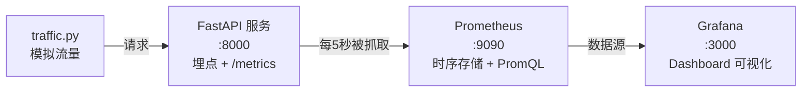

# （三）Prometheus 与 Grafana 指标看板

> 追踪（上一章）回答「这次请求哪里慢」，指标回答「服务整体怎么样」：QPS 多少？P95 延迟多少？今天烧了多少 token？本章用 Prometheus + Grafana 给问答服务装上仪表盘——compose 文件已预配置好数据源和 Dashboard，开箱即看。

## 本章目标

- 理解指标的两种基本类型：Counter（只增计数）与 Histogram（分布）
- 给 FastAPI 服务埋点并暴露 `/metrics` 端点
- 理解 Prometheus 的「拉模型」：它定时来抓你，不是你推给它
- 在 Grafana 里看懂四块核心面板（流量/性能/成本/质量）

## 一、四个指标，覆盖四个维度

| 指标 | 类型 | 维度 | 回答的问题 |
| --- | --- | --- | --- |
| `qa_requests_total{status}` | Counter | 流量 | QPS 多少？错误率多少？ |
| `qa_latency_seconds` | Histogram | 性能 | P95 延迟多少？ |
| `llm_tokens_total{kind}` | Counter | **成本** | 今天烧了多少 token？ |
| `retrieval_empty_total` | Counter | **质量** | 多少问题检索不到内容？ |

后两个是 LLM 应用特有的——**成本和质量必须从第一天就监控**（token 是真金白银；空检索率上升 = 知识库该补内容了）。

两个易混概念：

- **Counter 只增不减**，看的是「变化率」：`rate(qa_requests_total[1m])` = 每秒请求数。重启归零没关系，rate 会处理
- **Histogram 是一组桶**：`observe(0.8)` 落进 `le=1.0` 及以上的桶。P95 是用 `histogram_quantile` 从桶分布估算的——桶边界要按业务量级设计（LLM 应用：0.1s ~ 10s）

## 二、拉模型与整体架构



Prometheus 是**拉（pull）模型**：你的服务只负责把当前计数「摆」在 `/metrics` 上（纯文本），Prometheus 定时来抓。好处：服务零依赖监控系统、监控故障不影响业务。

## 三、动手实践（全程离线）

```bash
cd "06-监控与评估/（三）Prometheus与Grafana指标看板/project"
uv sync
uv run uvicorn app:app --port 8000        # 终端1：起服务
curl http://localhost:8000/metrics        # 先肉眼看看指标长什么样

docker compose up -d                      # 终端2：起 Prometheus + Grafana
uv run python traffic.py                  # 终端2：打 90 秒模拟流量
```

浏览器打开 [http://localhost:3000](http://localhost:3000)（admin/admin）→ Dashboards → **博客问答服务监控**，四块面板的曲线会在一两分钟内长出来。玩完 `docker compose down`。

| 文件 | 说明 |
| --- | --- |
| `project/app.py` | 带埋点的迷你问答服务（QA 模拟，埋点与真实服务一致） |
| `project/traffic.py` | 模拟流量脚本（随机间隔，让曲线有起伏） |
| `project/docker-compose.yml` + `prometheus.yml` | 监控栈 |
| `project/grafana/` | 预配置的数据源 + Dashboard JSON |

## 四、动手作业

1. 在 Prometheus（[localhost:9090](http://localhost:9090)）里手敲 PromQL：`rate(qa_requests_total[1m])`，对照 Grafana 曲线
2. 给 `app.py` 加一个 `Gauge` 类型指标 `active_sessions`（可增可减），模拟在线会话数
3. 把 `app.py` 里模拟错误概率从 5% 调到 30%，观察 QPS 面板里 error 曲线的变化——这就是「发版出 bug」时你会看到的画面

## 官方文档与延伸阅读

- [prometheus_client（Python 官方客户端）](https://prometheus.github.io/client_python/)
- [Prometheus 指标类型](https://prometheus.io/docs/concepts/metric_types/)
- [PromQL 入门](https://prometheus.io/docs/prometheus/latest/querying/basics/)
- [Grafana Provisioning 文档](https://grafana.com/docs/grafana/latest/administration/provisioning/)

## 下一章预告

日志、追踪、指标——「可观测性三件套」齐了，但它们都回答不了最核心的问题：**回答的质量到底好不好？** 下一章 **《（四）Ragas 入门》** 用「LLM 当裁判」的方式，给 RAG 的回答打出忠实度、相关性等量化分数。
