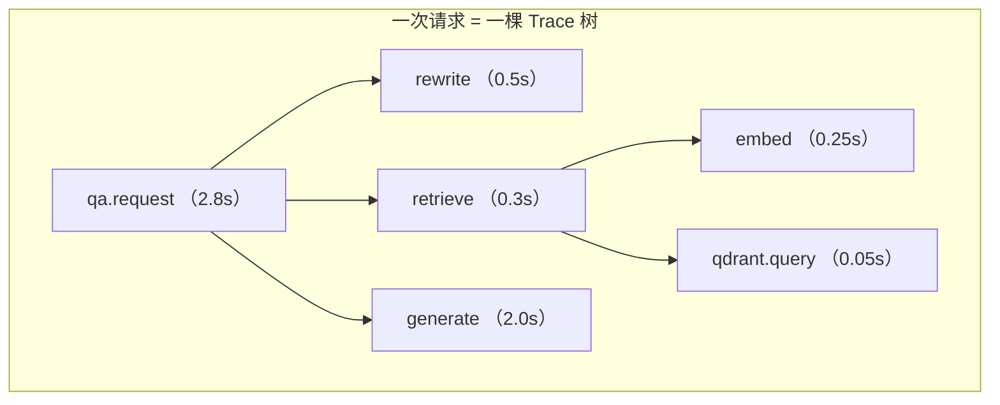
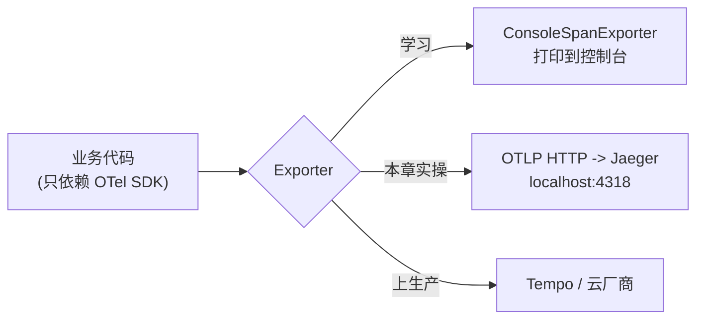

# （二）OpenTelemetry 链路追踪

> 上一章的 trace_id 能「串起」一次请求的日志，但看不出**层级与耗时分布**：总共 3 秒的请求，到底是检索慢还是生成慢？本章引入 OpenTelemetry 的 span 概念，用 Jaeger 把一次问答画成「瀑布图」——慢在哪，一眼看穿。

## 本章目标

- 理解 Trace / Span / 属性 / 事件 四个核心概念
- 用 `start_as_current_span` 给 RAG 流水线的每个环节套上嵌套 span
- 本地 Docker 起 Jaeger，看真实的瀑布图
- 理解 OpenTelemetry 是「标准」而非「产品」（厂商中立的意义）

## 一、从 trace_id 到 Span 树

上一章的日志是「平的」——所有事件并排躺着。span 是「树」：



| 概念 | 是什么 | 代码 |
| --- | --- | --- |
| Span | 有名字、有起止时间的一段操作 | `with tracer.start_as_current_span("retrieve")` |
| Trace | 一次请求的所有 span 组成的树 | 自动关联（with 嵌套 = 树的父子） |
| 属性 | 挂在 span 上的业务数据 | `span.set_attribute("hits.top_score", 0.62)` |
| 事件 | span 内的瞬间标记 | `span.add_event("prompt.built")` |

前端类比：Chrome DevTools 的 Performance 火焰图，只不过对象从函数调用变成了分布式服务的各个环节。

## 二、OpenTelemetry 是标准，Jaeger 是其中一种后端

OpenTelemetry（OTel）是 CNCF 的可观测性**标准**：你的代码只依赖 OTel SDK 埋点，导出到哪里（Jaeger / Tempo / 阿里云 SLS / 控制台）只是换一个 Exporter——埋点代码一行不改。



`BatchSpanProcessor` 值得注意：span 先攒批、异步导出，不阻塞业务代码——程序退出前要 `force_flush()` 把缓冲区刷完。

## 三、动手实践（全程离线可跑）

```bash
cd "06-监控与评估/（二）OpenTelemetry链路追踪/project"
uv sync
uv run python main.py              # 第一步：span 打印到控制台，先看懂结构

docker compose up -d               # 第二步：起本地 Jaeger
uv run python main.py --jaeger     # span 导出到 Jaeger
# 浏览器打开 http://localhost:16686 -> Service 选 blog-rag -> Find Traces
docker compose down                # 玩完销毁
```

| 文件 | 说明 |
| --- | --- |
| `project/tracing.py` | OTel 初始化封装（控制台/Jaeger 一键切换） |
| `project/main.py` | 带嵌套 span 的 RAG 流水线（检索真实，LLM 环节模拟） |
| `project/docker-compose.yml` | 本地 Jaeger |

在 Jaeger UI 里重点看：哪个 span 最宽（最耗时）？`retrieve` 里 `embed` 和 `qdrant.query` 的比例？点开 span 看我们挂的 `hits.top_score` 属性。

## 四、动手作业

1. 给 `rewrite` 里加一个子 span `llm.call`，刷新 Jaeger 看树多了一层
2. 在 `retrieve` 中故意 `time.sleep(2)`，用 Jaeger 找出「变慢的环节」——体验排查流程
3. 思考题：span 属性和上一章的 qa_logs 字段有重叠（top_score 等），两者各自的定位是什么？（提示：追踪看「单次请求哪里慢」，业务表做「批量统计与回放」）

## 官方文档与延伸阅读

- [OpenTelemetry Python 入门](https://opentelemetry.io/docs/languages/python/getting-started/)
- [Traces 概念文档](https://opentelemetry.io/docs/concepts/signals/traces/)
- [Jaeger 官方文档](https://www.jaegertracing.io/docs/)

## 下一章预告

追踪回答「单次请求发生了什么」，但老板问的是「服务今天整体怎么样？QPS 多少？P95 延迟多少？」——这是**指标（Metrics）**的领域。下一章 **《（三）Prometheus 与 Grafana 指标看板》** 给服务装上仪表盘。
