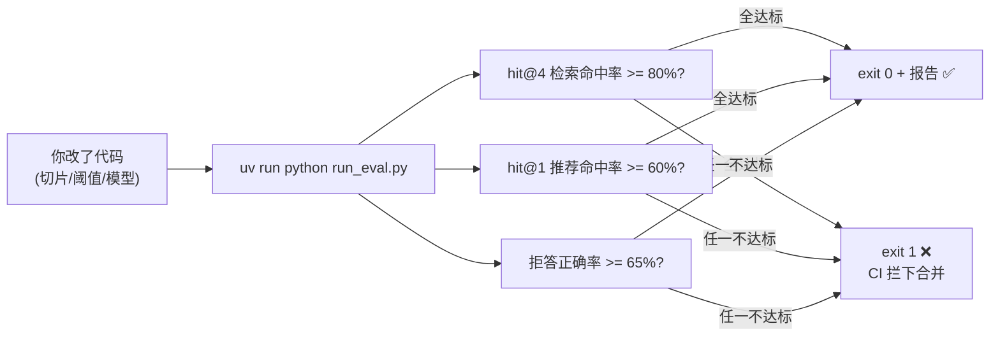

# （五）自建评估集与自动化回归

> 模块收官章。Ragas 强大但「贵、慢、有波动」，日常迭代需要的是**便宜、确定、秒级**的回归测试。本章自建评估集 + 回归脚本：每次改切片策略、换 embedding 模型、调阈值之后，30 秒知道「这次改动是变好还是变坏」——这是把 RAG 当工程做（而不是当玄学调）的分水岭。

## 本章目标

- 设计自己的评估集格式：`expected_articles` / `must_contain` / `should_refuse`
- 实现零 LLM 调用的检索回归：hit@K、hit@1、拒答正确率
- 输出 markdown 报告 + 不达标 exit 1（可直接接 CI）
- 理解两层评估体系：便宜的天天跑，贵的里程碑跑

## 一、评估集：你的「考试卷」

```jsonl
{"question": "useEffect 为什么会执行两次？", "expected_articles": ["react-useeffect"], "must_contain": ["StrictMode"], "should_refuse": false}
{"question": "博客里有讲 Java 的 Spring Boot 教程吗？", "expected_articles": [], "must_contain": [], "should_refuse": true}
```

| 字段 | 考什么 |
| --- | --- |
| `question` | 建议收集**真实用户提问**（qa_logs 表就是来源！），口语化的比标准表述更有价值 |
| `expected_articles` | 检索该命中哪篇文章（人工标注的「标准答案」） |
| `must_contain` | 命中文章还不够，关键内容片段必须真的被检索出来（抽查切片质量） |
| `should_refuse` | 知识库没有的问题，系统应该「诚实说不知道」而不是硬答 |

**拒答用例（最后三条）最容易被忽略也最重要**：没有它们，你把阈值调到 0 也能让命中率 100%——拒答用例逼着系统在「查得到」和「不乱答」之间保持平衡。

## 二、三个指标与回归红线



全程**不调用 LLM**：检索命中与否是确定的事实，不需要裁判。这就是它能天天跑、跑得起的原因。

### 两层评估体系（本模块的最终结论）

| | 自建回归（本章） | Ragas（上一章） |
| --- | --- | --- |
| 成本 | 零 | 每样本十几次 LLM 调用 |
| 速度 | 秒级 | 分钟级 |
| 确定性 | 完全确定 | 有波动 |
| 覆盖 | 检索质量 | 检索+生成质量 |
| 跑的时机 | **每次改动**（CI） | 里程碑 / 大改动前后 |

## 三、动手实践（全程离线）

```bash
cd "06-监控与评估/（五）自建评估集与自动化回归/project"
uv sync
uv run python run_eval.py            # 跑评估，看表格 + 生成 eval_report.md
uv run python run_eval.py --strict   # 用更严苛的阈值，体验「不达标 exit 1」
echo $?                              # 看退出码
```

| 文件 | 说明 |
| --- | --- |
| `project/eval_dataset.jsonl` | 12 个用例：9 个检索 + 3 个拒答 |
| `project/run_eval.py` | 回归脚本：评估 → 表格 → markdown 报告 → exit code |

## 四、动手作业

1. 故意「搞破坏」：把 `indexer.py` 里的 chunk_size 改成 2000（切片变粗），重跑评估——分数掉了吗？这就是回归测试的价值
2. 往评估集里加 3 个你自己想的问题（含 1 个拒答用例），重跑
3. 进阶：写一个 GitHub Actions workflow（`on: push` → `uv sync` → `uv run python run_eval.py`），把回归真正挂上 CI

## 官方文档与延伸阅读

- [Anthropic：Demystifying evals for AI agents](https://www.anthropic.com/research/demystifying-evals)
- [Hamel Husain：Your AI Product Needs Evals](https://hamel.dev/blog/posts/evals/)（评估体系的经典实践文章）
- [GitHub Actions 入门](https://docs.github.com/zh/actions/quickstart)

## 下一章预告

监控与评估的全套能力已就绪：黑匣子（qa_logs）、瀑布图（OTel）、仪表盘（Prometheus/Grafana）、质量裁判（Ragas）、回归红线（评估集）。**模块 07 实战**把 01~06 的一切组装成真正可部署的「博客知识库 Agent」：GitHub 仓库同步、动态增量索引、FastAPI 流式服务、LangGraph 生产图、全套监控、阿里云上线。
