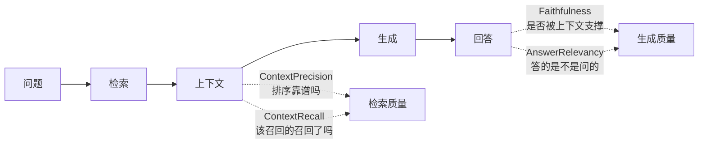

# （四）Ragas 入门（v0.4 API）

> 日志、追踪、指标管住了「快慢与成本」，但管不住最核心的问题：**回答质量好不好？** 人工一条条看不现实，Ragas 的思路是「LLM 当裁判（LLM as Judge）」——用一个模型给另一个模型的回答打分，让质量变成可比较、可回归的数字。

## 本章目标

- 理解 LLM as Judge 的思想与局限
- 掌握 RAG 评估四大指标，知道每个指标「抓什么病」
- 用 Ragas 0.4 collections API + DeepSeek 裁判模型跑通评估
- 又一次实现框架接口：`BaseRagasEmbedding` 包装本地 FastEmbed

## 一、四大指标：各抓一种病



| 指标 | 检查对象 | 抓什么病 | 需要什么输入 |
| --- | --- | --- | --- |
| Faithfulness | 生成 | **编造**（幻觉） | 问题+回答+检索上下文 |
| AnswerRelevancy | 生成 | **跑题** | 问题+回答（+embedding） |
| ContextPrecision | 检索 | 排序差、混入无关内容 | 问题+上下文+标准答案 |
| ContextRecall | 检索 | 该召回的没召回 | 问题+上下文+标准答案 |

排查逻辑与 02 模块五章一致：**分数告诉你锅在检索还是在生成**。上下文指标低 → 修检索（切片/改写/阈值）；忠实度低 → 修 Prompt（强调「只根据资料回答」）。

## 二、Ragas 0.4 的 API 要点

> 注意版本：网上大量教程还是 0.1/0.2 的 `evaluate(dataset, metrics=[...])` 旧写法。0.4 改为 collections API，旧 API 已废弃。

```python
from ragas.llms import llm_factory
from ragas.metrics.collections import Faithfulness

judge = llm_factory("deepseek-chat", provider="openai",
                    client=AsyncOpenAI(api_key=..., base_url="https://api.deepseek.com"))
metric = Faithfulness(llm=judge)
result = await metric.ascore(user_input=..., response=..., retrieved_contexts=[...])
result.value   # 0~1 的分数
```

两个工程细节：

1. **裁判模型可以是任何 OpenAI 兼容服务**——我们传入指向 DeepSeek 的 `AsyncOpenAI` 客户端。裁判调用也花钱，评估 4 个样本约十几次 LLM 调用
2. **AnswerRelevancy 需要 embedding**（算「从回答反推的问题」与原问题的相似度）。DeepSeek 没有 embedding 接口，我们实现 `BaseRagasEmbedding` 接口接入本地 FastEmbed——与 04 模块三章实现 LangChain `Embeddings` 接口异曲同工

## 三、动手实践

```bash
cd "06-监控与评估/（四）Ragas入门/project"
uv sync
uv run python main.py   # 需要 LLM Key，约 1~3 分钟
```

`main.py` 准备了 4 个样本，其中 3 个是「故意有病」的：编造的回答、答非所问的回答、检索拿错资料。运行后看分数表格——每种病都应被对应的指标抓出来（红色标注 < 0.7 的分数）。

## 四、LLM as Judge 的局限（必读）

- **裁判也会错**：分数是估计值，不是真理；同一样本两次评估分数可能略有波动
- **适合看趋势、比相对**：优化前 0.6 → 优化后 0.85 有意义；纠结单次 0.82 vs 0.85 没意义
- **贵**：每个样本十几次裁判调用，别在 CI 里对全量数据跑（下一章的自建评估集会解决「便宜的日常回归」问题）

## 五、动手作业

1. 自己往 `SAMPLES` 加一个样本：回答「一半对一半编」，预测忠实度大概多少，再运行验证
2. 把样本 4 的 `retrieved_contexts` 改成 `[CONTEXT_USEEFFECT, CONTEXT_DOCKER]`（错的+对的），观察 ContextPrecision 与 ContextRecall 的变化差异
3. 思考题：为什么 ContextPrecision/Recall 需要 `reference`（标准答案）而 Faithfulness 不需要？

## 官方文档与延伸阅读

- [Ragas 官方文档](https://docs.ragas.io/)
- [Ragas 指标概念（含各指标计算原理）](https://docs.ragas.io/en/stable/concepts/metrics/)
- [LLM as Judge 实践指南（Anthropic：Demystifying evals）](https://www.anthropic.com/research/demystifying-evals)

## 下一章预告

Ragas 强大但贵、且依赖裁判模型。日常迭代需要的是**便宜、确定、秒级**的回归测试。下一章 **《（五）自建评估集与自动化回归》** 用你自己标注的评估集（expected_articles / must_contain / should_refuse）实现零成本的检索回归——每次改动后 30 秒知道「变好还是变坏」。
