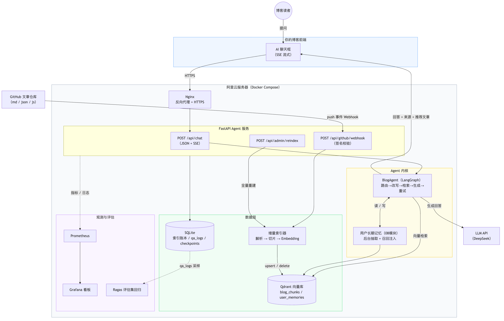

# 模块 07：实战——博客知识库 Agent

> 整套课程的终点：把前六个模块的能力组装成一个**生产级**的个人博客智能知识 Agent，可部署到你的阿里云服务器，接入你博客的 AI 聊天框。
>
> 与前面模块的最大区别：这不是 8 个独立 demo，而是**一个系统的 8 次迭代**——每章在上一章的 project 基础上叠加能力，最后一章的 project 就是可上线的完整服务。

## 最终交付（对应你最初的五点需求）

1. 构建个人博客知识库（RAG）——支持真实 GitHub 文章仓库（md/json/js）✅ 第二、三章
2. 博客 AI 聊天框提问 → 检索知识库 → 回答 + 推荐文章链接 ✅ 第四章
3. GitHub 仓库更新 → Webhook 触发 → 增量更新知识库（动态 RAG）✅ 第五章
4. Python 服务中实现完整的 BlogAgent ✅ 第六章
5. 监控与准确度衡量体系（指标 + 评估集）✅ 第七章

## 目标架构

整张图的三条主线：

1. **问答链路（实线，左上 → 右下）**：读者在博客聊天框提问 → Nginx → `/api/chat` → BlogAgent（LangGraph 图）→ Qdrant 向量检索 + LLM 生成 → SSE 流式返回「回答 + 来源 + 推荐文章」；08 模块升级后，Agent 还会在回答前召回用户长期记忆、对话后后台抽取新记忆
2. **动态 RAG 链路（实线，左侧）**：GitHub 文章仓库 push → Webhook（签名校验）→ 增量索引器（解析 → 切片 → Embedding）→ upsert/delete 到 Qdrant；`/api/admin/reindex` 可触发全量重建
3. **观测链路（虚线）**：FastAPI 服务输出指标/日志到 Prometheus + Grafana 看板，qa_logs 采样进入 Ragas 评估集做回归

> 架构图源文件：[`assets/architecture.mmd`](./assets/architecture.mmd)（mermaid 格式）。改动后可重新渲染：`npx -y @mermaid-js/mermaid-cli -i assets/architecture.mmd -o assets/architecture.png -w 1600 -s 2 -b white`

## 章节导览

| 章节 | 交付物 | 复用了哪些模块 |
| --- | --- | --- |
| （一）项目设计与架构总览 | 纯文档：需求拆解、数据模型、API 契约 | — |
| （二）GitHub 文章加载与解析 | 本地/GitHub 双后端 + 统一 Article 模型 + content_hash | 02 的 loader |
| （三）构建博客知识库 | Docker 版 Qdrant + 索引 CLI + SQLite 账本 | 02 的 chunker/embedder/indexer |
| （四）FastAPI 问答服务 | `/api/chat`（JSON + SSE）+ 测试聊天页 | 02 的检索、01 的流式 |
| （五）动态 RAG：Webhook 增量索引 | 签名校验 + 三类变更增量处理 + 模拟脚本 | 03 的工具安全意识 |
| （六）BlogAgent 升级 | LangGraph 生产图（路由/改写/重试/checkpointer） | 05 全模块 |
| （七）监控与评估接入 | 观测三件套 + Grafana 看板 + 评估回归 | 06 全模块 |
| （八）部署上线 | Dockerfile + 生产 compose + Nginx + 操作手册 | — |

## 两个贯穿全模块的设计决策

**1. 数据源双后端**：`.env` 里 `BLOG_SOURCE=local` 用课程自带的模拟仓库（mock_repo，6 篇文章），改成 `github` + 配上 `GITHUB_REPO` 即切换到你的真实仓库——**所有章节的代码不用改一行**。学习时用 local（离线、可随意增删文件做实验），上线时切 github。

**2. 一套 API 契约贯穿始终**：第一章就定死 `/api/chat` 的请求/响应 JSON，第四章实现 Workflow 版内核，第六章换成 LangGraph 版内核——前端与 API 层全程无感。「契约先行 + 内核可替换」是这个模块最想传递的工程品味。

> **后续升级（08 模块三章）**：（六）（七）（八）三章的 project 已接入**用户长期记忆**——`/api/chat` 新增可选 `userId` 字段（默认取 sessionId），对话结束后台抽取读者背景存入 Qdrant 的 `user_memories` collection，下次提问召回注入；并新增 `GET /api/memories` 调试端点（需管理令牌）与 `memory_recalls_total` 等观测指标。设计取舍与验证步骤见 [08-记忆系统（三）](../08-记忆系统/（三）记忆选型与BlogAgent接入/README.md)。

## 环境准备

- Docker Desktop 运行中（Qdrant/Prometheus/Grafana 都跑容器）
- 根目录 `.env` 配好 `LLM_API_KEY`（第四章起需要；没有 Key 时服务会返回友好的 503 提示，索引和评估等离线功能不受影响）
- 每章 project 独立 `uv sync`（PyCharm 直接打开 project 目录即可识别）

## 先行学习资料（官方文档）

- [FastAPI 官方文档（中文）](https://fastapi.tiangolo.com/zh/)
- [GitHub Webhooks 文档](https://docs.github.com/zh/webhooks)
- [GitHub Webhook 签名校验（X-Hub-Signature-256）](https://docs.github.com/zh/webhooks/using-webhooks/validating-webhook-deliveries)
- [GitHub REST API：仓库内容](https://docs.github.com/zh/rest/repos/contents)
- [GitHub REST API：比较两个 commit](https://docs.github.com/zh/rest/commits/commits#compare-two-commits)
- [Qdrant Docker 部署](https://qdrant.tech/documentation/guides/installation/)
- [Docker Compose 文档](https://docs.docker.com/compose/)
