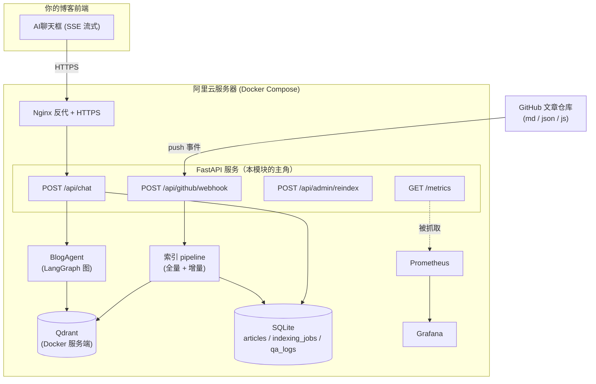
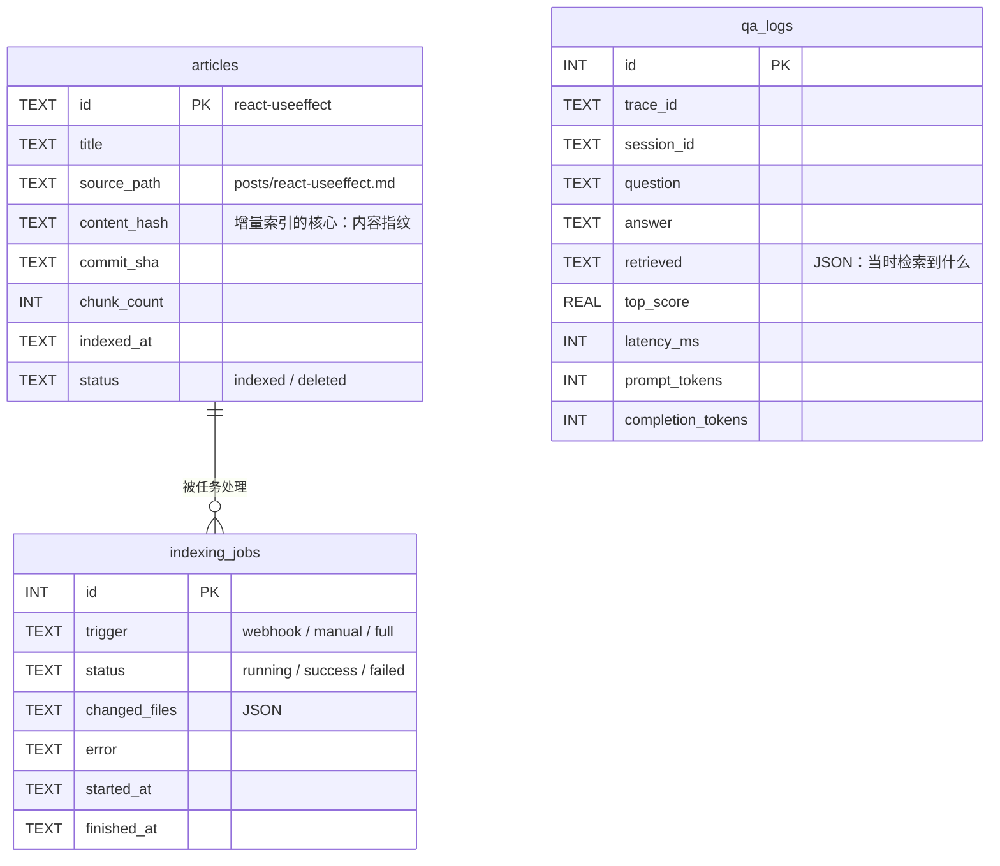
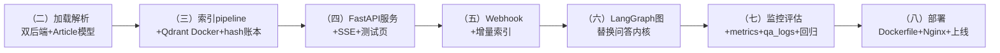

# （一）项目设计与架构总览

> 实战模块的第一章不写代码——**先把系统设计想清楚**。这一章是后面七章的「图纸」：需求拆解、整体架构、数据模型、API 契约、目录设计。写代码前把这些定下来，后面每一章都只是「按图施工」。

## 一、需求拆解：五点需求 → 系统能力

| 你的原始需求 | 系统能力 | 对应章节 |
| --- | --- | --- |
| 1. 构建博客知识库（RAG） | 文章加载/解析/切片/向量化/入库 | 二、三 |
| 2. 聊天框提问 → 回答 + 推荐文章 | FastAPI 流式问答服务 | 四 |
| 3. GitHub 更新自动学习（动态 RAG） | Webhook + 增量索引 | 五 |
| 4. 实现一个完整 Agent | LangGraph 生产图 + 会话记忆 | 六 |
| 5. 监控与准确度衡量 | 指标/日志/看板/评估集回归 | 七 |
| （隐含）能真正上线 | Docker + Nginx + HTTPS 部署 | 八 |

## 二、整体架构



三个关键设计决策（理解了它们，整个模块就不会迷路）：

**1. 数据源「双后端」**：`BLOG_SOURCE=local` 用课程自带的模拟仓库目录（`mock_repo/`），`BLOG_SOURCE=github` 通过 `.env` 配置 `GITHUB_REPO`/`GITHUB_TOKEN` 直连你的真实仓库。两个后端实现同一个接口——学习时零依赖，上线时改一行配置。

**2. Qdrant 切换 Docker 服务端模式**：前面模块用的本地文件模式只允许单进程访问；实战中「API 服务」和「索引任务」要同时访问向量库，必须用服务端模式（`QDRANT_URL=http://localhost:6333`）。

**3. 异步任务用 FastAPI BackgroundTasks 而非 Celery**：个人博客量级（文章数百篇、更新频率低），Webhook 触发的增量索引用 BackgroundTasks 足够。何时该升级 Celery？任务需要重试队列/定时调度/多 worker 并行时——届时只需替换「任务投递」那一层。

## 三、数据模型（SQLite）



- `content_hash` 是动态 RAG 的灵魂：内容没变就不重新索引（02 模块四章的稳定 ID + 本表配合）
- chunk 不单独建表：chunk 的真身在 Qdrant（payload 里带全部元数据），SQLite 只记 `chunk_count` 账目
- `qa_logs` 沿用 06 模块一章的设计，多了 `session_id`（多轮会话）

## 四、API 契约

### POST /api/chat

```jsonc
// 请求
{ "question": "useEffect 为什么执行两次？", "sessionId": "uuid-xxx", "stream": true }

// stream=false 的响应（stream=true 时通过 SSE 增量推送，最后一个事件给全量元数据）
{
  "answer": "这是 React 18 StrictMode 的刻意设计……",
  "sources": [
    { "title": "React useEffect 依赖数组的常见陷阱", "url": "https://blog.example.com/posts/react-useeffect", "score": 0.78 }
  ],
  "recommendedArticles": [
    { "title": "浏览器事件循环机制", "url": "https://blog.example.com/posts/browser-event-loop" }
  ],
  "confidence": 0.78,
  "traceId": "a1b2c3d4"
}
```

### POST /api/github/webhook

GitHub push 事件 + `X-Hub-Signature-256` 签名头；响应 `202 Accepted`（任务进后台，不阻塞 GitHub）。

### POST /api/admin/reindex

手动全量重建（带管理 token），兜底用。

## 五、各章节如何叠出最终系统



每章的 `project/` 都是**前一章的完整副本 + 当章新增**——任何一章都能独立运行，也方便你 diff 两章看「这章到底加了什么」。

## 六、动手作业（设计阶段）

1. 画出你自己博客的真实情况：文章仓库结构、文件格式、博客 URL 规则（第二章的 `BLOG_URL_TEMPLATE` 要用）
2. 思考：如果将来文章数到 10 万篇，本设计哪些地方要换？（SQLite→Postgres、BackgroundTasks→Celery、单机 Qdrant→集群）——体会「为当前量级设计」的务实原则
3. 把 API 契约发给「前端的你」审一遍：聊天框渲染 sources 和 recommendedArticles 还缺什么字段吗？

## 下一章预告

图纸画好了，开工。**《（二）GitHub 文章加载与解析》**实现数据入口：双后端仓库抽象（本地模拟 / GitHub REST API）、md/json/js 三格式解析、`content_hash` 内容指纹——动态 RAG 的地基。
