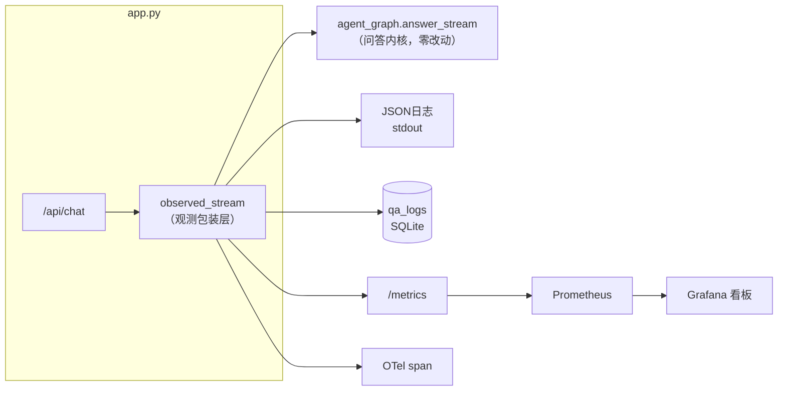

# （七）监控与评估接入

> 06 模块每章教了一件观测兵器，本章把它们全部装备到真实服务上：结构化日志、OTel 追踪、Prometheus 指标、qa_logs 明细、评估集回归——从「能跑」到「知道自己跑得怎么样」。

## 本章目标

- 一个 `observability.py` 集成观测三件套（日志 / 指标 / 追踪）
- 用「包装层」模式给问答内核埋点：内核零侵入
- `qa_logs` 落库每次问答明细，`/api/stats` 免 Grafana 速览
- 评估集回归脚本接入本项目的真实向量库，exit code 可挂 CI

## 一、观测埋点的架构位置



核心设计：**埋点放在包装层 `observed_stream`，不放进内核**。`agent_graph.py` 与第六章一字未改——观测随时可拆可换，内核保持可单测的纯粹。这是生产服务里非常值钱的习惯：业务逻辑和横切关注点（日志/指标/追踪）分层。

四类观测数据各管一摊：

| 数据 | 回答的问题 | 看哪里 |
| --- | --- | --- |
| JSON 日志 | 「刚才那个请求发生了什么」 | stdout / 日志收集器 |
| qa_logs 表 | 「用户都在问什么、答得如何」 | `/api/stats`、SQL 查询 |
| Prometheus 指标 | 「服务整体趋势怎么样」 | Grafana 四块板 |
| OTel 追踪 | 「慢在哪个环节」 | Jaeger 瀑布图（可选开启） |

看板四块板的「产品含义」：QPS 按 tech/chitchat 分类（用户拿它干嘛）、延迟 P50/P95（体验）、**拒答率**（知识库盲区哨兵——持续升高 = 用户在问你没写过的话题，该写新文章了）、**置信度 P50**（检索质量趋势）。

## 二、动手实践

```bash
cd "07-实战-博客知识库Agent/（七）监控与评估接入/project"
docker compose up -d        # qdrant + prometheus + grafana 一起起
uv sync && uv run python index_cli.py --rebuild
uv run uvicorn app:app --port 8000

# 在测试页随便问几轮，然后：
curl -s localhost:8000/metrics | grep qa_     # 原始指标
curl -s localhost:8000/api/stats              # 今日速览（免Grafana）
# Grafana: http://localhost:3000 (admin/admin) -> 博客Agent服务看板
# 想看瀑布图：OTEL_EXPORT=jaeger 起服务 + 06模块二章的 Jaeger compose

# 回归评估（改 chunker/阈值/模型前后各跑一次对比）
uv run python eval/run_eval.py            # 常规阈值
uv run python eval/run_eval.py --strict   # 上线前用严格阈值
```

| 文件 | 说明 |
| --- | --- |
| `project/observability.py` | **本章核心**：日志 + 指标 + 追踪 三合一 |
| `project/app.py` | `observed_stream` 包装层、`/metrics`、`/api/stats` |
| `project/db.py` | 新增 `qa_logs` 表与 `save_qa_log` |
| `project/eval/` | 评估集 + 回归脚本（已对接本项目向量库） |
| `project/grafana/` | 预配置数据源与看板（开箱即看） |

## 三、一个真实的「评估集打脸现场」

编写本章评估集时实测遇到两个失败，原样保留给你当教材：

1. **「Docker Compose 怎么同时起 Postgres 和 Redis？」检索失败**——top1 竟是事件循环文章（0.48）。把「同时起」换成「部署」立刻命中（0.59）。BGE-small 这类小模型对口语化表述很敏感，这正是第六章 rewrite 节点存在的意义（评估脚本测的是裸检索，不走 rewrite）。
2. **「Java Spring Boot 怎么配置多数据源？」拒答失败**——它和 Docker 文章里的「数据库」字样攒出了 0.587 的分数，超过 0.5 的拒答线。语义近邻的「硬负例」是拒答最难防的，靠单一阈值防不死。

这两个现场说明：**评估集的价值不是「全绿」，而是把这些边界用例钉住**——以后任何改动让它们回归失败，CI 立刻报警。

## 四、动手作业

1. 在测试页连续问 10 个问题（混合闲聊/技术/无关话题），到 Grafana 看四块板的曲线变化
2. 把「Java Spring Boot 多数据源」加回评估集（should_refuse=true），跑 `run_eval.py` 看它失败，然后尝试两种修法：调高 `SCORE_THRESHOLD`（看看会误伤多少正常用例）vs 接受现状并记录为已知问题——体会阈值权衡
3. 用 SQL 直接查 `qa_logs`：`SELECT question, confidence FROM qa_logs WHERE category='tech' ORDER BY confidence ASC LIMIT 5`——置信度最低的 5 个问题，就是你下一篇博客的选题

## 官方文档与延伸阅读

- [Prometheus：Histogram 与分位数](https://prometheus.io/docs/practices/histograms/)
- [OpenTelemetry Python](https://opentelemetry.io/docs/languages/python/)
- [Grafana Provisioning](https://grafana.com/docs/grafana/latest/administration/provisioning/)

## 下一章预告

功能齐了、眼睛亮了，只剩最后一步：**《（八）部署上线》**——多阶段 Dockerfile、生产版 docker-compose、Nginx HTTPS 反代（适配你的泛域名）、GitHub Webhook 真实配置、博客前端 SSE 接入指南、上线检查清单。
