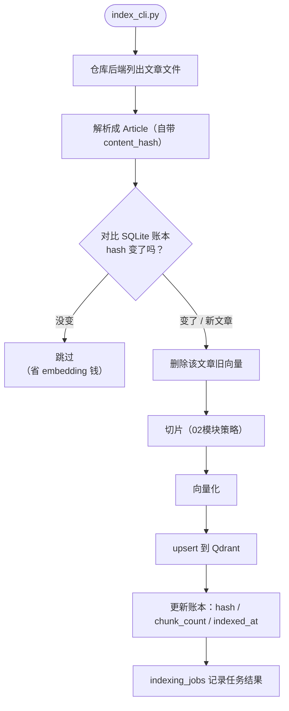

# （三）构建博客知识库

> 文章能读进来了，本章把它们变成**可检索的知识库**：Qdrant 切换 Docker 服务端模式、全量索引 CLI、以及最关键的——用 SQLite 账本记录每篇文章的 `content_hash`，让重复索引「零成本跳过」。这套账本就是第五章 Webhook 增量索引的底座。

## 本章目标

- Qdrant 从本地文件模式切换到 Docker 服务端模式（多进程并发访问的前提）
- 实现带「hash 账本」的索引 pipeline：没变的文章自动跳过
- 稳定 Point ID（UUIDv5）：重建即覆盖、删除可定位
- 账本两张表落地：`articles`（文章状态）与 `indexing_jobs`（任务记录）

## 一、为什么必须切换 Qdrant 服务端模式

前面模块的 `QdrantClient(path=...)` 是**单进程独占**的（你在 06 模块一章遇到过锁冲突）。实战中至少有两个进程要同时访问向量库：API 服务（查）和索引任务（写）。Docker 服务端模式天然支持并发，也和将来部署到阿里云的形态一致。

```bash
docker compose up -d     # 本章 project 目录里，一条命令
curl localhost:6333      # 验证存活
```

## 二、索引 pipeline：账本驱动的增量逻辑



两个工程关键点：

**1. 稳定 Point ID（UUIDv5）**：`uuid5(NAMESPACE_URL, f"{article_id}#{chunk_index}")`——同样输入永远生成同样 ID。于是「重新索引」就是天然的覆盖更新，「删除文章」可以按 `article_id` 过滤精确删除。没有稳定 ID，动态更新只能全删全建。

**2. 先删后建**：文章修改后切片数可能从 7 个变成 5 个——若只覆盖前 5 个，旧的第 6、7 个就成了「幽灵切片」永远留在向量库里污染检索。所以重建前必须先 `delete_article_points`。

## 三、动手实践

```bash
cd "07-实战-博客知识库Agent/（三）构建博客知识库/project"
docker compose up -d                              # 起 Qdrant
uv sync
uv run python index_cli.py                        # 第一次：6 篇全部索引
uv run python index_cli.py                        # 第二次：6 篇全部跳过（hash 没变！）
uv run python index_cli.py --stats                # 看账本
uv run python index_cli.py --search "构建太慢"     # 检索自测
```

**重点体验第二次运行**：全部「跳过（内容未变）」——这就是账本的价值。再试着改一下 `mock_repo/posts/` 里某篇文章的内容重跑，只有那一篇会被重建。

| 文件 | 说明 |
| --- | --- |
| `project/vector_store.py` | Qdrant 服务端封装：稳定 ID / upsert / 按文章删除 / 检索 |
| `project/db.py` | SQLite 账本：articles + indexing_jobs |
| `project/index_cli.py` | 索引 CLI：增量 / --rebuild / --search / --stats |
| `project/chunker.py` `embedder.py` | 02 模块的成熟实现（适配实战 Article） |
| `project/docker-compose.yml` | Qdrant 服务端 |

## 四、动手作业

1. 修改一篇 mock 文章的一个标点，重跑 `index_cli.py`，确认「只重建这一篇」；再用 `--stats` 看它的 hash 和 indexed_at 变了
2. 删掉 `blog_agent.db` 再跑一次——账本丢失会发生什么？（全部重建。体会「账本与向量库的一致性」问题）
3. 思考题：如果索引中途崩溃（切片入库了但账本没记上），下次运行会发生什么？这个设计是「至少一次」还是「恰好一次」？为什么对本场景可接受？

## 官方文档与延伸阅读

- [Qdrant Docker 部署](https://qdrant.tech/documentation/guides/installation/)
- [Qdrant Points 与 upsert](https://qdrant.tech/documentation/concepts/points/)
- [UUIDv5 说明（Python uuid 文档）](https://docs.python.org/zh-cn/3.10/library/uuid.html#uuid.uuid5)

## 下一章预告

知识库就绪，**《（四）FastAPI 问答服务》**把它包装成 HTTP 服务：`POST /api/chat` 支持 SSE 流式（打字机效果）、返回 sources / recommendedArticles / confidence，并附一个最小化测试聊天页——你的博客前端可以直接照着接。
