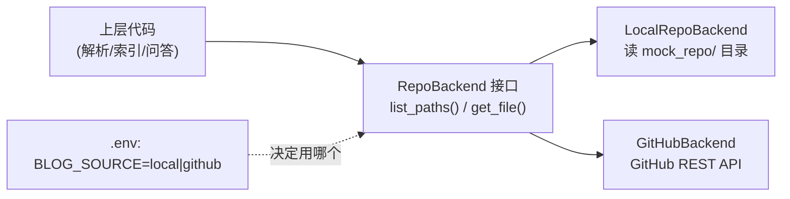

# （二）GitHub 文章加载与解析

> 实战第一行代码：把文章从仓库里读出来、解析成统一模型、打上内容指纹。本章交付「数据源双后端」——本地模拟仓库零依赖学习，`.env` 改一行就能切到你的真实 GitHub 仓库。

## 本章目标

- 用 Protocol 定义仓库后端接口，实现 Local / GitHub 两个后端
- 掌握 GitHub REST API 的三个端点：文件树、文件内容、commit 比较
- 把 02 模块的解析器升级为「从字符串解析」（内容可能来自 API，本地没有文件）
- 理解 `content_hash`：动态 RAG 增量索引的判断依据

## 一、双后端设计



接口只有两个方法——`list_paths()`（有哪些文章）和 `get_file(path)`（读内容）。这是 04 模块三章「面向接口编程」在自己项目里的落地：学习时用本地后端零网络依赖；上线时切 GitHub 后端，上层代码一行不改。

GitHub 后端用到的端点（注意第三个，第五章 Webhook 增量索引的关键）：

| 端点 | 用途 |
| --- | --- |
| `GET /repos/{repo}/git/trees/{branch}?recursive=1` | 一次拿到整个仓库文件树 |
| `GET /repos/{repo}/contents/{path}`（Accept: raw） | 读单个文件原文（raw 媒体类型省去 base64 解码） |
| `GET /repos/{repo}/compare/{base}...{head}` | 比较两个 commit：哪些文件增/改/删 |

## 二、content_hash：动态 RAG 的地基

```python
def content_hash(text: str) -> str:
    return hashlib.sha256(text.encode()).hexdigest()[:16]
```

每篇文章解析时自动算出内容指纹。下一章索引 pipeline 的核心逻辑就是：**hash 没变 → 跳过；hash 变了 → 删旧向量重建**。这个小函数让「每次全量重建」变成「只重建改动的文章」——embedding 费用和索引时间都降一个数量级。

## 三、动手实践

```bash
cd "07-实战-博客知识库Agent/（二）GitHub文章加载与解析/project"
uv sync
uv run python main.py    # 默认 local 后端，离线可跑
```

想连真实仓库：在根 `.env` 配置（公开仓库 TOKEN 可省）：

```ini
BLOG_SOURCE=github
GITHUB_REPO=你的用户名/你的文章仓库
GITHUB_TOKEN=ghp_xxx
GITHUB_BRANCH=main
BLOG_URL_TEMPLATE=https://你的域名/posts/{id}
```

| 文件 | 说明 |
| --- | --- |
| `project/config.py` | 全部配置集中地（从根 .env 读取） |
| `project/models.py` | `Article` / `RepoFile` / `content_hash` |
| `project/repo_backend.py` | **本章核心**：双后端 + GitHub API 封装 |
| `project/parser.py` | md/json/js 三格式解析（02 模块 loader 的字符串版） |
| `project/mock_repo/posts/` | 模拟仓库（6 篇文章） |

## 四、动手作业

1. 往 `mock_repo/posts/` 里加一篇你自己写的 md 文章（带 frontmatter），重跑 main.py 确认被解析
2. 如果你有公开的 GitHub 仓库，切 `BLOG_SOURCE=github` 跑一次，体验「代码不改、数据源已换」
3. 思考题：`GitHubBackend.list_paths` 对大仓库有什么隐患？（提示：trees API 有 100,000 条目上限与 7MB 响应上限——个人博客远用不满，但要知道边界在哪）

## 官方文档与延伸阅读

- [GitHub REST API：Git trees](https://docs.github.com/zh/rest/git/trees)
- [GitHub REST API：仓库内容](https://docs.github.com/zh/rest/repos/contents)
- [GitHub REST API：比较 commit](https://docs.github.com/zh/rest/commits/commits#compare-two-commits)
- [httpx 官方文档](https://www.python-httpx.org/)

## 下一章预告

文章已经能读进来了，**《（三）构建博客知识库》**把它们送进向量库：Qdrant 切换 Docker 服务端模式（API 服务和索引任务要并发访问）、全量索引 CLI、以及用 SQLite 记录 hash 账本——为第五章的增量索引备好底账。
