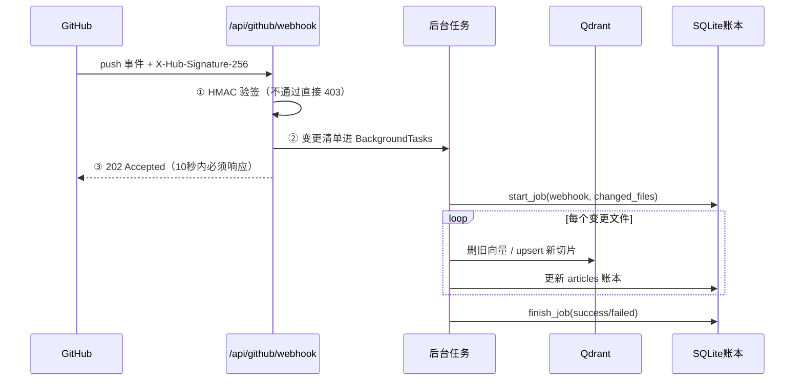

# （五）动态 RAG：Webhook 增量索引

> 你最初需求里最有「灵魂」的一条：**博客文章更新后，知识库自动学习**。本章实现完整闭环：GitHub push → Webhook（签名校验）→ 后台增量索引 → 新增/修改/删除三种事件各得其所。课程提供模拟 Webhook 脚本，没有公网地址也能完整测试。

## 本章目标

- 实现 `POST /api/github/webhook`：`X-Hub-Signature-256` 签名校验 + 202 异步处理
- 增量索引三种事件：added（建）/ modified（hash 对比后重建）/ removed（账本反查后删）
- `indexing_jobs` 全程记录，`GET /api/index/jobs` 可查
- 用模拟脚本本地走通全流程，并验证「伪造签名被拒」

## 一、动态 RAG 完整链路



## 二、三个安全与工程要点

**1. 签名校验是底线**：`HMAC-SHA256(密钥, 原始请求体)` 与签名头比对。没有这步，任何人 `curl` 一下就能让你的服务器疯狂跑索引（耗你的 embedding 钱）。比较用 `hmac.compare_digest`（恒定时间，防时序攻击）。注意必须用**原始 body 字节**算签名——任何 JSON 重序列化都会让签名对不上。

**2. 立即 202，活儿进后台**：GitHub 的 Webhook 投递超时是 10 秒，而一次索引可能要几十秒。`BackgroundTasks` 让响应立即返回、索引在后台执行。任务状态落在 `indexing_jobs` 表里，`GET /api/index/jobs` 随时可查——**异步任务必须可观测**，否则「Webhook 到底跑没跑」全靠猜。

**3. 删除事件靠账本反查**：文件被删后内容已不存在，无从解析 article_id——只能用账本里的 `source_path → id` 映射反查，再删向量、标记 deleted。这正是第三章坚持记账的原因之一。

## 三、动手实践

```bash
cd "07-实战-博客知识库Agent/（五）动态RAG：Webhook增量索引/project"
docker compose up -d && uv sync
echo 'WEBHOOK_SECRET=my-local-secret-123' >> ../../../.env   # 配置签名密钥（一次即可）
uv run python index_cli.py                                    # 基线索引
uv run uvicorn app:app --port 8000                            # 终端1：起服务

# 终端2：依次模拟四种场景
uv run python scripts/simulate_webhook.py add        # 新增文章 -> 自动入库
uv run python scripts/simulate_webhook.py modify     # 修改文章 -> hash变化 -> 重建
uv run python scripts/simulate_webhook.py remove     # 删除文章 -> 向量与账本同步清理
uv run python scripts/simulate_webhook.py bad-sig    # 伪造签名 -> 403
curl -s localhost:8000/api/index/jobs | python3 -m json.tool  # 查任务记录
uv run python scripts/simulate_webhook.py restore    # 还原 mock_repo
```

模拟脚本会**真实修改** `mock_repo/` 的文件再发送与 GitHub 格式一致的 payload——服务端的处理路径与真实事件完全相同。接真实仓库时只需把 Webhook 配到你的公网地址（第八章）。

| 文件 | 说明 |
| --- | --- |
| `project/incremental.py` | **本章核心**：三种变更事件的增量处理 |
| `project/app.py` | 新增 webhook / admin/reindex / index/jobs 三个端点 |
| `project/scripts/simulate_webhook.py` | 本地模拟 GitHub push（含签名） |

## 四、动手作业

1. `add` 之后立刻在测试聊天页问「FastAPI 怎么做 SSE？」——体验「博客刚发文章，AI 助手就会了」
2. 连续跑两次 `modify`，看第二次的 jobs 记录：为什么是 skipped？（同内容 hash 相同）
3. 思考题：如果一次 push 改了 50 篇文章、后台任务跑到一半进程重启，会发生什么？怎么补救？（提示：job 状态停在 running；可在服务启动时检查 running 任务并用 admin/reindex 兜底——也是升级 Celery 的信号）

## 官方文档与延伸阅读

- [GitHub Webhooks：验证投递签名](https://docs.github.com/zh/webhooks/using-webhooks/validating-webhook-deliveries)
- [GitHub push 事件 payload 结构](https://docs.github.com/zh/webhooks/webhook-events-and-payloads#push)
- [FastAPI BackgroundTasks](https://fastapi.tiangolo.com/zh/tutorial/background-tasks/)

## 下一章预告

服务已经「活」了：会答、会学。但问答内核还是固定流程的 Workflow。**《（六）BlogAgent 升级：LangGraph 生产图》**把内核换成 05 模块练过的生产级图：路由 → 改写 → 检索 → 评分 → 生成/拒答，外加 SQLite checkpointer 跨进程会话——API 层一行不改。
