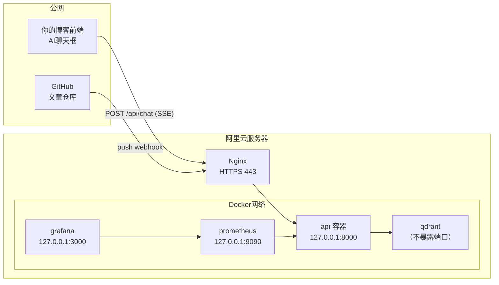
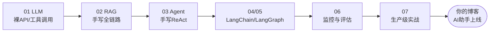

# （八）部署上线

> 最后一章：把整套服务搬到你的阿里云服务器，接上真实 GitHub 仓库和博客前端。本章一半是代码（Dockerfile / 生产 compose / Nginx 配置），一半是「照着做」的操作手册。

## 本章目标

- uv 多阶段 Dockerfile 构建生产镜像（本章已在本地构建并冒烟通过）
- `docker-compose.prod.yml`：api + qdrant + prometheus + grafana 一键编排
- Nginx HTTPS 反代（适配你的泛域名证书），重点是 SSE 三件套配置
- GitHub Webhook 真实配置 + 博客前端接入指南 + 上线检查清单

## 一、生产架构



安全边界设计：**只有 Nginx 监听公网**。api 绑 `127.0.0.1:8000`，qdrant 完全不映射端口（仅 Docker 网络内可达），监控面板用 SSH 隧道访问。攻击面只剩 443 一个口。

## 二、部署步骤（服务器上照着敲）

```bash
# 0. 前置：服务器装好 docker + docker compose；域名 agent.你的域名.com 解析到服务器 IP

# 1. 拉代码 + 配置生产 .env
git clone <本课程仓库> && cd "learnAgent/07-实战-博客知识库Agent/（八）部署上线/project"
cat > ../../../.env <<'EOF'
LLM_API_KEY=sk-你的DeepSeekKey
BLOG_SOURCE=github
GITHUB_REPO=你的用户名/博客文章仓库
GITHUB_TOKEN=ghp_xxx           # 私有仓库需要；公开仓库可不填
BLOG_URL_TEMPLATE=https://你的博客域名/posts/{id}
WEBHOOK_SECRET=用 openssl rand -hex 24 生成
ADMIN_TOKEN=同样随机生成一个
EOF

# 2. 起全套服务（首次构建约几分钟）
docker compose -f docker-compose.prod.yml up -d --build

# 3. 首次全量索引（从你的真实 GitHub 仓库拉文章）
docker compose -f docker-compose.prod.yml exec api python index_cli.py --rebuild

# 4. Nginx：拷配置、改域名和证书路径、重载
sudo cp nginx/blog-agent.conf /etc/nginx/conf.d/
sudo vim /etc/nginx/conf.d/blog-agent.conf   # 改 server_name 和 ssl_certificate
sudo nginx -t && sudo systemctl reload nginx

# 5. 验证
curl https://agent.你的域名.com/healthz       # {"status":"ok"}
```

### Dockerfile 的两个生产细节

1. **依赖层缓存**：先只拷 `pyproject.toml` + `uv.lock` 装依赖，再拷代码。改一行代码重新构建时依赖层直接命中缓存，几分钟变几秒
2. **非 root 运行 + 多阶段**：runtime 镜像不带 uv 和构建工具，用普通用户跑——容器被攻破时损失更小

### Nginx 的 SSE 三件套（坑最多的地方）

```nginx
proxy_http_version 1.1;          # HTTP/1.0 不支持 chunked 传输
proxy_set_header Connection "";  # 保持长连接
proxy_buffering off;             # 关掉缓冲，事件逐条到达浏览器
```

少配 `proxy_buffering off` 的典型症状：本地流式正常，上线后「卡住几十秒然后整段蹦出来」。

## 三、GitHub Webhook 真实配置

仓库 → Settings → Webhooks → Add webhook：

| 配置项 | 值 |
| --- | --- |
| Payload URL | `https://agent.你的域名.com/api/github/webhook` |
| Content type | `application/json` |
| Secret | 与 `.env` 的 `WEBHOOK_SECRET` 完全一致 |
| 事件 | Just the push event |

保存后 GitHub 立即发一个 `ping` 事件——我们的接口对非 push 事件返回 `{"status":"ignored"}`，在 Webhooks 页面的 Recent Deliveries 看到绿色对勾即配置成功。之后每次 push 文章，Recent Deliveries 都能看到投递记录和响应，配合服务端 `GET /api/index/jobs` 双向排查。

## 四、博客前端接入（你的主场）

测试页 `static/chat.html` 就是参考实现，核心是用 `fetch` 读 SSE 流（`EventSource` 只支持 GET，所以用 fetch + ReadableStream）：

```js
const resp = await fetch("https://agent.你的域名.com/api/chat", {
  method: "POST",
  headers: { "Content-Type": "application/json" },
  body: JSON.stringify({ question, sessionId, stream: true }),
});
const reader = resp.body.getReader();
const decoder = new TextDecoder();
let buf = "";
while (true) {
  const { done, value } = await reader.read();
  if (done) break;
  buf += decoder.decode(value, { stream: true });
  const events = buf.split("\n\n");
  buf = events.pop();                      // 末尾可能是半截事件，留到下轮
  for (const e of events) {
    const data = JSON.parse(e.replace(/^data: /, ""));
    if (data.type === "delta") appendText(data.text);        // 打字机
    else renderCards(data.sources, data.recommendedArticles); // 来源与推荐卡片
  }
}
```

上线前把 `app.py` 的 CORS `allow_origins=["*"]` 收紧为你的博客域名。`sessionId` 建议用 `localStorage` 存一个随机 ID——同一访客的多轮追问就有了记忆。

## 五、上线检查清单

- [ ] `.env` 中 `WEBHOOK_SECRET` / `ADMIN_TOKEN` 为强随机值（不是课程示例值）
- [ ] CORS 已从 `*` 收紧为博客域名
- [ ] Grafana admin 密码已修改；9090/3000 端口未暴露公网
- [ ] HTTPS 证书有效期 > 30 天，配置了到期提醒或自动续期
- [ ] Webhook ping 投递成功；push 一篇测试文章，`/api/index/jobs` 出现 success 记录
- [ ] 评估集回归通过：`docker compose -f docker-compose.prod.yml exec api python eval/run_eval.py`
- [ ] Grafana 看板有数据；问一个无关问题确认拒答率指标在动
- [ ] `docker compose restart api` 后会话记忆仍在（data 卷挂载正确）

## 六、课程终点，工程起点

回头看你已经亲手走完的路：



接下来值得探索的方向：混合检索与 rerank（检索质量天花板）、用户反馈闭环（qa_logs 加 👍👎 字段反哺评估集）、Celery 替代 BackgroundTasks（索引量大了之后）、MCP 协议（把 BlogAgent 的工具暴露给其他 Agent 用）。

## 官方文档与延伸阅读

- [uv：Docker 集成指南](https://docs.astral.sh/uv/guides/integration/docker/)
- [Nginx proxy_buffering](https://nginx.org/en/docs/http/ngx_http_proxy_module.html#proxy_buffering)
- [GitHub Webhooks 最佳实践](https://docs.github.com/zh/webhooks/using-webhooks/best-practices-for-using-webhooks)
- [Docker Compose 生产实践](https://docs.docker.com/compose/how-tos/production/)
