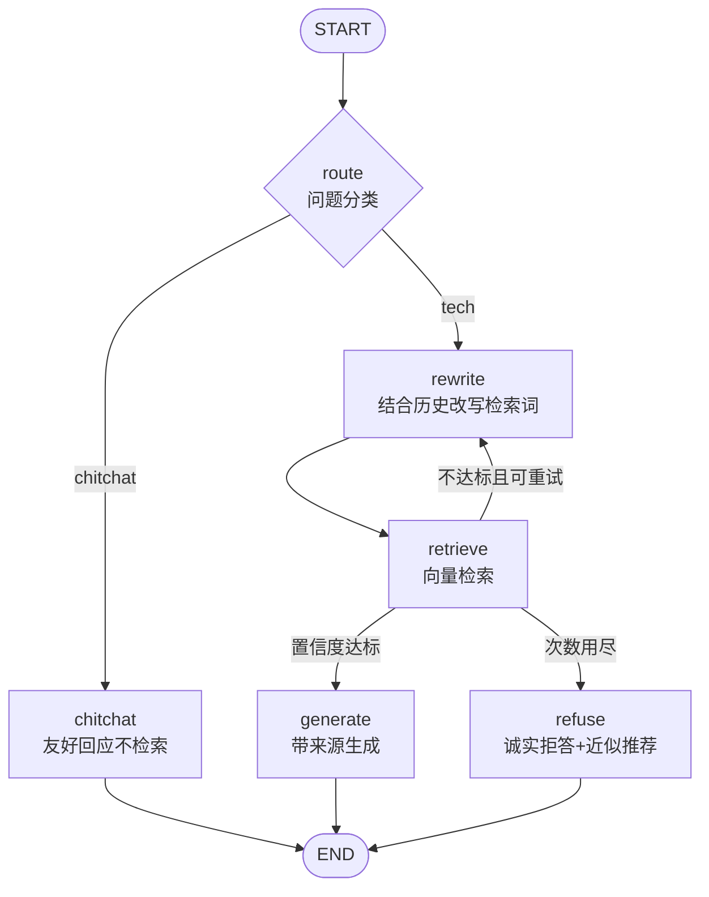

# （六）BlogAgent 升级：LangGraph 生产图

> 服务的「身体」（API、索引、Webhook）都已就位，本章给它换「大脑」：把第四章的固定 Workflow 内核换成 LangGraph 生产图——路由、改写、低置信度二次检索、SQLite 持久化会话，全部接进真实服务。**API 层一行契约不改**，这正是第一章「内核与服务解耦」埋下的伏笔。

## 本章目标

- 把 05 模块练过的图模式（路由 / 循环 / 评分 / checkpointer）组装成生产内核
- 用 `stream_mode="messages"` 把图内 LLM 的 token 流接到已有的 SSE 通道
- 会话记忆从手写 `session.py`（内存字典）升级为 SQLite checkpointer（重启不丢）
- 理解「同一 API 契约下热替换内核」的工程价值

## 一、新内核的图结构



对比第四章的 Workflow 版（`rag.py`，本章保留作对照），三个质变：

| 能力 | Workflow 版 | LangGraph 版 |
| --- | --- | --- |
| 闲聊「你好呀」 | 也去检索，浪费且答非所问 | route 分流，直接友好回应 |
| 追问「那它怎么部署？」 | 拿代词原句去检索，命中率差 | rewrite 结合历史补全指代再检索 |
| 首搜分数低 | 立刻拒答 | 自动换词重试一次，还不行才拒答 |
| 会话记忆 | 内存字典，重启即失忆 | SQLite checkpointer，跨进程持久 |

## 二、三个关键工程决策

**1. token 流的「节点过滤」**。`graph.stream(..., stream_mode="messages")` 会把图里**每一次** LLM 调用的 token 都流出来——包括 route 的分类输出和 rewrite 的改写词。靠 `metadata["langgraph_node"]` 过滤，只把 `generate` / `chitchat` 的 token 透传给前端，内部思考不外漏：

```python
for chunk, metadata in graph.stream(inputs, thread, stream_mode="messages"):
    if metadata.get("langgraph_node") in {"generate", "chitchat"} and chunk.content:
        yield ("delta", chunk.content)
```

**2. `sessionId` 直接当 `thread_id`**。第四章 API 契约里早就有 `sessionId` 字段，现在它无缝变成 checkpointer 的线程号——前端零改动，记忆却从「进程内」升级为「落盘」。`state["messages"]` 由 `add_messages` 自动累积，节点内只取最近 8 条参与推理（防上下文膨胀，03 模块滑动窗口的图版实现）。

**3. refuse 不调 LLM**。拒答文案是写死的——检索都不达标了，再让 LLM「编」一段只会引入幻觉还花钱。没有 token 流，就在 done 前补发一条 delta，前端无感。

## 三、动手实践

```bash
cd "07-实战-博客知识库Agent/（六）BlogAgent升级：LangGraph生产图/project"
docker compose up -d && uv sync
uv run python index_cli.py --rebuild
uv run uvicorn app:app --port 8000

# 浏览器打开 http://localhost:8000/ 依次试：
#   ① 你好呀！                    -> 秒回，无来源卡片（chitchat 路由，没碰向量库）
#   ② Docker 数据卷是干嘛的？      -> 正常回答 + 来源卡片
#   ③ 那它和直接挂载目录有什么区别？ -> 代词被 rewrite 还原，依然命中 Docker 文章
#   ④ 重启 uvicorn 后继续问 ③      -> 记忆还在（checkpoints.db 持久化）
#   ⑤ Java Spring 怎么入门？       -> 换词重试后仍不达标 -> 诚实拒答
```

| 文件 | 说明 |
| --- | --- |
| `project/agent_graph.py` | **本章核心**：生产图 + checkpointer + 流式适配 |
| `project/lc_client.py` | `ChatDeepSeek` 客户端（配置缺失抛 `LLMNotConfigured`） |
| `project/rag.py` | 第四章 Workflow 内核（保留对照，阈值/卡片逻辑被复用） |
| `project/app.py` | 仅改一处 import + 删 session 调用，契约不变 |

## 四、框架 vs 手写对照

| 本章用法 | 你在哪手写过 |
| --- | --- |
| `add_conditional_edges("route", ...)` | 05 模块（二）的路由模式 |
| retrieve→rewrite 重试循环 | 05 模块（三）Corrective RAG 的评分重检 |
| `SqliteSaver` + `thread_id` | 05 模块（五）的持久化；对照 03 模块（四）手写滑动窗口 |
| `stream_mode="messages"` 节点过滤 | 05 模块（五）的三种流模式 |

## 五、动手作业

1. 把 `MAX_ATTEMPTS` 改为 3，问一个边缘问题，观察 jobs 日志里 rewrite 跑了几轮、改写词如何变化
2. 给 route 增加第三类 `meta`（「你有哪些文章？」之类的元信息问题），新增节点直接列出账本里的文章清单（提示：查 `articles` 表，不需要 LLM）
3. 思考题：本章 route/rewrite 各多一次 LLM 调用，延迟和成本都涨了——什么样的产品阶段值得付这个代价？（提示：回看第四章拒答率，若大部分提问是闲聊或追问，这两个节点就是回本的）

## 官方文档与延伸阅读

- [LangGraph：Streaming（messages 模式）](https://docs.langchain.com/oss/python/langgraph/streaming)
- [LangGraph：Persistence 与 thread](https://docs.langchain.com/oss/python/langgraph/persistence)
- [LangGraph：条件边 API](https://reference.langchain.com/python/langgraph/graphs/)

## 下一章预告

大脑升级完毕，但它现在是个「黑盒」：route 判断对不对？rewrite 改得好不好？延迟花在哪个节点？**《（七）监控与评估接入》**把 06 模块的全套观测设施（结构化日志、OTel 追踪、Prometheus 指标、评估集回归）接到这套真实服务上。
