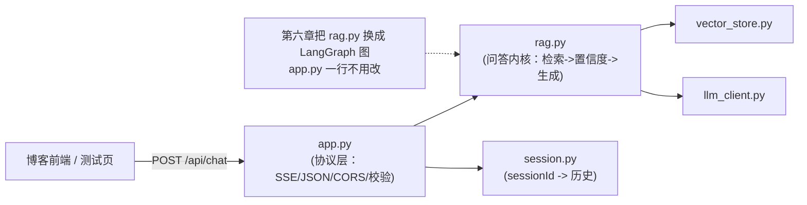

# （四）FastAPI 问答服务

> 知识库有了，本章把它包装成你博客前端可以直接调用的 HTTP 服务：`POST /api/chat` 支持 SSE 流式（打字机效果）、按第一章契约返回 sources / recommendedArticles / confidence / traceId，并附一个最小化测试聊天页——前端接入时照抄它的 SSE 处理逻辑即可。

## 本章目标

- 实现 `POST /api/chat`：非流式 JSON 与 SSE 流式两种模式
- 问答内核（rag.py）与服务层（app.py）解耦——第六章换内核 API 不动
- 会话管理：sessionId + 滑动窗口实现多轮对话
- 跑通浏览器测试页，看到打字机效果和来源/推荐卡片

## 一、分层：内核与服务解耦



`rag.py` 的产出是一个生成器，吐两种事件：`("delta", 文本)` 与 `("done", QaResult)`。协议层把它们翻译成 SSE 或 JSON——**业务与协议分开**，这是后端服务的基本素养（前端类比：数据层与视图层分离）。

## 二、SSE 流式的关键细节

SSE（Server-Sent Events）格式极简：每条消息 `data: {json}\n\n`。我们约定两种事件：

```text
data: {"type": "delta", "text": "这是"}          <- 增量文本，前端拼接显示
data: {"type": "delta", "text": "React 18 的"}
data: {"type": "done", "answer": "...", "sources": [...], "confidence": 0.78, ...}
```

三个实战经验（都体现在代码里）：

1. **POST + SSE 要用 `fetch` 读流**：浏览器原生 `EventSource` 只支持 GET。测试页演示了 `resp.body.getReader()` + 按空行切分事件的标准写法
2. **`X-Accel-Buffering: no` 响应头**：Nginx 反代默认会缓冲响应，SSE 会变成「憋一整段再吐」——这个头让 Nginx 对本响应关闭缓冲（第八章还会在 Nginx 配置里双保险）
3. **done 事件兜底**：来源、推荐、traceId 放在最后一个事件统一给，前端渲染卡片时机明确

## 三、置信度与拒答（02 模块策略的服务化）

`rag.py` 中 `top_score < 0.50` 时不调用 LLM，直接返回「博客中暂无相关内容」+ 最接近的文章——省钱、不胡说，并且响应飞快。confidence 字段也回传给前端，你可以在 UI 上对低置信回答加「仅供参考」标注。

## 四、动手实践

```bash
cd "07-实战-博客知识库Agent/（四）FastAPI问答服务/project"
docker compose up -d              # Qdrant（上一章起过就不用重复）
uv sync
uv run python index_cli.py        # 确保索引已建
uv run uvicorn app:app --port 8000 --reload
```

浏览器打开 [http://localhost:8000/](http://localhost:8000/)，试试：

- 「useEffect 为什么执行两次？」→ 流式回答 + 来源卡片
- 接着问「那怎么解决？」→ 验证多轮会话（它知道「那」指什么）
- 「Spring Boot 怎么学？」→ 拒答 + 推荐相近文章

命令行验证非流式模式：

```bash
curl -s localhost:8000/api/chat -X POST -H "Content-Type: application/json" \
  -d '{"question": "useEffect 为什么执行两次", "stream": false}' | python3 -m json.tool
```

## 五、动手作业

1. 给 `ChatRequest` 加 `topK: int = 4` 参数并传进内核——体会「契约变更」要动几处
2. 把 `SCORE_THRESHOLD` 调到 0.7，观察哪些原本正常回答的问题开始被拒答
3. 思考题：现在 session 存在进程内存里，重启丢失、多实例不共享——生产上有什么问题？（第六章的 SQLite checkpointer 回答这个问题）

## 官方文档与延伸阅读

- [FastAPI 官方文档（中文）](https://fastapi.tiangolo.com/zh/)
- [FastAPI StreamingResponse](https://fastapi.tiangolo.com/advanced/custom-response/#streamingresponse)
- [MDN：Server-Sent Events](https://developer.mozilla.org/zh-CN/docs/Web/API/Server-sent_events/Using_server-sent_events)

## 下一章预告

服务能回答问题了，但知识库还是「静态」的——文章更新后要手动跑 `index_cli.py`。**《（五）动态 RAG：Webhook 增量索引》**让 GitHub push 自动触发增量更新：签名校验、commit diff、新增/修改/删除三种事件的处理、indexing_jobs 状态记录。
