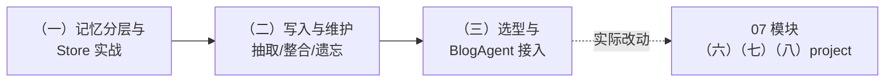

# 模块 08：记忆系统

> 03 模块学了短期记忆（滑动窗口+摘要），05 模块学了会话持久化（checkpointer），但它们都困在「单个会话」里。本模块补上最后一层：**跨会话的长期记忆**——并且不止于「会存会取」，重点讲生产里真正难的部分：**怎么维护（抽取/整合/冲突/遗忘）、怎么选型、怎么不踩坑**。
>
> 最后一章是真刀真枪的实战：给 07 模块的 BlogAgent 接入用户长期记忆，让你的博客 AI 助手记住每一位回头读者。

## 学习路径

## 章节导览

| 章节 | 核心内容 | project |
| --- | --- | --- |
| （一）记忆分层与长期记忆：Store 实战 | 四层记忆模型；checkpointer vs Store 边界；namespace 设计；FastEmbed 语义检索；remember/recall 工具 | 独立 project（3 个演示，前 2 个离线可跑） |
| （二）记忆写入与维护：抽取整合与遗忘 | 热路径 vs 后台抽取；原子化抽取；整合（去重/冲突更新）；实测校准阈值；时间衰减遗忘 | 独立 project（全部离线可跑，LLM 自动降级） |
| （三）记忆选型与 BlogAgent 接入 | 设计四问；选型决策树（自研/LangMem/Mem0/Zep/Letta）；复用 Qdrant 自研落地 | 无独立 project，**直接升级 07 模块三章** |

## 三个贯穿本模块的观点

1. **记忆系统的难点是维护，不是存储**——不做整合的记忆库三个月后必然变成「重复+矛盾」的垃圾场；冲突要「更新」不要「追加」
2. **阈值必须实测校准**——本模块的 0.95/0.85 阈值来自真实句对测量（真冲突对 0.921 / 无关对 <0.70），换 embedding 模型必须重测
3. **增强型记忆首选复用自有基建**——记忆只是锦上添花时，已有的向量库+两百行管线几乎总是优于引入新中间件

## 环境准备

- 前两章只需根目录 `.env` 的可选 `LLM_API_KEY`（不配也能跑，自动降级）
- 第三章需要 07 模块的环境（Docker Qdrant + 已建好的索引）

## 先行学习资料（官方文档）

- [LangGraph：Memory 概念](https://docs.langchain.com/oss/python/langgraph/memory)
- [LangGraph：持久化与 Store](https://docs.langchain.com/oss/python/langgraph/persistence)
- [LangMem SDK](https://langchain-ai.github.io/langmem/)
- [Mem0 文档](https://docs.mem0.ai/)
