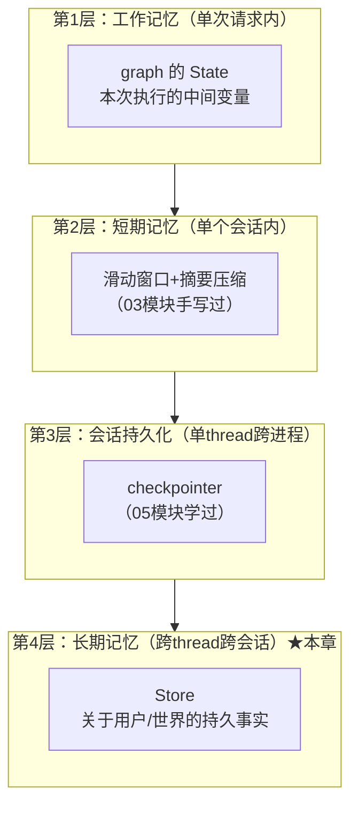
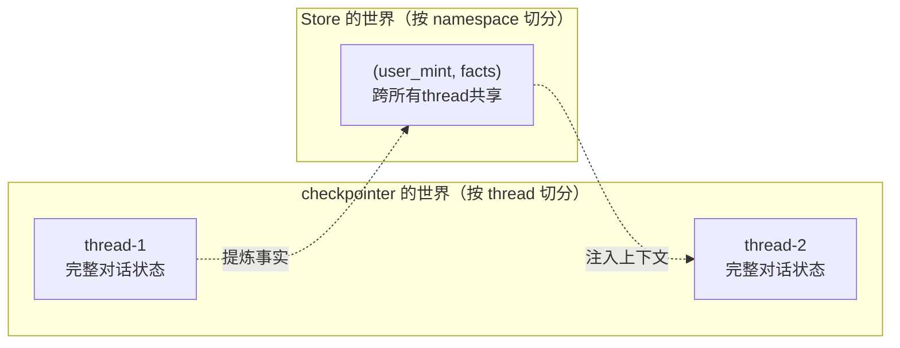

# （一）记忆分层与长期记忆：Store 实战

> 03 模块你手写了滑动窗口+摘要压缩（短期记忆），05 模块用 checkpointer 实现了会话持久化。但它们都有一个共同的天花板：**记忆锁死在单个 thread 里**。用户今天告诉你「我是前端工程师」，明天开个新会话，Agent 又变回陌生人。本章补上记忆体系的最后一块：跨会话的长期记忆。

## 本章目标

- 建立记忆系统的完整分层心智模型（这是后面所有设计决策的地图）
- 分清最易混淆的一对概念：**checkpointer vs Store**
- 掌握 LangGraph Store API：namespace 设计、put/get/search、语义检索
- 给 Agent 装上 `remember` / `recall` 两个记忆工具，实测跨 thread 记忆

## 一、记忆的完整分层



每层回答的问题不同：

| 层 | 回答的问题 | 生命周期 | 实现 |
| --- | --- | --- | --- |
| 工作记忆 | 这次执行算到哪一步了 | 一次 invoke | State |
| 短期记忆 | 这场对话聊了什么 | 一个会话 | messages + 裁剪压缩 |
| 会话持久化 | 重启后会话还能接上吗 | 一个 thread | checkpointer |
| **长期记忆** | **关于这个用户我知道什么** | **永久（user 级）** | **Store** |

按内容性质，长期记忆又分三类（认知科学借来的分类，业界通用）：

- **语义记忆**（facts）：「用户是前端工程师」「博客部署在阿里云」——本章主角
- **情景记忆**（episodes）：「上周排查过一次 CORS 问题，最后是 Nginx 配置的锅」——带时间的经历
- **程序性记忆**（procedures）：「这个用户喜欢先给结论再给代码」——做事方式，常沉淀进 system prompt

## 二、checkpointer vs Store：一字之差，天壤之别

最容易踩的认知坑。两者都「持久化」，但维度完全不同：



- checkpointer 记「**对话进行到哪了**」：消息列表、中间状态，thread 之间互不可见
- Store 记「**我知道什么**」：提炼后的事实，所有 thread 都能读

类比你熟悉的前端：checkpointer 像每个标签页的 sessionStorage，Store 像跨标签页的 localStorage + 一个支持模糊搜索的索引。生产 Agent 通常**两个都要**——本章演示 3 的 `compile(checkpointer=..., store=...)` 就是这个形态。

## 三、Store API 三个关键设计

**1. namespace 是元组，当目录用**：`("user_mint", "facts")`。第一段放隔离主体（user_id），后段放记忆类型。**namespace 设计错误 = 用户记忆串台**，这是长期记忆的第一事故源。

**2. 语义检索是插上去的**：`InMemoryStore(index={"embed": 函数, "dims": 512, "fields": ["text"]})`——`embed` 接受任何 `list[str] -> list[向量]` 的函数。我们直接塞课程一直用的本地 FastEmbed，**零 API 费用**。配了 index，`search(ns, query="...")` 就从「列表」变成「按意思找」。

**3. 工具通过 `InjectedStore()` 拿 Store**：注入参数对 LLM 不可见（不进 tool schema），由 ToolNode 在执行时填入。实测一个坑：**注入参数不能写默认值**（`= None` 会让识别失效，转 schema 直接报错）——project 里有注释标记。

## 四、动手实践

```bash
cd "08-记忆系统/（一）记忆分层与长期记忆：Store实战/project"
uv sync
uv run python main.py
```

| 演示 | 内容 | 需要 Key |
| --- | --- | --- |
| 1 | namespace 隔离、put/get/search 基础 | 否 |
| 2 | FastEmbed 接入语义检索（查询与原文零字面重叠也能命中） | 否 |
| 3 | 记忆 Agent：thread-1 透露身份 → **thread-2 仍然认识你** → 换 user 即陌生人 | 是 |

## 五、本章的坑与对策

| 坑 | 现象 | 对策 |
| --- | --- | --- |
| namespace 缺 user 维度 | 所有用户共享记忆，A 的偏好影响 B 的回答 | namespace 第一段永远是隔离主体 |
| 把 Store 当业务数据库 | 订单、文章这类业务数据塞进记忆 | 业务数据进业务库；Store 只放「影响对话行为的提炼事实」 |
| InjectedStore 带默认值 | bind_tools 时 schema 报错 | 注入参数不写默认值 |
| InMemoryStore 上生产 | 重启全忘 | 学习用 InMemory，生产换 PostgresStore / 自建向量库（第三章选型） |

## 六、动手作业

1. 在演示 2 里加一条情景记忆（带日期的经历），观察「上次遇到什么问题？」这类查询能否命中
2. 给 `remember` 工具加一个 `kind: str` 参数（facts/episodes/prefs），按类型写进不同 namespace，验证 `recall` 按需收窄检索范围后准确率的变化
3. 思考题：用户说「我不用 React 了，换 Vue 了」——现在的 `remember` 会怎么处理？会出什么问题？（这正是下一章「冲突处理」的引子）

## 官方文档与延伸阅读

- [LangGraph：Memory 概念（短期/长期）](https://docs.langchain.com/oss/python/langgraph/memory)
- [LangGraph：Store 与跨 thread 持久化](https://docs.langchain.com/oss/python/langgraph/persistence#memory-store)
- [LangGraph：Store 语义检索配置](https://docs.langchain.com/oss/python/langgraph/persistence#semantic-search)

## 下一章预告

工具有了，但「记什么、怎么记」全凭 LLM 自觉——它可能把闲聊也记下来，可能同一件事记八遍，可能新旧偏好打架。**《（二）记忆写入与维护》**解决记忆系统真正的难点：抽取、整合、冲突与遗忘。
