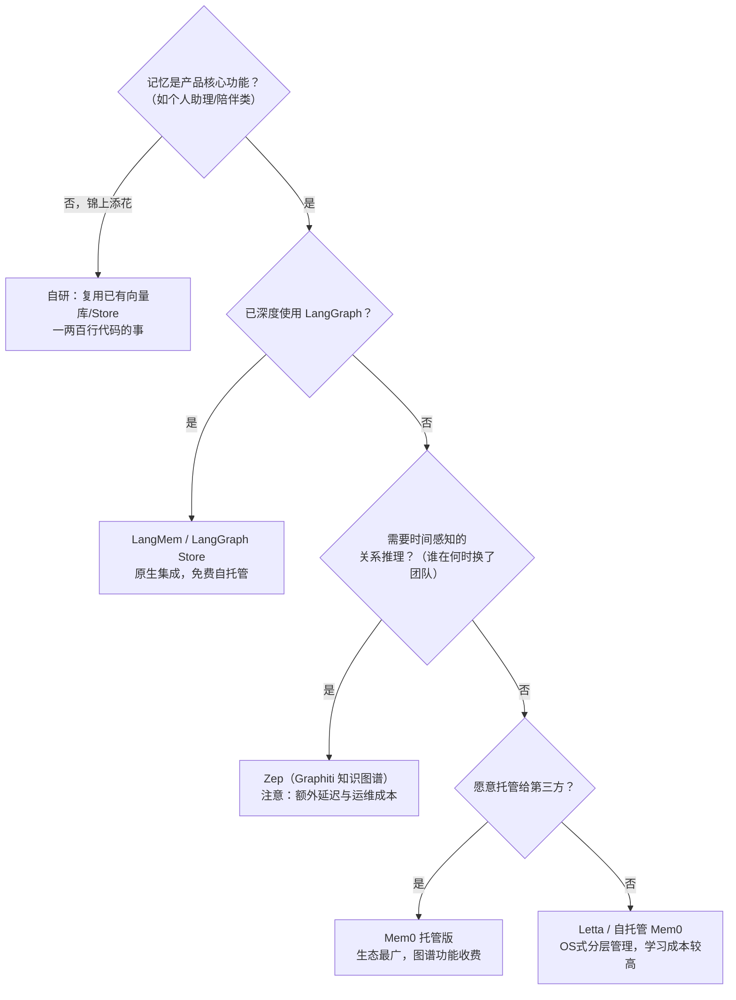
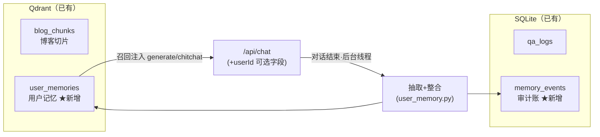

# （三）记忆选型与 BlogAgent 接入（实际升级 07 项目）

> 前两章你掌握了长期记忆的存取（Store）与维护（抽取/整合/遗忘）。最后一个问题是工程上最常被问的：**生产里到底该自研还是用现成方案？** 本章先给选型决策框架，然后用「给 07 实战项目接入用户长期记忆」做一次完整的选型示范——你会看到，最优解常常不是引入新轮子。

本章没有独立 project：**代码改动直接落在 07 模块（六）（七）（八）三章的 project 里**，改完即是生产形态。

## 一、设计先于选型：先回答四个问题

工具选型放最后。任何记忆系统设计，先回答：

| 问题 | 对应设计 | BlogAgent 的答案 |
| --- | --- | --- |
| **记什么？** | 抽取规则与红线 | 读者的技术背景/在做的事/偏好；不记 PII |
| **记多久？** | TTL/衰减策略 | 长期保留，依赖冲突更新保新鲜 |
| **谁能看？** | namespace 隔离 + 访问控制 | 按 userId 严格隔离；调试端点要管理令牌 |
| **记错了怎么办？** | 审计 + 可删除 | SQLite 审计账 + 调试端点可核查 |

四个问题答不上来就选工具，等于先买家具再画户型图。

## 二、选型决策树



### 五种方案横向对比

| 维度 | 自研（Store/向量库） | LangMem | Mem0 | Zep | Letta |
| --- | --- | --- | --- | --- | --- |
| 托管方式 | 全自托管 | 自托管 | 托管为主（可自托管） | 托管/自托管 | 自托管为主 |
| 时间感知 | 自己写（衰减） | 弱 | 一般 | **强**（时序知识图谱） | 一般 |
| 知识图谱 | 无 | 无 | 收费版 | **核心能力** | 无 |
| 额外延迟 | 最低（同机房） | 低 | 网络往返 | 写入侧较明显 | 低 |
| 成本 | 基建已有≈0 | 免费 | 用量计费 | 用量计费 | 免费 |
| 生态锁定 | 无 | LangGraph | 低 | 低 | Letta 框架 |
| 适合 | 已有向量库的项目 | LangGraph 重度用户 | 快速上线、多框架 | 时序关系重的助理 | 研究/重记忆产品 |

**经验法则**：记忆只是「让回答更贴心」的增强功能时，自研管线（前两章的两百行代码）几乎总是赢——没有新依赖、没有网络往返、数据不出门。记忆是产品命脉（用户花钱买「它记得我」）时，再评估专业方案。

## 三、BlogAgent 的选型示范：复用自有基建

BlogAgent 的记忆是增强功能（回头读者体验更好），且项目已有 Qdrant + SQLite + 本地 FastEmbed——按决策树走「自研」分支：



**关键决策与理由**：

1. **新开 collection 而不是混在 `blog_chunks` 里**——记忆和知识必须分库：检索博客时绝不该召回「读者偏好」，反之亦然
2. **userId 是 API 可选字段，默认取 sessionId**——契约只加不改，老前端零改动；博客登录体系接入后传真实 userId 即可升级为「跨设备记忆」
3. **抽取跑 daemon 线程而非 BackgroundTasks**——SSE 场景下 answer 要等流吐完才拿得到，已错过注册 BackgroundTasks 的时机（实现细节里的真坑）
4. **召回失败静默降级**——记忆是锦上添花，记忆库挂了不能拖垮问答主链路（`_memory_block` 里的 try/except）
5. **调试端点必须带管理令牌**——「Agent 记住了用户什么」属于敏感数据

## 四、07 项目实际改动清单

对（六）（七）（八）三章 project 同步改动（已全部改完并复验）：

| 文件 | 改动 |
| --- | --- |
| `user_memory.py` ★新增 | 抽取+整合+召回+审计，第二章管线的生产版（阈值沿用实测校准值） |
| `config.py` | 新增 `USER_MEMORY_COLLECTION`（默认 `user_memories`） |
| `db.py` | 新增 `memory_events` 审计表 |
| `agent_graph.py` | State 加 `user_id`；`_memory_block` 召回注入 generate/chitchat |
| `app.py` | `userId` 可选字段；对话结束后台抽取；`GET /api/memories` 调试端点 |
| `observability.py`（七/八章） | 新增 `memory_recalls_total`、`memory_events_total{op}` 指标 |

验证一条龙（在（七）章 project 下）：

```bash
docker compose up -d
uv run uvicorn app:app --port 8000        # 另开终端
# 第一轮对话：透露背景（需配置 LLM_API_KEY）
curl -s localhost:8000/api/chat -X POST -H 'content-type: application/json' \
  -d '{"question":"我是前端工程师，最近想把博客从 webpack 迁到 Vite，有什么建议？","sessionId":"s1","userId":"reader_42","stream":false}'
# 看它记住了什么（需 ADMIN_TOKEN）
curl -s "localhost:8000/api/memories?userId=reader_42" -H "X-Admin-Token: $ADMIN_TOKEN"
# 新会话提问：回答会带上「这位读者是前端、在迁 Vite」的背景
curl -s localhost:8000/api/chat -X POST -H 'content-type: application/json' \
  -d '{"question":"那构建产物的缓存策略怎么配？","sessionId":"s2","userId":"reader_42","stream":false}'
# 回归不破坏：评估与 webhook 照旧通过
uv run python eval/run_eval.py
```

观测侧：`/metrics` 多了两个记忆指标——`memory_recalls_total` 持续为 0 说明要么没有回头客，要么抽取管线挂了，都值得排查；`memory_events_total{op="update"}` 的占比能看出读者背景的「变化率」。

## 五、本章的坑与对策

| 坑 | 现象 | 对策 |
| --- | --- | --- |
| 记忆和知识混库 | 问技术问题召回「读者喜欢咖啡」 | 永远分 collection |
| 记忆召回拖垮主链路 | 记忆库故障 → 问答 500 | 召回包 try/except，失败当没有 |
| 流式场景丢抽取时机 | BackgroundTasks 注册晚于响应返回 | done 事件后起 daemon 线程 |
| 调试端点裸奔 | 任何人能看任意用户画像 | 管理令牌 + 后续可加用户自查/自删 |
| 一上来就引入记忆中间件 | 多一套服务要运维，延迟+成本上升 | 先按决策树评估自研，增强型记忆首选复用基建 |

## 六、动手作业

1. 给 `user_memory.py` 加上第二章的时间衰减（payload 里已存了 `created_at`），让一年前的偏好自然让位
2. 实现 `DELETE /api/memories?userId=x`（带管理令牌）——「被遗忘权」是记忆系统的合规底线
3. 思考题：如果博客接了登录体系，匿名期（sessionId）积累的记忆要不要合并进登录后的 userId？怎么合并才不会污染？

## 官方文档与延伸阅读

- [LangMem SDK 发布说明（写入策略设计）](https://www.langchain.com/blog/langmem-sdk-launch)
- [Mem0 文档](https://docs.mem0.ai/)
- [Zep / Graphiti：时序知识图谱记忆](https://www.getzep.com/)
- [Letta（MemGPT）：OS 式记忆分层](https://docs.letta.com/)

## 下一模块预告

记忆让单个 Agent 更聪明，但有些任务一个 Agent 干不动——检索、撰写、评审各需要不同的「专注力」。**《09-MultiAgent》**讲多 Agent 协作：什么时候真的需要、Supervisor/Handoff 怎么手写、以及用数据对比单 Agent vs 多 Agent 的成本与质量。
