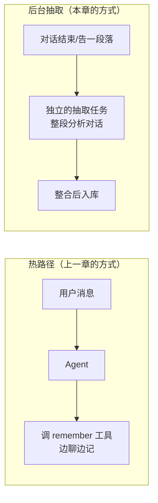
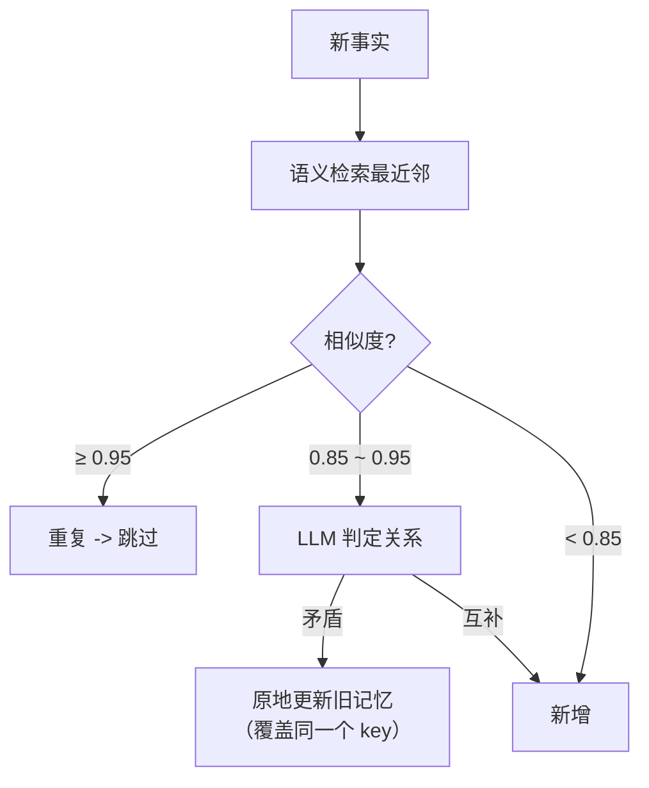

# （二）记忆写入与维护：抽取、整合、冲突与遗忘

> 上一章的 `remember` 工具有个隐患：记什么、怎么记全凭 LLM 自觉。放任不管，三个月后你的记忆库会变成「同一件事记了八遍、新旧偏好互相打架、闲聊垃圾淹没关键事实」的垃圾场。**记忆系统的难点从来不是存储，而是维护**。本章建立完整的写入管线：抽取 → 整合 → 衰减。

## 本章目标

- 掌握两种写入策略（热路径 vs 后台抽取）的选型标准
- 用结构化输出做「原子事实抽取」，理解原子化对准确率的决定性影响
- 实现整合（consolidation）：重复跳过、**冲突更新**、新增
- 用时间衰减实现「温和遗忘」，理解它与硬删除的区别

## 一、先选写入策略：热路径还是后台？



| 维度 | 热路径（工具式） | 后台抽取 |
| --- | --- | --- |
| 及时性 | 即时生效，本轮就能用 | 有延迟（下次会话才生效） |
| 主任务干扰 | LLM 要分心决定「记不记」，复杂任务易漏记 | 零干扰 |
| 记忆质量 | 零散、视角局部 | 看完整段对话，能提炼与去重 |
| 成本 | 每次工具调用都是一次 LLM 往返 | 批量一次处理，便宜 |
| 适合 | 用户明示「记住 XX」、强即时性场景 | 绝大多数对话型产品（**默认选它**） |

实践中常见组合：**后台抽取为主 + 热路径处理用户明示指令**。LangMem 把这两种分别叫 "hot path" 和 "background"，Mem0 默认就是后台式——这是业界收敛后的共识形态。

## 二、抽取：原子化是准确率的根基

抽取用 `with_structured_output(Pydantic)`（01 模块就练过），关键全在 Prompt 规则里：

1. **原子化**：一条记忆一个事实。演示 1 用真实数据证明了为什么——把 5 个事实糊成一条「大杂烩」记忆，问「博客怎么构建部署」只得 0.660 分（咖啡偏好稀释了语义）；拆成原子事实后相关条目 0.72+，且不会把无关内容夹带进上下文
2. **只记长期有效的**：闲聊、一次性信息不记——记忆库不是聊天日志
3. **第三人称统一改写**：「我用 Vite」存成「用户的构建工具是 Vite」，否则检索时「我」「你」指代混乱
4. **隐私红线写进 Prompt**：住址、证件号、健康状况等 PII 明确不抽取——记忆库一旦泄露就是事故，最稳的防线是**从源头不记**

## 三、整合：入库前先和旧记忆「对账」

直接 `put` 进库是记忆污染的源头。每条新事实入库前先查最近邻，按相似度分三路：



两个工程要点：

- **冲突必须「更新」而不是「追加」**。webpack→Vite 如果追加，两条都会被检索到，Agent 各引用一半，回答自相矛盾——这是记忆系统最经典的事故
- **阈值必须实测校准**。本章的 0.95 / 0.85 来自真实句对测量：真冲突对（webpack vs Vite）= 0.921，无关事实对全部 < 0.70。换 embedding 模型分布就变，阈值必须重测——`pipeline.py` 里保留了校准数据

## 四、遗忘：衰减比删除更聪明

到期硬删除（TTL）简单粗暴，但「90 天没提就删」很容易误删长期有效的事实。更好的方式是**检索时按时间衰减权重**：

\[ score_{final} = score_{raw} \times 0.5^{\,age / halflife} \]

演示 4 的效果：一年前的「深色主题偏好」原始得分 0.838（比新偏好还高），衰减后掉到 0.05，自然让位给上周的新偏好。衰减是冲突整合的**兜底网**——整合漏掉的旧记忆，随时间自动降权，但在没有新记忆竞争时依然可被召回。

## 五、动手实践

```bash
cd "08-记忆系统/（二）记忆写入与维护：抽取整合与遗忘/project"
uv sync
uv run python main.py    # 未配 Key 也能完整跑通（抽取/判定自动降级）
```

| 文件 | 说明 |
| --- | --- |
| `project/pipeline.py` | **本章核心**：extract / consolidate / decay 三环节 + 实测校准的阈值 |
| `project/main.py` | 四个演示：原子化对照、抽取、冲突更新、时间衰减 |

## 六、本章的坑与对策

| 坑 | 现象 | 对策 |
| --- | --- | --- |
| 记忆污染 | 错误/过时记忆被反复检索，越用越「自信」 | 入库必经整合；冲突更新而非追加；衰减兜底 |
| token 膨胀 | 把全部记忆倒进 system prompt | 永远 top-k + 阈值检索注入（像 RAG 一样） |
| 大杂烩记忆 | 检索分数平庸、夹带无关内容 | 抽取时强制原子化 |
| 阈值拍脑袋 | 换模型后整合行为全乱 | 用真实句对校准，阈值随模型走 |
| 记了 PII | 合规风险 | 抽取 Prompt 写明红线，从源头不记 |

## 七、动手作业

1. 把 `TRANSCRIPT_DAY30` 里的「学 Rust」改成「不学 Rust 了，改学 Go」，再跑一轮 Day60 对话——验证「学习方向」的冲突更新链
2. 给 `Fact` 加 `confidence: float` 字段（抽取时让 LLM 评估确定性），在 `recall_with_decay` 里乘上它——「用户随口一提」和「用户明确强调」就有了不同权重
3. 思考题：演示 2 的抽取 Prompt 看完了「整段对话」。如果对话长达 200 轮，一次抽取塞不下怎么办？（提示：03 模块的摘要压缩 + 分段抽取再整合）

## 官方文档与延伸阅读

- [LangMem：记忆类型与写入策略（hot path vs background）](https://langchain-ai.github.io/langmem/)
- [LangChain Blog：LangMem SDK 设计理念](https://www.langchain.com/blog/langmem-sdk-launch)
- [Mem0：记忆抽取与整合的工程实现](https://docs.mem0.ai/)

## 下一章预告

管线会写了，但生产里该「自研还是用现成的」？LangMem、Mem0、Zep、Letta 怎么选？**《（三）记忆选型与 BlogAgent 接入》**给出选型决策树，并把用户长期记忆真正装进 07 模块的实战项目——你的博客 AI 助手将记住每位回头读者。
