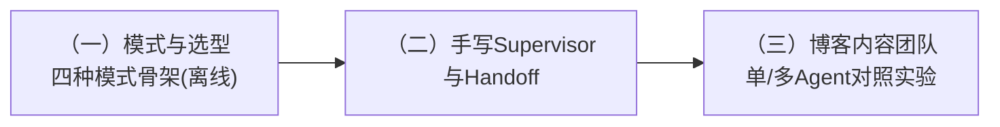

# 模块 09：MultiAgent

> 多 Agent 是当下最热的词，也是最容易被滥用的架构。本模块的态度很明确：**先学会判断「要不要」，再学会「怎么做」，最后用对照实验验证「值不值」**。三章层层递进：选型判断 → 手写机制 → 实战与实验。
>
> 全程贯穿四大坑的识别与解决：成本爆炸、无限互踢、错误级联、责任不清。

## 学习路径

## 章节导览

| 章节 | 核心内容 | project |
| --- | --- | --- |
| （一）何时需要 MultiAgent：模式与选型 | 判断三标准；四模式全景与决策树；通信即上下文工程；坑总览 | 四种模式最小骨架 + 互踢事故 + 成本账单（**全离线**） |
| （二）手写 Supervisor 与 Handoff | `Command` 路由原语；handoff 工具；**消息配对规则**；防环/摘要回传/token 计量 | supervisor + 2 worker 真 LLM 团队（需 Key） |
| （三）实战：博客内容团队 | researcher/writer/reviewer 评审回路；打回上限；**单 vs 多 Agent 三维对照实验** | 内容团队 + 单 Agent 基线 + 公平裁判（检索部分离线） |

## 三个贯穿本模块的观点

1. **多数场景单 Agent + 好工具就够**——「多 Agent 需求」常常是「工具没写好」；三标准（可并行、需隔离、专业化收益覆盖成本）不满足就别拆
2. **通信设计的本质是上下文工程**——共享完整历史是 O(轮数²) 的成本；worker 过程不出门、只回传结论摘要
3. **架构决策要用数据验证**——第三章的对照实验给出方法论：同任务、同工具、同裁判，比 token/耗时/质量三维

## 环境准备

- （一）章完全离线；（二）（三）章的协作演示需要根目录 `.env` 的 `LLM_API_KEY`（未配置时友好跳过）
- 无新增基础设施依赖（不需要 Docker）

## 先行学习资料（官方文档）

- [Anthropic：Building effective agents](https://www.anthropic.com/research/building-effective-agents)
- [Cognition：Don't Build Multi-Agents](https://cognition.ai/blog/dont-build-multi-agents)
- [LangGraph：Multi-agent 概念与模式](https://docs.langchain.com/oss/python/langgraph/multi-agent)
- [LangGraph：Command 与动态路由](https://docs.langchain.com/oss/python/langgraph/graph-api#command)
