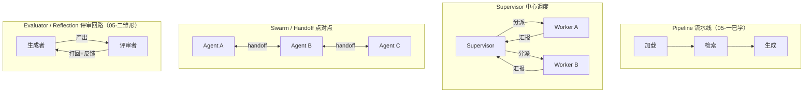
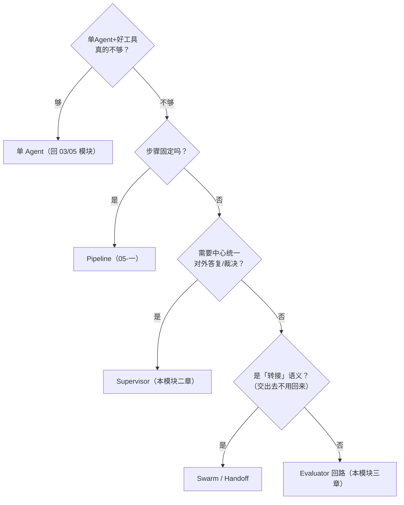

# （一）何时需要 MultiAgent：模式全景与选型

> 这可能是整个模块最省钱的一章——因为它的第一个结论是：**多数场景你不需要 MultiAgent**。在写第一行「真」多 Agent 代码之前，先建立判断力：什么时候单 Agent 就够，什么时候多 Agent 真的赢，以及四种协作模式怎么选。
>
> 本章的 project 刻意「去 LLM 化」：四种模式的最小可跑骨架全部用规则函数代替模型调用（离线免 Key），让你把注意力放在**控制流与上下文的流动**上——第二章把规则换成真 LLM，骨架一行不用改。

## 一、先泼冷水：别急着多 Agent

业界两个有分量的观点：

- **Anthropic**（《Building effective agents》）：能用 Workflow 解决的不要上 Agent，能用单 Agent 解决的不要上多 Agent——每加一层编排，成本、延迟、调试难度都翻倍
- **Cognition**（Devin 团队，《Don't Build Multi-Agents》）：多 Agent 最大的隐患是**上下文割裂**——两个 Agent 各看到任务的一半，各自做出「局部合理、整体矛盾」的决定

一个常被忽略的事实：**很多「多 Agent 需求」其实是「工具没写好」**。给单 Agent 一个高质量的检索工具，往往比「检索 Agent + 回答 Agent」更准、更便宜、更好调。03 模块的 ReAct 单 Agent + 05 模块的图编排，已经能覆盖你 80% 的场景。

### 判断三标准

满足越多，多 Agent 越值得：

| 标准 | 自问 | 例子 |
| --- | --- | --- |
| **任务可并行** | 子任务能独立推进、互不依赖吗？ | 同时调研 5 个竞品（可并行）vs 改一个函数（不可） |
| **上下文需要隔离** | 子任务的中间过程会污染彼此吗？ | 评审员不该看到作者的草稿心路，否则评审失去独立性 |
| **专业化收益 > 编排成本** | 拆开后每个角色的 prompt 是否显著变简单？ | 「检索专家+写作专家」各自 prompt 减半 vs 拆完每个还是很复杂 |

三条都不满足？用单 Agent + 好工具。

## 二、四种模式全景



| 模式 | 控制权 | 适合 | 代价 |
| --- | --- | --- | --- |
| **Pipeline** | 固定边，无 LLM 决策 | 步骤确定的流程（RAG 索引） | 不灵活 |
| **Supervisor** | 中心 LLM 动态分派 | 任务类型多样、需要统一对外答复 | supervisor 本身的 token 开销；中心成为瓶颈 |
| **Swarm/Handoff** | 当前 Agent 决定交给谁 | 客服转接类：领域明确、移交后不用回来 | 路径难预测，调试更难 |
| **Evaluator** | 生成-评审循环 | 质量门槛高的产出（代码/文章） | 轮数失控就是成本黑洞 |

### 选型决策树



实践中常见组合：**Supervisor 为骨架，局部嵌 Evaluator 回路**——第三章的博客内容团队就是这个形态。

## 三、通信设计的本质是上下文工程

多 Agent 的核心设计决策不是「拆几个角色」，而是**每个 Agent 能看到什么**：

| 策略 | 做法 | 优点 | 代价 |
| --- | --- | --- | --- |
| **共享完整历史** | 所有 Agent 读写同一条 messages | 信息无损，实现最简单 | token 成本随 Agent 数 × 轮数爆炸；互相干扰 |
| **隔离 + 摘要回传** | 各 Agent 私有上下文，只回传结论摘要 | 成本可控、互不污染 | 摘要丢细节，可能丢掉关键信息 |

两条工程铁律：

1. **worker 的「过程」不要回传，只回传「结论」**——supervisor 不需要看 worker 调了几次工具、走了什么弯路（第二章会实现「摘要化回传」）
2. **移交时传「任务描述」而不是「完整历史」**——Cognition 强调的「上下文压缩损耗」要在设计时显式权衡，宁可让下游 Agent 多问一句，不要让它读三千行无关历史

## 四、坑总览（后两章逐个实操解决）

| 坑 | 现象 | 本模块的解法 |
| --- | --- | --- |
| **成本爆炸** | 共享历史 + 多 Agent，token 翻 5-15 倍（Anthropic 实测多 Agent 系统约为单 chat 的 15 倍） | 隔离上下文 + 摘要回传 + token 计量（二章） |
| **无限互踢** | A 觉得该 B 干，B 觉得该 A 干，循环到超时 | handoff 次数上限 + 兜底直答（二章防环实现） |
| **错误级联** | 上游检索错了，下游基于错误结果继续放大 | 评审环节 + 来源可追溯（三章） |
| **责任不清难调试** | 答案错了，不知道哪个 Agent 的锅 | 每步带 Agent 标签的轨迹日志（二、三章） |
| **消息历史不合法** | tool_call 与 ToolMessage 不配对，下一次 LLM 调用直接 400 | 二章专门小节讲清配对规则 |

## 五、动手实践

```bash
cd "09-MultiAgent/（一）何时需要MultiAgent：模式与选型/project"
uv sync
uv run python main.py    # 全部离线，不需要 API Key
```

| 演示 | 内容 | 你应该看到 |
| --- | --- | --- |
| 1 | Pipeline：控制流写死在边上 | 三步固定轨迹 |
| 2 | Supervisor：`Command(goto=...)` 动态分派 | 图里**没有固定边**，跳转全在运行时决定 |
| 3 | Handoff 互踢事故现场 | 无上限 → `GraphRecursionError`（烧掉 24 次调用费）；上限 3 次 → 兜底直答 |
| 4 | 通信策略的 token 账单 | 共享完整历史 ≈ 2.6 倍成本，且随轮数平方增长 |

`Command` 是 LangGraph 动态控制流的路由原语——节点返回 `Command(goto=..., update=...)`，同时完成「改状态」和「决定下一跳」。演示 2/3 的骨架就是第二章真 LLM 版的地基。

## 六、动手作业

1. 把你工作中的一个真实流程（如「需求 → 设计 → 开发 → CR」）套进判断三标准：哪些环节值得拆 Agent？哪些其实是「工具没写好」？
2. 用决策树给这三个场景选型，并说出理由：① 电商客服（售前/售后/物流咨询）② 周报自动汇总（拉 git log + 拉 issue + 成文）③ 论文初稿打磨到投稿质量
3. 改演示 4 的参数：把协作轮数从 4 改到 10，看两种策略的成本差距如何拉大；再把 `summary_chars` 调到 300，体会「摘要保真度 vs 成本」的取舍
4. 思考题：Supervisor 模式里，supervisor 自己要不要配工具？配了之后它和 worker 的边界在哪？（二章揭晓）

## 官方文档与延伸阅读

- [Anthropic：Building effective agents](https://www.anthropic.com/research/building-effective-agents)
- [Anthropic：How we built our multi-agent research system](https://www.anthropic.com/engineering/built-multi-agent-research-system)
- [Cognition：Don't Build Multi-Agents](https://cognition.ai/blog/dont-build-multi-agents)
- [LangGraph：Multi-agent 概念与模式](https://docs.langchain.com/oss/python/langgraph/multi-agent)

## 下一章预告

知道了「什么时候用、用哪种」，下一章动手把 Supervisor 和 Handoff 的底层机制**亲手写出来**：`Command` 路由原语、handoff 工具、消息配对规则、防环与成本计量——读完你再看 `langgraph-supervisor` 这类框架，一眼就知道它替你做了什么。
